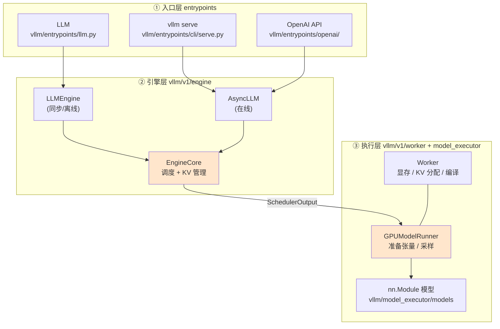
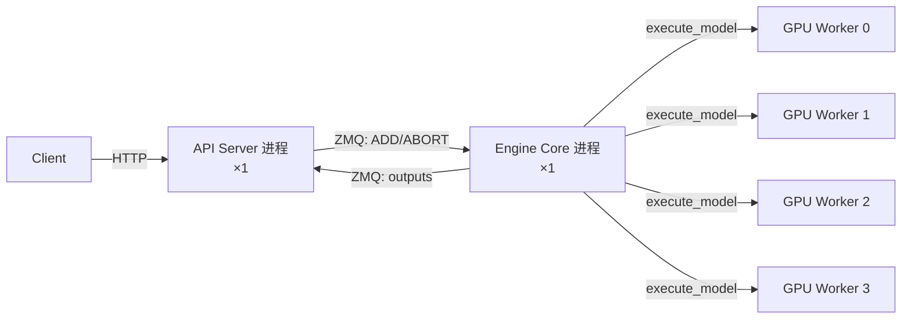
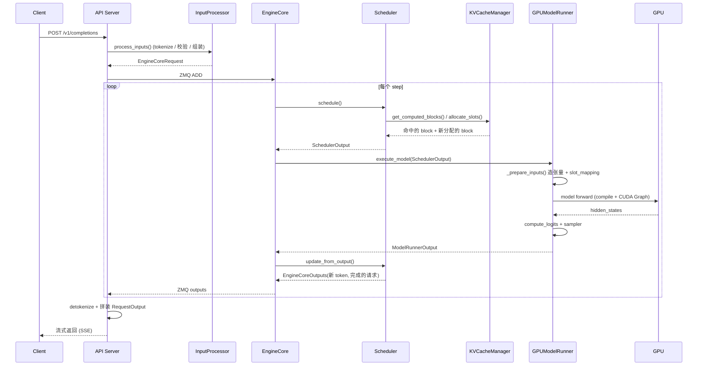

# 第 1 章 整体架构鸟瞰：一次请求的旅程

> 目标：建立一张"文件 → 职责"的地图。之后你读任何一个文件，都知道它在图中的位置。

## 1.1 三层结构：入口 / 引擎 / 执行

vLLM 的代码可以粗暴地分成三层：



关键点：**引擎层负责"决定算什么"，执行层负责"算"**。二者之间只通过两个数据结构通信：

- 下行：`SchedulerOutput`（`vllm/v1/core/sched/output.py:219`）—— 这一步要算哪些请求的哪些 token。
- 上行：`ModelRunnerOutput` / `EngineCoreOutputs` —— 采样出来的 token。

> 💡 **性能视角**：这个切分不是为了好看，而是为了**让调度逻辑与 GPU 执行并行**。
> 极端情况下（异步调度、`step_with_batch_queue`），CPU 在准备 step `t+1` 的输入时，GPU 还在跑 step `t`。

## 1.2 进程架构：为什么是多进程

单机 4 卡（`-tp=4`）的默认进程布局：



官方文档 [`docs/design/arch_overview.md`](../docs/design/arch_overview.md) 给出的一般公式：

| 进程类型 | 数量 | 说明 |
| --- | --- | --- |
| API Server | `A`（默认 = DP size） | HTTP、tokenize、流式回包 |
| Engine Core | `DP` | 调度、KV 管理 |
| GPU Worker | `N = DP × PP × TP` | 一卡一进程 |
| DP Coordinator | `DP > 1` 时为 1 | DP 之间的负载均衡与同步前向 |

为什么 Engine Core 要独立成进程？

1. **Python GIL**：调度是纯 Python 代码（每秒要跑几百上千次），如果和 API Server 共进程，会和 tokenize、JSON 序列化抢 GIL。
2. **故障隔离**：API Server 崩了不影响引擎状态。
3. **多 API Server 扩展**：`--api-server-count` 可以让多个 API Server 进程共享一个 Engine Core（多对多 ZMQ 拓扑）。

什么时候**不**分离？

- 离线 `LLM` 且 `VLLM_ENABLE_V1_MULTIPROCESSING=0` 时，用 `InprocClient`（`vllm/v1/engine/core_client.py:306`）把 Engine Core 放在同进程，省掉 ZMQ 往返。适合调试和单批次离线任务。

> 💡 **性能视角**：ZMQ 往返在**单步延迟**上要花几十微秒；在 decode 阶段一个 step 可能只有几毫秒，这个开销并非免费。
> 所以 vLLM 才需要"异步调度"和 `batch_queue` 来把这个延迟隐藏在 GPU 执行背后。

## 1.3 类层次与依赖注入：`VllmConfig` 是全局状态

vLLM 的类层次很深：`LLM → LLMEngine → EngineCore → Executor → Worker → WorkerWrapper → ModelRunner → nn.Module`。

这套层次有一条重要设计约定（见官方架构文档的 "Class Hierarchy" 一节）：

1. **所有类都接受一个 `VllmConfig` 对象**，而不是一堆散参数。加新特性时只需在 `VllmConfig` 加字段，改不到构造函数签名。
2. **模型构造函数统一为**：

   ```python
   def __init__(self, *, vllm_config: VllmConfig, prefix: str = ""):
   ```

   这样 ModelRunner 不需要知道具体模型类型就能构造它。
3. **切分与量化发生在模型初始化时，而不是初始化之后**。405B 模型 16 卡部署时，每卡只加载自己分到的那 1/16，而不是先加载全量再切 —— 这是能不能跑起来（OOM）的问题，不是快慢问题。
4. `prefix` 参数让同一份模型代码能根据所处位置（`""` / `"vision"` / `"language"`）做不同初始化（非均匀量化需要）。

配置对象在 `vllm/config/` 下按领域拆分：`model.py`、`cache.py`、`scheduler.py`、`parallel.py`、`compilation.py`、`speculative.py`……最后由 `vllm/config/vllm.py` 聚合成 `VllmConfig`。

## 1.4 一次请求的完整旅程（在线服务）

把这张图记住，后面四章就是把它逐层放大：



注意几个反直觉的地方：

- **Engine Core 不会"每来一个请求就跑一次"**。它跑的是一个 busy loop（`vllm/v1/engine/core.py:1411` `run_busy_loop`）：先抽干输入队列，然后 step 一次，再 step 一次…… 请求只是往队列里塞。
- **一次 `execute_model` 是全体请求一起的**。不存在"请求 A 的 forward"。所有被调度的 token 拼成一个大 batch 一起算，这也是"连续批处理"的字面意思。
- **输出路径独立于输入路径**。`AsyncLLM` 有一个后台 task `_run_output_handler`（`vllm/v1/engine/async_llm.py:666`）专门拉取输出并分发到各请求的流，与 `add_request` 完全解耦。

## 1.5 一个 step 的六件事（全书主线）

```text
① Scheduler.schedule()                     vllm/v1/core/sched/scheduler.py:501
② KVCacheManager.get_computed_blocks()     vllm/v1/core/kv_cache_manager.py:228
   KVCacheManager.allocate_slots()         vllm/v1/core/kv_cache_manager.py:343
③ GPUModelRunner._prepare_inputs()         vllm/v1/worker/gpu_model_runner.py:1975
④ model forward + CUDA Graph replay        vllm/v1/worker/gpu_model_runner.py:3917 (_model_forward)
⑤ reshape_and_cache（写 KV）               vllm/v1/attention/ops/triton_reshape_and_cache_flash.py
⑥ Sampler / RejectionSampler               vllm/v1/sample/sampler.py:73
```

`EngineCore.step()`（`vllm/v1/engine/core.py:597`）就是把这六件事串起来的那 30 行：

```python
def step(self):
    if not self.scheduler.has_requests():
        return {}, False
    scheduler_output = self.scheduler.schedule(self._should_throttle_prefills())
    future = self.model_executor.execute_model(scheduler_output, non_block=True)  # ← ① ② ③ ④ 异步发起
    grammar_output = self.scheduler.get_grammar_bitmask(scheduler_output)
    model_output = future.result()
    if model_output is None:
        model_output = self.model_executor.sample_tokens(grammar_output)          # ← ⑥
    self._process_aborts_queue()
    engine_core_outputs = self.scheduler.update_from_output(scheduler_output, model_output)
    return engine_core_outputs, scheduler_output.total_num_scheduled_tokens > 0
```

注意 `non_block=True`：execute 是**异步发起**的，在等待 GPU 的时候 CPU 顺手把 `grammar_output`（结构化输出的位掩码）算出来 —— 这就是"把 CPU 工作塞进 GPU 空隙"的最小例子。

## 1.6 文件地图（打印出来贴在显示器上）

| 目录 | 职责 | 必读文件 |
| --- | --- | --- |
| `vllm/entrypoints/` | 入口：LLM / OpenAI API / CLI | `llm.py`、`launchers/api_server/`（真正的 API server）、`openai/chat_completion/serving.py` |
| `vllm/v1/engine/` | 引擎编排 | `core.py`, `async_llm.py`, `core_client.py`, `input_processor.py`, `output_processor.py`, `detokenizer.py` |
| `vllm/v1/core/` | 调度与 KV 管理（**纯 CPU，无 GPU 代码**） | `sched/scheduler.py`, `kv_cache_manager.py`, `block_pool.py`, `kv_cache_utils.py` |
| `vllm/v1/worker/` | 执行 | `gpu_model_runner.py`, `gpu_worker.py`, `gpu_input_batch.py`, `block_table.py` |
| `vllm/v1/attention/` | 注意力后端与算子 | `backend.py`, `selector.py`, `backends/`, `ops/` |
| `vllm/v1/sample/` | 采样 | `sampler.py`, `ops/`, `rejection_sampler.py` |
| `vllm/v1/spec_decode/` | 投机解码 | `eagle.py`, `ngram_proposer.py`, `draft_model.py` |
| `vllm/v1/executor/` | worker 进程编排 | `multiproc_executor.py`, `abstract.py` |
| `vllm/model_executor/` | 模型与层实现 | `models/registry.py`, `layers/linear.py`, `layers/fused_moe/`, `model_loader/` |
| `vllm/compilation/` | torch.compile 与 CUDA Graph | `backends.py`, `cuda_graph.py`, `decorators.py` |
| `vllm/distributed/` | 通信 | `parallel_state.py`, `device_communicators/` |
| `vllm/config/` | 所有配置 | `vllm.py` 聚合其余 |
| `vllm/platforms/` | 硬件抽象 | `interface.py`, `cuda.py` |

**最值得先读的三个文件**（按顺序）：

1. `vllm/v1/core/sched/scheduler.py` 的 `schedule()`（第 501 行起）—— 全书的"大脑"。
2. `vllm/v1/core/kv_cache_manager.py` 的 `allocate_slots()`（第 343 行起）—— 显存是吞吐的天花板。
3. `vllm/v1/worker/gpu_model_runner.py` 的 `execute_model()`（第 4249 行起）—— 只读骨架，不要逐行。

## 1.7 本章小结

- 三层结构：入口 / 引擎 / 执行；层间靠 `SchedulerOutput` 和 `ModelRunnerOutput` 通信。
- 进程结构：API Server（可多）/ Engine Core（每 DP 一个）/ GPU Worker（每卡一个）/ DP Coordinator（可选）。
- `VllmConfig` 是贯穿所有类的全局状态；模型构造签名统一。
- Engine Core 是 busy loop；一次 `execute_model` 服务全体请求。
- 一个 step = 调度 → 分配 KV → 准备输入 → forward → 写 KV → 采样。

⚠️ **易错点**
- 顶层 `vllm/engine/`、`vllm/worker/`、`vllm/attention/`（无 `v1`）里有大量**旧版（V0）残留**。默认 `VLLM_USE_V1=1`，请以 `vllm/v1/` 为准，否则你会读到已经不生效的代码。
- `vllm/v1/core/` 里没有一行 CUDA 代码，全是 CPU 逻辑 —— 这本身就是个重要信号：**调度与显存管理的开销是纯 CPU 开销**。

📖 官方文档：`docs/design/arch_overview.md`（进程模型与类层次）

下一章 → [第 2 章 请求生命周期](02-请求生命周期.md)
