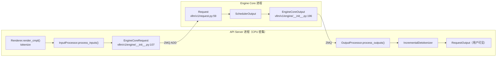

# 第 2 章 请求生命周期：从字符串到 token 再回来

> 目标：走通"字符串 → GPU → 字符串"的完整数据流，知道每个数据结构在哪个进程里诞生。

## 2.1 全景：三个数据结构，三个进程



关键认识：**`EngineCoreRequest` 是跨进程边界的数据，`Request` 是引擎内部的长期状态**。
`EngineCoreRequest` 是不可变的一次性消息；`Request` 会随着生成过程不断被修改（`num_computed_tokens` 递增、`output_token_ids` 增长）。

## 2.2 输入侧：三步预处理

### 步骤 1：tokenize（Renderer）

```python
# vllm/v1/engine/input_processor.py:332
(engine_input,) = renderer.render_cmpl([parsed_prompt], tok_params)
```

`Renderer` 是近期重构出来的组件（`vllm/renderers/`），负责把**聊天模板 + 文本**变成 token id 列表。
它替代了早期散落在各处的 `tokenizer.encode(...)` 调用，好处是：

- 聊天模板（Jinja）、工具调用解析、多模态占位符插入统一在一处；
- tokenization 参数（`add_special_tokens` 等）统一管理。

> 💡 **性能视角**：tokenize 是纯 CPU 工作，而且**对长 prompt 是 O(n) 的 Python 调用**。
> 在线服务下它发生在 API Server 进程（可以多开），与 Engine Core 的调度执行**完全并行**。这正是 vLLM 要把 API Server 和 Engine Core 分进程的原因之一。
> 优化手段：`--api-server-count` 多开进程、`VLLM_MEDIA_LOADING_THREAD_COUNT` 加速多模态加载、`VLLM_USE_FASTOKENS` 用 Rust 分词器。

### 步骤 2：校验与组装（InputProcessor）

`InputProcessor.process_inputs()`（`vllm/v1/engine/input_processor.py:281`）做这些事：

1. `_validate_params` / `_validate_lora`：采样参数与 LoRA 合法性。
2. `_validate_model_inputs`：prompt 长度是否超过 `max_model_len`。
3. **补齐 `max_tokens`**：

   ```python
   if sampling_params.max_tokens is None:
       sampling_params.max_tokens = self.model_config.max_model_len - seq_len
   ```

4. **从模型 config 合并生成参数**（`sampling_params.update_from_generation_config(...)`）：例如从 `generation_config.json` 里读 `eos_token_id`、`repetition_penalty`。
5. 多模态：把图片/音频的描述符存进 P0 缓存（API Server 侧），只把 hash 传给引擎 —— 见 `inject_into_mm_cache`。

> 💡 **性能视角**：多模态输入不能走 ZMQ 直接传图像张量（太大），vLLM 用**内容寻址缓存**：API Server 侧算 hash 并行做预处理，引擎只拿 hash。
> 这既省带宽也省重复计算（同一张图在多个请求里只算一次视觉编码）。

### 步骤 3：变成 `EngineCoreRequest`

```python
class EngineCoreRequest(msgspec.Struct):
    request_id: str
    prompt_token_ids: list[int] | None
    mm_features: list[MultiModalFeatureSpec] | None
    sampling_params: SamplingParams | None
    arrival_time: float
    lora_request: LoRARequest | None
    cache_salt: str | None
    data_parallel_rank: int | None
    prompt_embeds: torch.Tensor | None = None
    priority: int = 0
    ...
```

注意它是 `msgspec.Struct` —— **这是为序列化性能服务的**。msgspec 比 pickle/JSON 快数倍，跨 ZMQ 传 `EngineCoreRequest` 和 `EngineCoreOutput` 时这个选择直接体现在每步延迟上（序列化在 `vllm/v1/engine/serial_utils.py`）。

## 2.3 引擎内部：`Request` 对象的生命

进入 Engine Core 后，`EngineCore.add_request`（`vllm/v1/engine/core.py:452`）把它变成 `Request`（`vllm/v1/request.py:59`）。

### 三个计数决定了一切

```text
num_prompt_tokens        prompt 有多长
num_computed_tokens      已经算过 KV 的 token 数  ← 调度器的核心变量
num_tokens_with_spec     当前"应该有"的总 token 数（prompt + 已生成 + 投机草案）
```

调度器的全部工作，就是**让 `num_computed_tokens` 追上 `num_tokens_with_spec`**，每步推进一点。这个抽象同时覆盖了三种情况：

- prefill：`num_computed_tokens < num_prompt_tokens`，一次推进一大块；
- decode：`num_computed_tokens == num_prompt_tokens`，每步推进 1（或 1+投机数）；
- chunked prefill：中间状态，每次推进一个 chunk。

代码里的注释说得很清楚（`scheduler.py:503-512`）：

```text
There's no "decoding phase" nor "prefill phase" in the scheduler.
Each request just has the num_computed_tokens and num_tokens_with_spec.
At each step, the scheduler tries to assign tokens to the requests
so that each request's num_computed_tokens can catch up its num_tokens_with_spec.
```

### 状态机

`RequestStatus`（`vllm/v1/request.py:364`）：

| 状态 | 含义 |
| --- | --- |
| `WAITING` | 在等待队列，还没排上（可能是没 KV 空间，也可能是新请求） |
| `WAITING_FOR_STRUCTURED_OUTPUT_GRAMMAR` | 等结构化输出的语法编译 |
| `WAITING_FOR_REMOTE_KVS` | 等远端 KV 传输完成（P/D 分离场景） |
| `WAITING_FOR_STREAMING_REQ` | 流式输入请求，等后续输入 |
| `RUNNING` | 在跑 |
| `PREEMPTED` | 被抢占，KV 被回收，回到等待队列 |
| `FINISHED_STOPPED` | 命中 stop 条件 |
| `FINISHED_LENGTH_CAPPED` | 达到 `max_tokens` |
| `FINISHED_ABORTED` | 客户端取消 |
| `FINISHED_IGNORED` | 超过 `max_model_len` 被直接丢弃 |
| `FINISHED_ERROR` | 出错 |
| `FINISHED_REPETITION` | 重复检测触发 |

> ⚠️ **易错点**：`PREEMPTED` 的请求**不保留已算的 KV**（`num_computed_tokens` 被重置为 0，`_preempt_request` 里 `self._free_request_blocks(request)`）。
> 也就是说 vLLM 采用 **recompute（重算）** 而非 swap（换出到 CPU）。原因是 PCIe 带宽换入换出的代价通常高于重算，尤其 prefix caching 打开时重算还能命中缓存。

## 2.4 输出侧：采样结果怎么变回文字

Engine Core 产出 `EngineCoreOutput`：

```python
class EngineCoreOutput(msgspec.Struct):
    request_id: str
    new_token_ids: list[int]
    new_logprobs: LogprobsLists | None = None
    finish_reason: FinishReason | None = None
    ...
```

回到 API Server，`OutputProcessor.process_outputs()`（`vllm/v1/engine/output_processor.py:607`）把它变成 `RequestOutput`。中间的关键是**增量 detokenize**。

### 为什么需要"增量"detokenize

朴素做法是每生成一个 token 就把整个序列 `tokenizer.decode(all_ids)` 一次 —— 这是 O(n²)，长输出时 CPU 会爆炸。

vLLM 的做法是只解码新增的部分（`vllm/v1/engine/detokenizer.py`）：

```python
def update(self, new_token_ids, stop_terminated) -> str | None:
    stop_check_offset = len(self.output_text)
    for new_token_id in new_token_ids:
        self.token_ids.append(new_token_id)
        self.output_text += self.decode_next(new_token_id)   # ← 只解码这 1 个 token
        ...
```

两个实现：

- `FastIncrementalDetokenizer`（`detokenizer.py:168`）：用 HuggingFace `tokenizers` 的底层 API，逐个 token 解码。快，但需要处理 BPE 边界（一个字符可能被切成多个 token）。
- `SlowIncrementalDetokenizer`（`detokenizer.py:251`）：兼容性更好，必要时回退到整段解码。

### stop 字符串为什么要"缓冲"

流式返回时有个陷阱：stop 字符串是**字符级**的，而 token 边界和字符边界不对齐。比如 stop 是 `"\n\n"`，可能第一个 token 解出 `"\n"`，第二个 token 解出 `"\nUser"` —— 如果第一个 `"\n"` 已经发给客户端，就无法回退了。

所以 `get_next_output_text` 里有个 `stop_buffer_length`：

```python
buffer_length = 0 if finished else self.stop_buffer_length
...
return self.output_text[last_offset:length]   # 扣掉尾巴上的缓冲区
```

**缓冲住末尾若干个字符不发**，等确认不是 stop 前缀再发。

> 💡 **性能视角**：这是"正确性 vs 延迟"的典型权衡。
> `stop_buffer_length` 越大越安全，TTFT/ITL 观感越差；没有 stop 字符串时应当为 0。
> 一些框架为了省事选择"不做缓冲"，代价是偶尔多发几个字符。

## 2.5 一次请求的字段级时间线

| 时刻 | 事件 | 谁做的 | 数据结构变化 |
| --- | --- | --- | --- |
| T0 | HTTP 到达 | API Server | — |
| T1 | tokenize + 校验 | `InputProcessor` | `EngineCoreRequest` |
| T2 | ZMQ ADD | API Server → Engine Core | `Request(status=WAITING)` |
| T3 | 第一次被调度 | `Scheduler.schedule()` | `num_computed_tokens += chunk` |
| T4 | 首个 token 产出 | `Sampler` | `output_token_ids=[t0]`，TTFT 在此结算 |
| T5… | 后续每步 | 同上 | 每步 +1（或 +1+k） |
| Tn | 命中 stop / max_tokens | `Scheduler.update_from_output` | `status=FINISHED_*` |
| Tn+ | detokenize 补全 + 回包 | `OutputProcessor` | `RequestOutput`（`finished=True`） |

**TTFT**（Time To First Token）= T4 − T0，其中 T1 的 tokenize 和 T3 之前的排队时间都是可观的组成部分。
**TPOT/ITL**（Time Per Output Token）= (Tn − T4) / n，主要由 decode 步的耗时决定。

## 2.6 本章小结

- 输入侧三步：tokenize（Renderer）→ 校验组装（InputProcessor）→ `EngineCoreRequest`（msgspec 序列化）。
- 引擎内部用 `Request` 表示长期状态；`num_computed_tokens` vs `num_tokens_with_spec` 是调度的唯一抓手。
- 抢占是 recompute 而非 swap。
- 输出侧用增量 detokenize + stop 缓冲，避免 O(n²) 解码与错误提前输出。
- `EngineCoreRequest` / `EngineCoreOutput` 是跨进程数据，序列化格式（msgspec）直接进入每步延迟。

⚠️ **易错点**
- `max_tokens=None` 时会被填成 `max_model_len - prompt_len`，容易在压测时产生超长输出。压测务必显式给 `max_tokens`。
- 流式输出的 `delta=True` 语义是"自上次调用以来的新文本"，不是"每个 token"。写客户端时别混淆。

📖 官方文档：`docs/design/metrics.md`（指标口径）

下一章 → [第 3 章 调度器](03-调度器.md)
