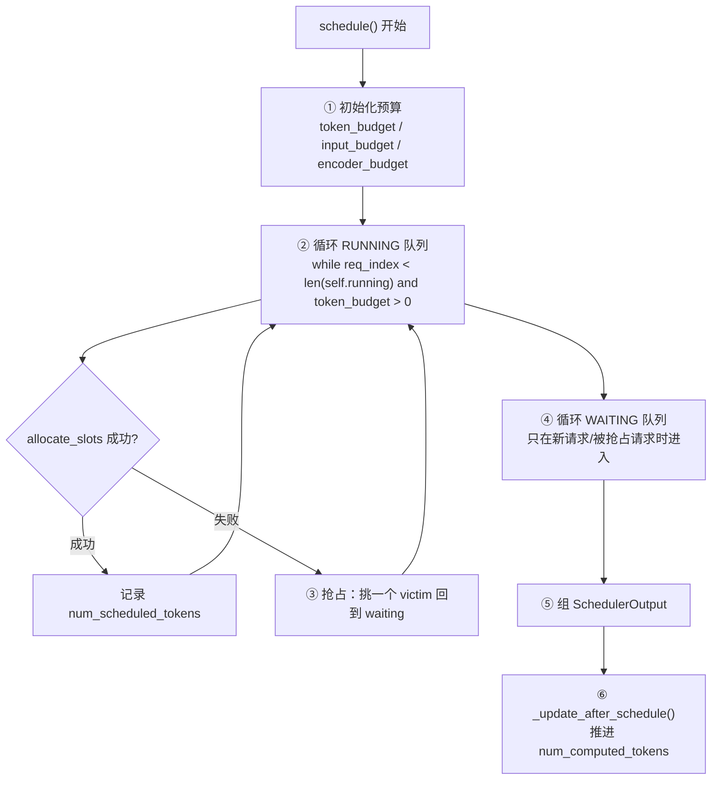

# 第 3 章 调度器：连续批处理到底批了什么

> 目标：看懂 `Scheduler.schedule()`，能回答"为什么这个请求这一步只算了 512 个 token"、"为什么我的请求被抢占了"。
> 这是全教程**最重要**的一章。调度决定了每一步 GPU 上跑多大的 batch，也就基本决定了吞吐。

## 3.1 一句话概括

> 每个 step，调度器在**两个预算**（token 数、KV block 数）下，从 running 队列和 waiting 队列里挑请求，尽量多塞。

```text
token_budget = max_num_batched_tokens          （这一步最多算多少 token）
kv_budget    = 空闲 block 数                    （这一步最多能新建多少 KV slot）
max_num_seqs                                    （这一步最多几个请求）
```

`max_num_seqs` 限制 batch 里请求个数，`max_num_batched_tokens` 限制 batch 里 token 总数。prefill 请求一个就能吃掉几千 token，decode 请求一个只吃 1 个 token —— 这个差异是**理解调度器一切行为的钥匙**。

## 3.2 `schedule()` 的四段结构

`vllm/v1/core/sched/scheduler.py:501` 起：



### ① 初始化预算

```python
token_budget = self.max_num_scheduled_tokens
input_budget = self.scheduler_config.max_num_batched_tokens
if self._pause_state == PauseState.PAUSED_ALL:
    token_budget = 0                      # 暂停时什么都不调度
```

注意有**两个**预算：`token_budget`（本步总 token）与 `input_budget`。`input_budget` 还要额外预留 `draft_slots`（投机解码的草案 token 位）：

```python
spec = self.vllm_config.speculative_config
draft_slots = spec.max_num_new_slots_for_drafting if spec is not None else 0
```

### ② RUNNING 队列：先照顾已经在跑的

```python
while req_index < len(self.running) and token_budget > 0:
    request = self.running[req_index]
    ...
    num_new_tokens = (request.num_tokens_with_spec
                      + request.num_output_placeholders
                      - request.num_computed_tokens)   # ← 还差多少
    if 0 < long_prefill_token_threshold < num_new_tokens:
        num_new_tokens = long_prefill_token_threshold  # ← 长 prefill 主动切块
    num_new_tokens = min(num_new_tokens, token_budget, input_budget - draft_slots)
    num_new_tokens = min(num_new_tokens,
                         self.max_model_len - request.num_computed_tokens
                         - self.num_sampled_tokens_per_step)   # ← 别越界
```

`num_new_tokens` 就是"这个请求这一步要算几个 token"：

- **decode 请求**：`num_tokens_with_spec - num_computed_tokens = 1`（或 `1 + num_spec_tokens`）。所以 decode 一步只花 1 个预算。
- **prefill 请求**：差值是整个 prompt 长度，可能是几万。它会被 `token_budget` 截断 —— **这就是 chunked prefill**。

紧接着是最关键的调用：

```python
while True:
    new_blocks = self.kv_cache_manager.allocate_slots(
        request, num_new_tokens, num_lookahead_tokens=self.num_lookahead_tokens)
    if new_blocks is not None:
        break                     # 分到 KV 了，这一步可以跑
    # 分不到 → 抢占
    ...preempt...
```

**`allocate_slots` 返回 `None` = 显存不够 = 触发抢占**。这是 vLLM 中"显存压力"唯一的表现形式。

### ③ 抢占（Preemption）

```python
preempted_req = max(self.running, key=lambda r: (r.priority, r.arrival_time))
victim_index = self.running.index(preempted_req)
del self.running[victim_index]
```

- **FCFS 策略**下，victim 是"最后到达的"（`max` + `arrival_time`），语义上等价于"优先踢掉最新的请求"。
- **PRIORITY 策略**下，`priority` 数值大的先被踢。

抢占的后果（`_preempt_request`，`scheduler.py:1405`）：

```python
self._free_request_blocks(request)     # KV 全部回收
request.num_computed_tokens = 0        # 进度清零 → 后面要重算 prefill
request.status = RequestStatus.PREEMPTED
self.waiting.prepend_request(request)  # 插到等待队首（而不是队尾）
```

> 💡 **性能视角（关键）**：
> 抢占是 **recompute**，代价是"整个 prompt 的 prefill 白算一遍"。
> 但如果开启 **prefix caching**，被抢占请求的 block 只要没被驱逐，重算时能直接命中缓存 —— 这也是为什么 prefix caching 在高并发下不只是"省 prefill"，还是**抢占的止痛药**。
> 观测方式：日志里的 `preempted_requests` 指标 + `Waiting` 队列长度。**如果频繁抢占，说明 `max_num_seqs` / `gpu_memory_utilization` / `max_model_len` 设置得超出了显存能力**。

### ④ WAITING 队列：只在有"新面孔"时进入

调度器不会每步都尝试 waiting 队列（那会让 decode 每一步都被大 prefill 打断）。它只在两种情况下去看 waiting：

- running 队列里的请求都被调度完了（token 还有余量）；
- 或者有请求刚从 waiting 变成 running。

进入 waiting 后，除了分配 KV，还有一个**很重要的逻辑叫 `pad_spec_decode`**：

```python
# Pad new decode requests to uniform spec decoding size to
# preserve full cudagraph for this step.
if (self.num_spec_tokens > 0 ... and num_new_tokens == 1
        and (scheduled_running_reqs and not prefill_scheduled)):
    padded_num_tokens = 1 + self.num_spec_tokens
    if (num_computed_tokens + padded_num_tokens + self.num_sampled_tokens_per_step
            <= self.max_model_len):
        if padded_num_tokens > request_token_budget:
            break           # 宁可不调度，也不要破坏 uniform 形状
        num_new_tokens = padded_num_tokens
        pad_spec_decode = True
```

**为了保住 full CUDA Graph 的形状一致性，宁可不调度这个请求**。这是一个很典型的 vLLM 取舍：*uniform 形状的价值 > 多塞一个请求的价值*。

还有 `enable_chunked_prefill=False` 时的行为：

```python
if (not enable_chunked_prefill and num_new_tokens > request_token_budget):
    break     # 关掉 chunked prefill 后，大 prefill 直接卡住整个调度
```

> ⚠️ **易错点**：关掉 chunked prefill（`--no-enable-chunked-prefill`）会让长 prompt 请求独占一步，**decode 延迟出现尖峰**。生产环境几乎总是开启。

### ⑤ `SchedulerOutput`：给 GPU 的"工单"

`vllm/v1/core/sched/output.py:219`。最重要的字段：

```python
scheduled_new_reqs: list[NewRequestData]      # 首次调度的请求，附完整信息
scheduled_cached_reqs: CachedRequestData      # 老请求，只传增量
num_scheduled_tokens: dict[str, int]          # req_id → 本步算几个 token ★
total_num_scheduled_tokens: int               # sum(...)，就是 batch 的 token 数 ★
scheduled_spec_decode_tokens: dict[str, list[int]]
num_common_prefix_blocks: list[int]           # 给 cascade attention 用
finished_req_ids: set[str]                    # 通知 worker 释放状态
new_block_ids_to_zero: list[int] | None       # 新块要先清零，防 NaN
```

注意注释里的设计意图：

```python
# list of the requests that have been scheduled before.
# Since the request's data is already cached in the worker processes,
# we only send the diff to minimize the communication cost.
```

> 💡 **性能视角（重要且常被忽视）**：`scheduled_cached_reqs` 只传 **diff**。
> 如果每步都把 1000 个请求的完整信息（prompt token ids、采样参数、block table）序列化过 ZMQ，单是 pickle 就要毫秒级。
> vLLM 让 worker 侧长期持有 `CachedRequestState`，调度器只发"谁、算几个 token"。**这正是 worker 端 `InputBatch` 存在的理由**（第 5 章）。

### ⑥ `_update_after_schedule()`：先推进，后修正

```python
for req_id, num_scheduled_token in num_scheduled_tokens.items():
    request = self.requests[req_id]
    request.num_computed_tokens += num_scheduled_token
    request.num_in_flight_tokens += num_scheduled_token
```

**在 GPU 还没算之前就把 `num_computed_tokens` 加上了**。为什么？

1. `SchedulerOutput` 里的 `num_scheduled_tokens` 是按"调度前"的位置算的（`_prepare_inputs` 要用它来推 `positions`），所以必须先发出去再改。
2. 提前推进的好处：**下一步调度立刻可以基于新状态决策**，不用等 GPU 返回。
3. 如果投机解码的草案 token 事后被拒绝，在 `update_from_output` 里再修正。

## 3.3 `update_from_output()`：把采样结果翻译成状态变化

`vllm/v1/core/sched/scheduler.py:1802`。做的事：

1. 把新 token 追加到 `request.output_token_ids`。
2. 判断是否结束：`max_tokens`、stop token、`max_model_len`、abort。
3. **投机解码**：统计接受/拒绝数量，修正 `num_computed_tokens`（被拒的草案 token 对应的 KV 要作废重算）。
4. 结构化输出：推进 FSM 状态，准备下一步的 grammar bitmask。
5. 生成 `EngineCoreOutputs`，并构造 `SchedulerStats`（`num_running_reqs`、`num_waiting_reqs`、`kv_cache_usage`）。

## 3.4 两种队列策略

`vllm/v1/core/sched/request_queue.py`：

- `FCFSRequestQueue`（默认）：`deque`，先到先服务。
- `PriorityRequestQueue`：最小堆，按 `priority` 排序。请求的 `priority` 可以从 API 传（`SamplingParams.priority`）。

选法：`--scheduling-policy fcfs|priority`（`SchedulerConfig.policy`）。
`create_request_queue(policy)` 是工厂函数（`request_queue.py:201`）。

优先级队列还有个坑：`PriorityRequestQueue` 用堆实现，`prepend_request` / `remove_requests` 都比 deque 贵。高吞吐场景默认 FCFS 更划算。

## 3.5 三个队列而不是两个

新手容易忽略 `skipped_waiting` 这个第三队列：

```python
self.waiting: RequestQueue          # 正常等待
self.skipped_waiting: RequestQueue  # 这一步因为预算不够被跳过的
```

被跳过的请求放 `skipped_waiting`，下一步优先于"更晚到达但从没尝试过"的请求 —— 避免**饿死**（starvation）。看到日志里 `num_skipped_waiting_reqs` 就是它。

## 3.6 让 CPU 追上 GPU：异步调度与 batch queue

调度是纯 Python，一个 step 可能只有几毫秒。如果流程是"调度 → 等 GPU → 输出 → 再调度"，CPU 时间就白扔了。vLLM 有两级解法：

| 机制 | 做法 | 入口 |
| --- | --- | --- |
| `non_block=True` + `future.result()` | execute 异步发起，CPU 在等待期间干别的活（如算 grammar bitmask） | `core.py:597` `step()` |
| **Batch queue** | 把多个 step 的 future 排队，CPU 连续提交多个 step，不等 GPU | `core.py:638` `step_with_batch_queue()` |
| **异步调度**（async scheduling） | 调度器不等采样结果，用"占位 token"先推进下一步 | `SchedulerConfig.async_scheduling` |

`step_with_batch_queue` 的逻辑（`core.py:638` 注释）：

```text
1. Try to schedule a new batch if the batch queue is not full.
   If a new batch is scheduled, directly return an empty engine core output.
   In other words, fulfilling the batch queue has a higher priority than
   getting model outputs.
2. If there is no new scheduled batch, ... block until the first batch is finished.
3. Update the scheduler from the output.
```

代价是**输出延迟增加**（要等队列里的多个 step 结束），并且 `max_model_len` 需要额外预留（因为调度超前了）。这就是 `SchedulerConfig` 里 `max_num_scheduled_tokens` 这个独立预算存在的原因。

## 3.7 关键配置与它们的性能含义

| 参数 | 默认 | 调大 | 调小 |
| --- | --- | --- | --- |
| `--max-num-batched-tokens` | 按模型定 | prefill 更快、decode 更慢（ITL 抖动） | decode 更稳、长 prompt 需要更多 chunk |
| `--max-num-seqs` | 按设备定 | 吞吐↑（更多请求并发），显存压力↑、可能抢占 | 延迟↓，吞吐↓ |
| `--long-prefill-token-threshold` | 0（关） | 主动把长 prefill 切块，牺牲 TTFT 换 decode 稳定 | — |
| `--scheduling-policy` | `fcfs` | `priority` 可让重要请求插队 | — |
| `--async-scheduling` | 自动 | 吞吐↑，输出略有延迟 | — |

> 💡 **性能视角总结**：
> `max_num_batched_tokens` 是 **prefill/decode 权衡旋钮**。它越大，一步能吞的 prompt token 越多（TTFT↓），但一步的执行时间越长（ITL↑，因为 decode 请求也要陪跑）。
> 经验值：这个数设为 `max_num_seqs` 的 2~4 倍以上时，prefill 会被有效切块；Chunked prefill 的 `chunk` 大小实际由它决定。

## 3.8 本章小结

- 调度 = 在 `token_budget` 和 KV block 预算下塞满 batch。
- `num_computed_tokens` 追 `num_tokens_with_spec`；三种情况（prefill/decode/chunk）统一处理。
- `allocate_slots` 返回 `None` → 抢占 → recompute。抢占是显存不足的唯一信号。
- waiting 队列不是每步都进；为了 CUDA Graph 形状一致性可以拒绝调度。
- `SchedulerOutput` 只传 diff；worker 侧持有长期状态。
- GPU 还没算就推进 `num_computed_tokens`，为的是让下一步调度不等 GPU。
- batch queue / 异步调度用"更多输出延迟"换"CPU 不空转"。

⚠️ **易错点**
- `total_num_scheduled_tokens == 0` 时 `step()` 返回 `model_executed=False`，此时不跑模型但也不会崩 —— 例如请求都在等远端 KV。
- 抢占计数在 `Request.num_preemptions`，最终体现在 `SchedulerStats.preempted_requests`。
- `max_num_batched_tokens` 不是"batch 大小"，而是"token 数"。batch 大小由 `max_num_seqs` 管。

📖 官方文档：`docs/design/dbo.md`（Dual Batch Overlap，更激进的 CPU/GPU 重叠）

下一章 → [第 4 章 KV Cache 与 PagedAttention](04-KV-Cache与PagedAttention.md)
