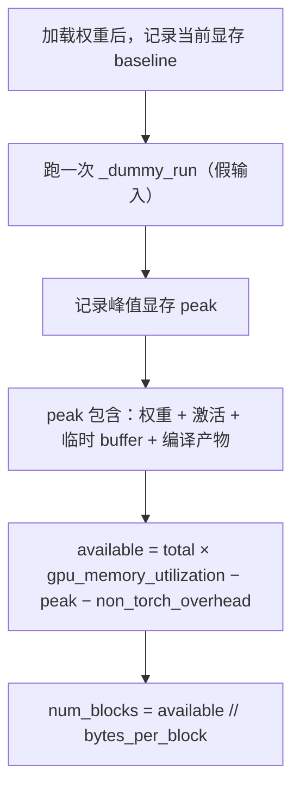

# 第 4 章 KV Cache 与 PagedAttention：显存是第一公民

> 目标：理解为什么 vLLM 要发明 PagedAttention、block 粒度怎么选、prefix caching 的哈希怎么算、以及"KV 显存利用率"为什么直接等于吞吐上限。

## 4.1 先算一笔账：KV cache 有多大

对一个标准 decoder 模型（GQA 情况）：

```text
每 token 每层 KV 字节数 = 2 × num_kv_heads × head_dim × dtype_bytes
一个请求的 KV 占用     = 上面的值 × num_layers × 序列长度
```

以 Qwen2.5-7B（28 层、4 个 KV head、head_dim 128、fp16）为例：

```text
每 token 每层 = 2 × 4 × 128 × 2B = 2048 B = 2 KiB
每 token      = 2 KiB × 28 = 56 KiB
8K 上下文的单请求 KV ≈ 56 KiB × 8192 ≈ 448 MiB
```

**一个请求 448 MiB**，80 GB 的卡除去权重后大约能装几十个这样的请求。这个数字直接决定了并发上限，也就决定了吞吐。

> 💡 **性能视角**：LLM 推理的吞吐瓶颈**不是算力，是显存带宽与容量**。
> - **容量**决定 batch 能有多大（并发）；
> - **带宽**决定每个 decode step 要多久（因为 decode 是 memory-bound：算一个 token 要读全部权重 + 全部 KV）。
> 所以 vLLM 的一切设计都围绕"别浪费 KV 显存"和"别浪费带宽"。

对比两种朴素方案，你就明白 PagedAttention 的价值：

| 方案 | 问题 |
| --- | --- |
| 每个请求预分配 `max_model_len` 的连续显存 | 内部碎片严重。平均只用到 20~40%，等于把并发砍到 1/3 |
| 动态增长 + `torch.cat` 拼接 | 外部碎片 + 每次扩容都要拷贝整段 KV（O(n²) 拷贝） |

vLLM 的方案：**固定大小 block（默认 16 token）+ 非连续存储 + block table 做地址翻译**，即 PagedAttention 论文的核心思想。

```text
逻辑视图（请求看到的）        物理视图（显存里的）
req A: [t0..t15][t16..t31]     block 7  ← t0..t15   (req A)
req B: [t0..t15]               block 2  ← t16..t31  (req A)
                               block 5  ← t0..t15   (req B)
```

内部碎片最多浪费 `block_size - 1` 个 token 的位置（16 token 里的最后 15 个）。**碎片率从 60% 降到 <5%**，这是 vLLM 相对朴素实现能提升数倍吞吐的根本原因。

## 4.2 Block 的三个关键尺寸

| 概念 | 默认 | 在哪定义 | 影响 |
| --- | --- | --- | --- |
| `block_size`（逻辑块，token 数） | 16 | `CacheConfig.block_size` | 碎片率 vs 前缀缓存命中粒度 |
| kernel block size（物理块） | 由后端定 | 各 attention backend 的 `get_supported_kernel_block_sizes()` | 有些 kernel 要求 32/64 |
| `page_size`（字节） | 由 spec 决定 | `KVCacheSpec.page_size_bytes` | 混合模型（MLA/Mamba）下要统一 |

当逻辑块与 kernel 块大小不一致时，`BlockTable.map_to_kernel_blocks`（`vllm/v1/worker/block_table.py:239`）会把一个逻辑块映射到多个 kernel 块：

```python
kernel_block_ids = (kv_manager_block_ids.reshape(-1, 1) * blocks_per_kv_block
                    + kernel_block_arange)
```

**为什么 `block_size` 越小越好（但不绝对）？**

- 越小 → 内部碎片越少 → 显存利用率越高；
- 越小 → 前缀缓存能匹配到更细的粒度 → 命中率越高；
- 太小 → block table 变长、kernel 循环次数变多、元数据开销上升。

实测经验：**16 是甜点**；MLA 模型（DeepSeek 系）常用 64，因为其 latent 维度小、每块字节数少，需要更大的块才能让 kernel 高效。

> ⚠️ **易错点**：`--block-size` 一旦指定且不被后端支持，会导致启动失败（`AttentionBackend.validate_configuration` 报错）或性能下降。**不要随便动它**，除非你明确知道后端支持哪些值。

## 4.3 BlockPool：所有 block 在启动时一次性创建

`vllm/v1/core/block_pool.py:143`。三个设计要点：

### 用双向链表而不是 `deque`

`FreeKVCacheBlockQueue`（`vllm/v1/core/kv_cache_utils.py:229`）：

```python
class FreeKVCacheBlockQueue:
    """... We implement this class instead of using Python builtin deque to
    support removing a block in the middle of the queue in O(1) time. To close
    the performance gap to the builtin deque which is implemented in C++, this
    class does not allocate any Python objects when manipulating the linked
    list. Instead, this class manipulates the prev_free_block and
    next_free_block attributes of the given blocks."""
```

- **需要在中间 O(1) 删除**：前缀缓存命中时要把命中的 block 从 free 队列里"摘出来"（避免被驱逐），deque 做不到。
- **不分配新对象**：把 `prev_free_block` / `next_free_block` 指针**直接放在 `KVCacheBlock` 上**；如果用 `deque`，每个元素都会包一层 wrapper。调度每步都要操作这些链表，省下的分配开销直接体现在 CPU 时间上。
- **哨兵头尾**：`fake_free_list_head` / `fake_free_list_tail`，减少边界分支判断。

### 队列顺序约定

```text
1. The least recent used block is at the front (LRU).
2. If two blocks have the same last accessed time (allocated by the same
   sequence), the one with more hash tokens (the tail of a block chain)
   is at the front.
```

第 2 条很巧妙：请求释放时，vLLM **按逆序**把 block 加回队列尾部（代码注释：`We maintain this order by reversing the block order when free blocks of a request.`）。
因为**一个请求的最后一个 block 哈希覆盖的 token 最多、最不可能被别人复用**，所以它应该最先被驱逐。

### 每步只做增量操作

`BlockPool.new_step_starts()`（`vllm/v1/core/block_pool.py` 附近，由 `KVCacheManager.new_step_starts` 调用）用于清理上一步的临时状态，而不是每步重扫全池。

## 4.4 前缀缓存的哈希：为什么是链式的

`hash_block_tokens`（`vllm/v1/core/kv_cache_utils.py:621`）：

```python
def hash_block_tokens(hash_function, parent_block_hash, curr_block_token_ids, extra_keys=None):
    if not parent_block_hash:
        parent_block_hash = NONE_HASH
    curr_block_token_ids_tuple = tuple(curr_block_token_ids)
    return BlockHash(
        hash_function((parent_block_hash, curr_block_token_ids_tuple, extra_keys))
    )
```

哈希的输入是三元组：

```text
hash(父块哈希, 本块 token 序列, 额外哈希)
```

**为什么要包含父块哈希？** 为了区分"相同的 block 内容出现在不同上下文"。例如 `[the, leaves]` 在 prompt 开头和在中间含义完全不同，KV 也不同。链式哈希让"只有整条前缀都相同"才命中。

**`extra_keys` 用来区分哪些东西？**（`generate_block_hash_extra_keys`，`kv_cache_utils.py:583`）

- **LoRA ID**：不同 LoRA 适配器的同一段文本，KV 不同。
- **多模态输入哈希**：图片占位符 token 都是 `<P>`，必须用图像 hash 区分。官方文档 `docs/design/prefix_caching.md` 给了完整例子。
- **`cache_salt`**：多租户隔离。请求里带 `cache_salt`，只有相同 salt 的请求能互相复用 —— 防止通过**计时侧信道**推断别人的 prompt 内容。

> 💡 **性能视角**：
> 哈希算法可选（`CacheConfig.prefix_caching_hash_algo`）：默认 `sha256`（安全但有开销）；
> `xxhash` 快得多（128 位非加密），但要权衡碰撞风险与多租户安全。
> 另外 `hash_block_tokens` 上挂了 LRU cache，`get_request_block_hasher` 会在请求级别缓存哈希结果 —— 因为同一请求每步都会重新做 prefix 查找，哈希不能每步重算。

**只缓存满块**（官方文档原话："We only cache full blocks"）。半满的块不进哈希表，因为它还可能继续被追加 token，内容会变。

## 4.5 四个操作：allocate / append / free / evict

`KVCacheManager`（`vllm/v1/core/kv_cache_manager.py:118`）。

### ① 新请求：`get_computed_blocks()` + `allocate_slots()`

`get_computed_blocks`（`kv_cache_manager.py:228`）做前缀查找：

```python
max_cache_hit_length = request.num_tokens - 1
computed_blocks, num_new_computed_tokens, num_uncached = (
    self.coordinator.find_longest_cache_hit(request.block_hashes, max_cache_hit_length))
```

**为什么 `max_cache_hit_length = num_tokens - 1`？** 这个 `-1` 很重要：即使整个 prompt 都命中缓存，也**必须重算最后一个 token** 才能拿到 logits（KV 只是中间结果，不算最后一步就没有输出）。代码注释里也承认这会导致多算一个 block，未来可以优化。

`allocate_slots`（`kv_cache_manager.py:343`）的布局注释很值得读：

```text
| < comp > | < new_comp > | < ext_comp >  | < new >  | < lookahead > |
                                          |   < to be computed >     |
                        |            < to be allocated >             |
```

- `comp`：已有 block（该请求之前分配的）
- `new_comp`：本步新命中的前缀缓存块
- `ext_comp`：外部（KV connector，如 P/D 分离 / NIXL）提供的块
- `new`：本步要算的 token 需要的新块
- `lookahead`：**投机解码预留**（EAGLE 等需要为草案 token 预分配 KV slot）

其中 `num_lookahead_tokens` 是个容易被忽略的性能细节：投机解码要"先占位再算"，如果每步都临时分配，会频繁触发驱逐。

### ② "Touch" 命中块：把它们从 free 队列摘出来

命中前缀缓存的 block 必须先 `touch`（`BlockPool.touch`，`block_pool.py:702`）：

```python
def touch(self, blocks: Sequence[KVCacheBlock]) -> None:
    for block in blocks:
        if block.ref_cnt == 0 and not block.is_null:
            self.free_block_queue.remove(block)   # O(1) 摘除
        block.ref_cnt += 1
```

否则它们会在这步被别人驱逐掉，白命中。官方 `prefix_caching.md` 的 Time 6 示例专门展示了：即使 free 队列顺序是 `7-8-9-4-3-2-6-5-1-0`，命中的 0/1/2 被 touch 后队列变成 `7-8-9-4-3-6-5`，分配结果就是 `0(cached), 1(cached), 2(cached), 7, 8, 9, 4, 3(evicted)`。

### ③ 驱逐（Eviction，LRU）

`_maybe_evict_cached_block`（`block_pool.py:679`）：

```text
1. Pop the block from the head of the free queue.  ← LRU
2. Remove the block ID from the cache block (哈希表).
3. Remove the block hash (block.reset_hash()).
```

**驱逐不拷贝数据、不清零显存** —— 只是从哈希表里摘掉。这就是它便宜的原因。
（例外：`new_block_ids_to_zero` 机制会清零**新分配**的块，防止上一次留下的 NaN/脏数据污染 attention。这是近期加入的正确性修复。）

### ④ 释放（Free）

`KVCacheManager.free` → `BlockPool.free_blocks`（`block_pool.py:723`）。按**逆序**加回队列尾部。

## 4.6 重复块与"append-only" block table

官方文档里有个细节很能说明 vLLM 的设计哲学：

> 在 v0 中，检测到 block 3 与 block 1 重复时会释放 block 3 并让请求复用 block 1。但 vLLM v1 的 block table 是 **append-only**，不允许把 `[0, 3]` 改成 `[0, 1]`，所以会产生重复块，直到请求被释放才消除。

**为什么接受这个"浪费"？** 因为 append-only 让 block table 的更新变成纯粹的追加（`BlockTable.append_row`），不需要回写和查找。**用少量显存换 CPU 路径的简单与快** —— 这个取舍在 vLLM 里反复出现。

## 4.7 混合模型的 KV：为什么需要"分配器组"

`vllm/v1/core/single_type_kv_cache_manager.py`（2094 行）与 `kv_cache_coordinator.py`（988 行）处理的是：

- **MLA**（DeepSeek）：KV 压缩成 latent，块大小与其他层不同；
- **Mamba / SSM**：状态不是"每 token 一个 KV"，而是固定大小的 recurrent state；
- **Sliding window**：只有最近 W 个 token 需要保留，空间可以循环复用；
- **Cross-attention / encoder-decoder**：编码器 KV 只读，生命周期不同。

vLLM 的解法：把层按 KV 规格分组（`KVCacheGroupSpec`），**每组一个 allocator**，由 `KVCacheCoordinator` 统一协调。相关的"页大小统一"逻辑在 `unify_kv_cache_spec_page_size` / `unify_hybrid_kv_cache_specs`（`kv_cache_utils.py`）。

官方文档 `docs/design/hybrid_kv_cache_manager.md` 是这块的深入材料。

## 4.8 显存是怎么定出来的：`determine_available_memory`

这是初学者最容易困惑的环节。`vllm/v1/worker/gpu_worker.py:510` 的流程：



关键公式：

```text
num_gpu_blocks = (总显存 × gpu_memory_utilization − 非 KV 开销) / 每块字节数
```

**为什么要"跑一次假前向"来测峰值？** 因为激活内存、CUDA Graph 捕获所需的内存、inductor 的 workspace 都很难静态估算，实测最可靠。

> 💡 **性能视角（调参核心）**：
> - `--gpu-memory-utilization`（默认 0.92）**直接线性决定 `num_gpu_blocks`，也就是并发上限**。调大 5% ≈ 并发上限多 5%。调到 0.95+ 有 OOM 风险（其他进程、显存碎片）。生产上常用 0.90~0.95。
> - 启动日志里的 `GPU KV cache size: N tokens` 就是这个结果。**记住这个数**：它除以 `max_model_len` 就是理论上最大的并发请求数。
> - `--num-gpu-blocks-override` 可以手动覆盖，用于压测固定条件。
> - **CUDA Graph 会吃掉可观的显存**（要预留输入输出 buffer 和 graph 私有池）。`-O0`/`--enforce-eager` 省显存但性能下降。

## 4.9 PagedAttention 内核在做什么

官方 `docs/design/paged_attention.md` 是历史文档（描述的是 v0 的自研 CUDA kernel），但其中的**内存布局思想仍然是今天的**。要点：

```cpp
const scalar_t* k_cache,   // [num_blocks, num_kv_heads, head_size/x, block_size, x]
const scalar_t* v_cache,   // [num_blocks, num_kv_heads, head_size, block_size]
```

- K 的布局把 `head_size` 再拆成 `x` 段（x = 16B / element_size），使相邻线程读相邻内存 → **内存合并（coalescing）**。
- V 的布局是 `[head_size, block_size]`，即**转置存储**：因为 V 的访问模式是"同一个 head 位置跨多个 token 求点积"，转置后同一列（列 = token）连续 → 又利于合并。
- **`logits` 放在 shared memory**，`q_vecs` 放 shared memory（被多个线程复用），`k_vecs` 放寄存器（每个线程只用一次）。
- 跨 warp 归约用 `__shfl_xor_sync`（`VLLM_SHFL_XOR_SYNC`），最后用 shared memory 做 block 级归约。

**今天的现实**：生产上绝大多数场景用的是 FlashAttention / FlashInfer / Triton 后端，而不是这个自研 kernel。但**分页 KV 的内存布局（slot_mapping + block table）是所有后端共享的接口**。这部分在第 6 章和进阶教程第 7 章展开。

## 4.10 KV 的扩展：offload 与 transfer

`vllm/v1/kv_offload/` 与 `vllm/v1/simple_kv_offload/`：把暂时用不到的 KV 分层放到 CPU 内存（`--kv-offloading-size`）或远端（NIXL、LMCache 等 connector）。
`CacheConfig.kv_offloading_backend` 选择实现。

> 💡 **性能视角**：offload 是"用 PCIe/RDMA 带宽换显存容量"。
> 只在**多轮对话 / 固定前缀**（前缀命中率高）时划算 —— 因为换回来的 KV 能被反复复用。
> 随机 prompt 场景下 offload 通常得不偿失，因为换入换出的拷贝比重新算更慢。

## 4.11 本章小结

- KV cache 容量决定并发上限，进而决定吞吐；decode 是 memory-bound。
- PagedAttention = 固定块 + 非连续存储 + block table 翻译，把碎片从 ~60% 降到 <5%。
- `block_size` 默认 16；小则省显存、命中细，大则 kernel 高效。
- Free block 队列是**自实现的双向链表**（O(1) 中部删除、零对象分配、LRU + 尾部优先驱逐）。
- 前缀缓存用**链式哈希** `hash(父哈希, 本块 token, extra)`；`extra` 涵盖 LoRA / 多模态 / cache_salt。
- 只缓存满块；重复块因 append-only 而容忍。
- `gpu_memory_utilization` 线性决定 block 数 = 并发上限。
- 抢占是 recompute，prefix caching 是其止痛药。

⚠️ **易错点**
- `Prefix cache hit rate: 0.0%` 不一定是 bug：如果每个请求都是全新 prompt，本来就该是 0。
- `GPU KV cache usage` 长期很低说明 batch 太小（`max_num_seqs` 或上游 QPS 不足），不是省显存。
- 开启 `--enable-prefix-caching`（v1 默认已开）后，压测要意识到**重复 prompt 会让结果虚高**。

📖 官方文档：`docs/design/prefix_caching.md`、`docs/design/paged_attention.md`、`docs/design/hybrid_kv_cache_manager.md`

下一章 → [第 5 章 模型执行](05-模型执行.md)
