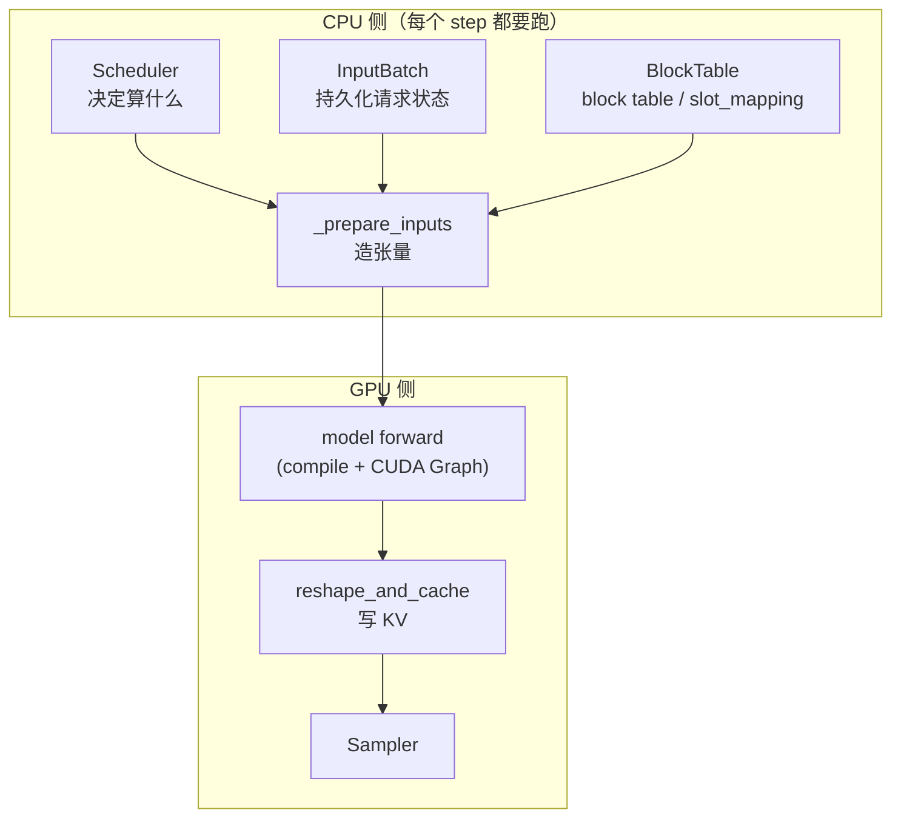

# 第 5 章 模型执行：ModelRunner 的一次 step

> 目标：能画出 `GPUModelRunner.execute_model()` 的骨架，理解为什么要有 `_prepare_inputs`、`slot_mapping`、`InputBatch` 这些东西。
> 这一章只讲骨架和设计意图；函数级的细节在进阶教程第 5 章。

## 5.1 什么在 ModelRunner 里，什么不在



关键认识：**`vllm/v1/core/` 里没有任何 GPU 代码，`ModelRunner` 是 CPU 与 GPU 的交界处**。
它的职责不是"跑模型"，而是**"把调度器的意图翻译成 GPU 张量，并把 GPU 结果翻译回调度器能理解的形式"**。

于是它的两个核心方法就是这对翻译：

| 方法 | 方向 | 输入 | 输出 |
| --- | --- | --- | --- |
| `execute_model` | CPU → GPU | `SchedulerOutput` | （异步）启动 forward |
| `sample_tokens` | GPU → CPU | grammar bitmask | `ModelRunnerOutput` |

## 5.2 `execute_model` 的骨架

`vllm/v1/worker/gpu_model_runner.py:4249`。下面按行号给出主干（行号可能漂移）：

```python
def execute_model(self, scheduler_output, intermediate_tensors=None):
    # ── ① 更新持久化状态：谁走了、谁来了、谁是第一次见 ──
4288    deferred_state_corrections_fn = self._update_states(scheduler_output)

    # ── ② 空 batch 提前返回，避免无谓的 forward ──
4298    if not num_scheduled_tokens:
4313        return EMPTY_MODEL_RUNNER_OUTPUT

    # ── ③ 准备这一步的全部张量（CPU 密集） ──
4330    logits_indices, spec_decode_metadata, max_num_sampled_tokens = \
            self._prepare_inputs(scheduler_output, num_scheduled_tokens_np)

    # ── ④ 决定用哪个 CUDA Graph / 要不要 pad / DP 对齐 ──
4344    cudagraph_mode, batch_desc, should_ubatch, num_tokens_across_dp, _ = \
            self._determine_batch_execution_and_padding(...)

    # ── ⑤ slot_mapping 与 attention metadata ──
4407    slot_mappings_by_group, slot_mappings = self._get_slot_mappings(...)
4417    attn_metadata, spec_decode_common_attn_metadata = \
            self._build_attention_metadata(...)

    # ── ⑥ 模型前向（被 set_forward_context 包裹） ──
4464    with set_forward_context(attn_metadata, ..., cudagraph_runtime_mode=...,
                                 batch_descriptor=batch_desc, slot_mapping=...):
4479        model_output = self._model_forward(...)

    # ── ⑦ 只对需要采样的行算 logits ──
4520    sample_hidden_states = hidden_states[logits_indices]
            logits = self.model.compute_logits(sample_hidden_states, ...)

    # ── ⑧ 把状态存起来，等 sample_tokens 用 ──
4545    self.execute_model_state = ExecuteModelState(...)
4553    deferred_state_corrections_fn()      # ← 注意：forward 启动之后才跑
4555    return None
```

### 三个值得记住的设计点

**① `_update_states` 返回一个"延迟修正函数"**

```python
def _update_states(self, scheduler_output) -> Callable | None:
    ...
    return deferred_state_corrections_fn     # 在 forward 启动之后才调用（4553）
```

在 **异步调度** 下，上一步采样出的 token 要到这一步才知道。vLLM 的做法是：先用乐观假设启动 forward，**等 GPU 开始跑之后**再修正 CPU 侧状态。这不是"顺手"的优化，而是异步调度的核心机制。

**② `return None` 是设计，不是疏漏**

`execute_model` 返回 `None`，真正的输出由 `sample_tokens` 给。`ExecuteModelState`（`gpu_model_runner.py:486`）是两者之间的传递载体。
这么拆的目的：**让引擎核心在"forward 已发出、采样未开始"这段时间里插入别的 CPU 工作**（算 grammar bitmask、处理 abort），并支持 `step_with_batch_queue`。代码在 `4249` 处有一条断言：

```python
if self.execute_model_state is not None:
    raise RuntimeError("State error: sample_tokens() must be called after execute_model() returns None.")
```

**③ 早期返回是一条性能路径，也是正确性要求**

```python
4311  if not has_kv_transfer_group():
4313      return EMPTY_MODEL_RUNNER_OUTPUT
```

没有 token 要算时直接返回，不跑 forward。但如果配了 KV connector，即使没有 token 也要"跑一步"（为空），否则 **DP 各 rank 的 collective 会对不上而挂死**。

## 5.3 `_prepare_inputs`：一步要造的 7 个张量

`gpu_model_runner.py:1975`。它返回 `(logits_indices, spec_decode_metadata, max_num_sampled_tokens)`，但副作用是造出了一堆张量。

### 第 0 步就很讲究：先把 block table 的拷贝发出去

```python
1993  # OPTIMIZATION: Start copying the block table first. This way, we can
      # overlap the copy with the following CPU operations.
      self.input_batch.block_table.commit_block_table(num_reqs)
```

`commit_block_table`（`block_table.py:231`）是一次 **H2D 拷贝**（把 CPU 上刚更新的 block id 数组推到 GPU）。
把它放在最前面，后面几十行 numpy 计算就能和这次拷贝**重叠**。这类"调整顺序换并行"的手法在 vLLM 里非常常见。

### 核心张量清单

| 张量 | 含义 | 怎么造 |
| --- | --- | --- |
| `input_ids` | 这一步每个 token 的 id，形状 `[num_tokens]` | numpy 算 index → `torch.index_select` 从 `token_ids_cpu_tensor` 里抓 |
| `positions` | 每个 token 在**它自己请求里**的位置 | `num_computed_tokens_cpu[req_indices] + query_pos` |
| `query_start_loc` | 每个请求的 token 区间起点（前缀和，长度 `batch+1`） | `_get_cumsum_and_arange` |
| `seq_lens` / `optimistic_seq_lens` | 每个请求的序列长度（含本步要算的） | 纯 CPU 加法 |
| `block_table` | `[batch, max_blocks]` 的物理块号表 | `BlockTable` 维护，H2D 拷贝 |
| `slot_mapping` | 每个 token 的 KV 写到哪个物理槽位 | Triton kernel，见 5.4 |
| `logits_indices` | 哪些行需要算 logits | 无投机时 `query_start_loc[1:] - 1` |

### 三个值得品味的小优化

**a) `positions` 在 CPU 上用 numpy 算**

为什么不用 GPU kernel？因为**调度器本来就知道 `num_computed_tokens`**，直接加就行；用 GPU 算还得先把数据传上去，反而多一次 H2D。

```python
2010  positions_np = num_computed_tokens_cpu[req_indices] + query_pos
```

**b) `torch.index_select` 比 `np.take` 快**

```python
2041  # 注释里明说：对大的张量 torch.index_select 比 np.take 快
      torch.index_select(self.input_batch.token_ids_cpu_tensor.flatten(), 0,
                         token_indices_tensor, out=self.input_ids.cpu[:total])
```

注意 `out=` 参数：**写进预分配的 pinned buffer**，不产生新分配。这是热路径的基本功。

**c) `query_start_loc` 的尾部要"单调不减"**

```python
2093  # [0, *cu_num_tokens]，尾部填 cu_num_tokens[-1]
```

为什么？因为 FlashAttention 的 kernel 假设 `query_start_loc` 单调（非递减）。pad 出去的位置如果填 0，会让 kernel 认为长度是负数。**这是个典型的"接口约定倒逼数据结构"的例子。**

### `logits_indices`：为什么只算一部分行的 logits

```python
# 无投机解码
logits_indices = query_start_loc[1:] - 1     # 每个请求的最后一个 token
```

chunked prefill 下，一个请求这一步可能算了 512 个 token，但**只有最后一个 token 需要采样**（前面的是 prompt，不算 logits）。`compute_logits` 是一个 `[num_sampled, hidden] × [vocab, hidden]ᵀ` 的大矩阵乘 —— **vocab 通常 10 万+，这是整步里最贵的算子之一**。只对需要的行算，直接省掉一个数量级。

> 💡 **性能视角**：`compute_logits` 的成本 ∝ **被采样的 token 数**，不是被调度的 token 数。
> 这也是为什么投机解码"验证 K 个草案 token"时成本可控 —— 它确实要把 K+1 行都算 logits，但分摊到 K+1 个 token 上就划算了。

## 5.4 `slot_mapping`：把逻辑 token 映射到物理槽位

这是理解 `reshape_and_cache` 的钥匙。

```text
slot_mapping[i] = block_table[req(i), pos(i) // block_size] * block_size
                  + pos(i) % block_size
```

即：**第 i 个待算 token 的 KV 应该写到"物理块号 × block_size + 块内偏移"这个扁平位置。**

计算它的 kernel 在 `vllm/v1/worker/block_table.py:397` `ComputeSlotMappingKernel`（Triton，AOT 预热）。两个设计点：

**① `do_not_specialize=["num_tokens", "max_num_tokens"]`**

Triton 默认会为不同的标量参数值重新编译。batch 大小每步都在变，如果不声明"这两个参数不做特化"，就会**每步都触发一次 JIT 编译**（或者至少走进慢路径）。这是 Triton 调优的常见坑。

**② grid 是 `num_reqs + 1`，最后那个 program 专门写 padding**

```python
# 最后一个 program 把 [num_tokens, max_num_tokens) 填成 PAD_ID（-1）
```

因为 CUDA Graph 要求固定形状，batch 会被 pad 到某个 capture size。pad 出来的位置必须让 `reshape_and_cache` 知道"别写"，所以填 `-1`。

**③ 消费端：`reshape_and_cache`**

`vllm/v1/attention/ops/triton_reshape_and_cache_flash.py:363`：

```python
slot = slot_mapping[token]
block_idx = slot // block_size
offset    = slot % block_size
key_cache[block_idx, :, offset, :] = key[token]      # 类似这样
```

**负的 `slot_mapping` = 不写**。这就是 padding 行的处理方式。

> ⚠️ **易错点**：`slot_mapping` 的语义是**扁平偏移**，不是块号。很多人第一次看会以为是"第几个块"。
> 另外，某些模型（Mamba/GDN）的 `slot_mapping_mode == NONE`（`block_table.py:52`）—— 它们的"块表"其实是 recurrent state 索引，没有 per-token 槽位。

## 5.5 `InputBatch`：为什么要有持久化 batch

`vllm/v1/worker/gpu_input_batch.py:92`。这个类存在的理由在 `_update_states` 的 docstring 里写得最直白：

```python
# The persistent batch optimization assumes that consecutive batches contain
# mostly the same requests. If batches have low request overlap (e.g.,
# alternating between two distinct sets of requests), this optimization
# becomes very inefficient.
```

也就是说：**vLLM 假设相邻两步的 batch 成员高度重合**，因此把所有状态**按 slot 预分配**，每步只做增量更新。

`InputBatch.__init__` 里预分配的东西（一旦分配，永不重新分配）：

| 类别 | 例子 | 备注 |
| --- | --- | --- |
| token 相关 | `token_ids_cpu_tensor` `(max_num_reqs, max_model_len)` | **不 pin**（因为从不直接拷贝到 GPU，pin 是浪费） |
| 计数相关 | `num_computed_tokens_cpu_tensor`、`num_prompt_tokens_cpu_tensor` | **pin + numpy view 双份**，同一块内存两种访问方式 |
| 采样参数 | `temperature` / `top_p` / `top_k` 张量 | 每个都有 pinned CPU 孪生 |
| 惩罚项 | frequency / presence / repetition penalties | 同上 |
| 成员集合 | `greedy_reqs` / `random_reqs` / `top_p_reqs` / `no_penalties` … | **关键设计，见下** |
| block table | `MultiGroupBlockTable` | 每 KV 组一张 |

### 成员集合：把"每步都检查"变成"提前算好"

```python
1117  @property
      def all_greedy(self) -> bool:
          return len(self.greedy_reqs) == 0 or ...   # 纯集合判断

1133  @property
      def no_penalties(self) -> bool:
          return (len(self.frequency_penalties_reqs) == 0
                  and len(self.presence_penalties_reqs) == 0
                  and len(self.repetition_penalties_reqs) == 0)
```

采样器就靠这些布尔量走**整张张量的快速路径**：如果 `no_penalties`，就完全不做惩罚项的 gather/scatter，省掉一次 `[num_reqs, vocab]` 级别的操作。

> 💡 **性能视角**：这是"**用 O(1) 的集合维护换掉 O(batch) 的逐请求判断**"。
> 加一个请求时顺手把它塞进对应的集合（`add_request`，`gpu_input_batch.py:350`）；采样时只看集合空不空。
> 同类思想还有 `all_random`、`no_top_p`、`no_top_k`、`max_num_logprobs`。

### `swap_states` 与 `condense`：行序管理

请求结束时它在 `InputBatch` 里的行会空出来。vLLM 不移动所有行（那要拷大量数据），而是：

- **`condense()`**（`:706`）：把非空行往上滑。有 `batch_update_builder` 记录"哪些行被删了"，所以能跳过没变化的常见情况（`711-715` 有 early-return）。
- **`swap_states(i1, i2)`**（`:584`）：交换两行。注意优化注释：**只拷贝活跃 token 前缀**（`num_tokens_no_spec + len(spec_token_ids)`），而不是整行 `max_model_len`。
- 行序变了之后，GPU 上上一轮的张量也要跟着重排 —— 这就是 `_compute_prev_positions`（`:1779`）的用途：建立"当前行 → 上一轮行"的映射（新行填 `-1`），用它去 gather 上一轮的 GPU 张量。

## 5.6 从 `SchedulerOutput` 到 `ModelRunnerOutput`

上行路径同样值得看。`_bookkeeping_sync`（`gpu_model_runner.py:3751`）是整个 step 里**唯一的 GPU→CPU 同步点**，所以它被精心设计成"只同步一次"：

- `discard_sampled_tokens_req_indices` 会把 chunked-prefill 行采样出来的 token **丢掉**（那不是真正的输出），并且把随机数发生器的 offset 往回退一格（`gen.set_offset(gen.get_offset() - 4)`）—— 保证随机流不被丢弃的采样扰动，从而保证**可复现性**。这个细节很微妙，但重要。
- 同步路径里只有一个 `gpu_sync_allowed()` 块包住 `_to_list(sampled_token_ids)`。
- **异步路径**（`3820-3840`）根本不 D2H：把采样结果留在 GPU 上的 `input_batch.prev_sampled_token_ids`，下一步的 `_prepare_input_ids` 直接在 GPU 上 scatter 使用。**省掉一次同步就等于省掉几十微秒。**

> 💡 **性能视角**：GPU 同步（`.item()` / `.cpu()` / `.tolist()`）会让 CPU 等 GPU，把流水线打断。
> 整个 `gpu_model_runner.py` 里到处是"避免同步"的注释和技巧（pinned buffer、`non_blocking=True`、分块拷贝、`prev_positions` gather）。
> **读这个文件时，凡是看到 `_cpu` / `_np` / `non_blocking` / `pinned` 字样，都值得停下来想想它在避免什么。**

一个具体的例子：M-RoPE 位置拷贝（`2217-2247`）**逐行拷贝**而不是一次 `copy_()`。原因是 `mrope_positions.gpu[row, :N]` 从 `[3, max+1]` 的分配里切出来是**跨步（strided）**的，一次拷贝会退化成走 pageable staging buffer，**让 `non_blocking=True` 悄悄变成同步**。为了保住非阻塞语义，宁愿多几次小拷贝。

## 5.7 本章小结

- `ModelRunner` 是 CPU/GPU 交界；`execute_model`（发起）与 `sample_tokens`（收尾）分开是为了插入 CPU 工作。
- `_prepare_inputs` 造出 7 类张量；第一件事是发起 block table 的 H2D 拷贝，后面用 CPU 计算掩盖它。
- `slot_mapping` = `物理块号 × block_size + 块内偏移`，pad 位填 `-1`。
- `logits_indices` 只挑需要采样的行 → `compute_logits` 成本 ∝ 采样 token 数而非调度 token 数。
- `InputBatch` 按 slot 预分配一切，用成员集合维护 fast path；`condense`/`swap_states` 管理行序，`prev_positions` 处理行序变化。
- 全步只有一次同步点；异步路径完全不 D2H。

⚠️ **易错点**
- 不要试图逐行读 `gpu_model_runner.py`（7700+ 行）。按 `record_function_or_nullcontext` 的字符串搜，能从 profiler 直接跳到对应代码块。
- `use_v2_model_runner` 时走的是 `vllm/v1/worker/gpu/` 下的 V2 实现，与本文件是两套代码，别混读。

📖 官方文档：`docs/design/model_runner_v2.md`（V2 ModelRunner）、`docs/design/cuda_graphs.md`

下一章 → [第 6 章 注意力后端与采样](06-注意力后端与采样.md)
