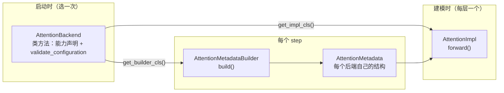
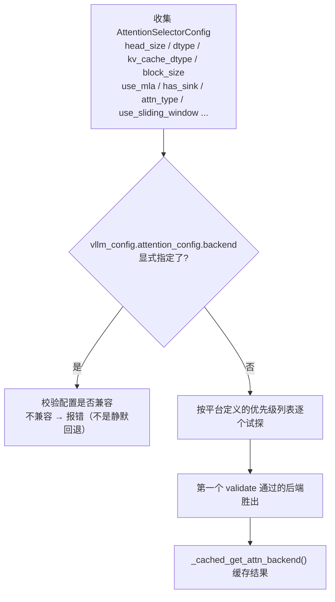

# 第 6 章 注意力后端与采样：选对 kernel

> 目标：知道 attention 后端是怎么选出来的、`AttentionBackend` 抽象层在管什么、采样为什么"看起来很简单却很讲究"。

## 6.1 为什么需要"注意力后端"这层抽象

注意力的实现方式在硬件、dtype、head 结构、是否稀疏等维度上组合爆炸：

- FlashAttention v2/v3/v4（不同 SM 架构各有最优版本）
- FlashInfer（含 XQA / trtllm-gen 等专用路径）
- Triton 纯手写实现（兼容性最好，性能中上）
- MLA 专用实现（DeepSeek 系，prefill 与 decode 要用**不同**的 kernel）
- Mamba / 线性注意力 / 短卷积（根本不是 softmax attention）
- ROCm / XPU / CPU 平台的各自实现

vLLM 的做法是定义一个**能力接口**，让上层不知道下面用的是谁。

## 6.2 三层接口：Backend / MetadataBuilder / Impl

`vllm/v1/attention/backend.py`：



### `AttentionBackend`：全是便宜的类方法

```python
class AttentionBackend(ABC):
    @classmethod
    def get_supported_kernel_block_sizes(cls) -> list[int | MultipleOf]: ...
    @classmethod
    def get_impl_cls(cls) -> type["AttentionImplBase"]: ...
    @classmethod
    def get_builder_cls(cls): ...
    @classmethod
    def supports_head_size(cls, head_size: int) -> bool: ...
    @classmethod
    def supports_kv_cache_dtype(cls, kv_cache_dtype) -> bool: ...
    @classmethod
    def supports_sliding_window(cls) -> bool: ...
    @classmethod
    def supports_non_causal(cls) -> bool: ...
    @classmethod
    def validate_configuration(cls, vllm_config, ...) -> list[str]: ...
```

**为什么全是 classmethod？** 因为**选择阶段不能实例化**。自动选择要在所有候选后端里逐个问"你能干这个活吗"，如果每个都要构造对象（可能还会分配显存），启动就废了。所以能力声明必须是纯类级别的、零副作用的。

`get_supported_kernel_block_sizes()` 返回 `MultipleOf(64)` 这类值（`MultipleOf` 在 `backend.py:52`）—— 表达"我支持 64 的倍数"。这让 vLLM 能在**不改后端**的前提下，把逻辑块大小和 kernel 块大小解耦（还记得 `map_to_kernel_blocks` 吗）。

`validate_configuration()` 返回一个**字符串列表**（不兼容原因），空列表表示可用。这比抛异常更适合"逐个候选试探"的场景。

### `CommonAttentionMetadata`：后端无关的 batch 描述

`backend.py:369`。这是 ModelRunner 造出来、所有后端共同消费的结构：

```python
query_start_loc / query_start_loc_cpu     # 每个请求的 token 区间
seq_lens                                  # 每个请求的序列长度
num_reqs / num_actual_tokens / max_query_len / max_seq_len
block_table_tensor                        # [batch, max_blocks]
slot_mapping                              # [num_tokens]
causal                                    # bool 或 tensor
```

**`max_query_len` 是 CUDA Graph 分派的关键**（还记得第 5 章 F1 的 `BatchDescriptor.uniform` 吗）：

- `max_query_len == 1` → 纯 decode；
- `max_query_len == 1 + num_spec_tokens` → 投机解码的 uniform decode；
- 否则 → prefill 或混合 batch。

**怎么用 `max_query_len` 控制"要不要跑 prefill kernel"？** 在捕获 CUDA Graph 时，vLLM 会显式设置期望的 `max_query_len`（uniform decode 设成 `1+K`，非 uniform 设成 `num_tokens`），这样底层 kernel 就会走到对应的分支，**录进图里的就是那条分支的 kernel**。（`docs/design/cuda_graphs.md` 的 "Full CUDA Graph capturing & warm-up" 一节）

### `AttentionMetadataBuilder`：每步一次，且尽量复用

```python
def build(self, common_prefix_len, common_attn_metadata, fast_build=False) -> M: ...
def update_block_table(self, metadata, blk_table, slot_mapping) -> None: ...
def build_for_cudagraph_capture(self, ...) -> M: ...
```

两个性能设计：

**① `update_block_table` 避免全量重建**

```python
# 注释：faster when there are multiple kv-cache groups that create
# virtually the same metadata but just with different block tables
```

多个 KV 组（比如混合模型里的 full attention 组 + sliding window 组）产出的 metadata 几乎一样，只有 block table 不同。这时不重建，直接换 block table。

**② 每个 KV 组只建一次，不是每层一次**

```python
for layer_name in attn_group.layer_names:
    attn_metadata[layer_name] = cm
```

一个 32 层模型如果只有一个 KV 组，metadata 只 build 一次，32 层共用同一个对象。

**③ padding 行必须指向 `NULL_BLOCK_ID`**

```python
blk_table.get_device_tensor(num_reqs_padded)   # 尾部填 NULL_BLOCK_ID
```

CUDA Graph 里所有形状是固定的，pad 出来的请求行如果携带垃圾 block 号，就会读到非法显存。**块 0 被保留作 padding 专用。**

## 6.3 后端怎么选出来：`selector.py`

`vllm/v1/attention/selector.py:102` `get_attn_backend`：



关键点：

- **选择旋钮是 `--attention-backend`（即 `AttentionConfig.backend`），不是环境变量。** 在较新的版本里 `VLLM_ATTENTION_BACKEND` 环境变量已经不再被读取 —— 如果你在网上看到它，那是旧文档。
- `_cached_get_attn_backend`（`selector.py:195`）带 `@cache`，并且委托给 `current_platform.get_attn_backend_cls(...)`。**平台拥有优先级列表**（CUDA 和 ROCm 的列表不同），见 `docs/design/attention_backends.md` 的自动生成表格。
- **显式指定时不做静默回退**。如果你指定了 `FLASHMLA` 但硬件不支持，会直接报错并说明原因。这是刻意的 fail-fast，避免"我明明配了 FA3 却在跑 FA2"这种性能事故。
- MLA 模型**prefill 和 decode 用不同后端**：decode 用 `-ac.backend`，prefill 用 `-ac.mla_prefill_backend`。这是 MLA 的特殊性 —— prefill 是 compute-bound 的常规 attention 形状，decode 是 memory-bound 的 absorbed-MQA 形状。

`get_attn_spec_kind()`（`selector.py:62`）先把 KV 规格分类成 `FULL_ATTENTION` / `SLIDING_WINDOW` / `MLA_ATTENTION` / `SLIDING_WINDOW_MLA`，因为同一模型里不同层可能要选不同后端（`attention_config.backend_per_kind` 支持按类覆盖）。

## 6.4 常见后端一览（CUDA）

| 后端 | 典型场景 | CUDA Graph 能力 |
| --- | --- | --- |
| `FLASH_ATTN` | 默认首选，FA2/FA3/FA4 按 SM 架构自动选 | `UNIFORM_BATCH`（实际支持 ALWAYS，为性能刻意降级） |
| `FLASHINFER` | 需要 XQA / trtllm-gen / 多种采样融合时 | `UNIFORM_SINGLE_TOKEN_DECODE`（Blackwell 上 TRTLLM 路径升到 `UNIFORM_BATCH`） |
| `TRITON_ATTN` | 兼容性兜底，所有平台都能跑 | `ALWAYS`（但 prefill/decode 是不同 kernel，所以偏好 PIECEWISE） |
| `FLEX_ATTENTION` | 需要任意 mask（研究/特殊结构） | `NEVER` |
| MLA 系列 | DeepSeek 系；prefill / decode 分开选 | `UNIFORM_BATCH` 或 `UNIFORM_SINGLE_TOKEN_DECODE` |
| `FLASH_ATTN` diffkv | K/V head_dim 不同（如某些 MQA 变体） | — |
| Mamba / linear attention | 混合 SSM 模型 | `UNIFORM_SINGLE_TOKEN_DECODE` |

`AttentionCGSupport`（`backend.py:567`）是排序过的枚举，取 min 就得到混合模型的整体能力：

```python
class AttentionCGSupport(enum.Enum):
    ALWAYS = 3              # 任意 batch 都能进图（含 prefill+decode 混合）
    UNIFORM_BATCH = 2       # 只有所有请求 query 长度相同时可以
    UNIFORM_SINGLE_TOKEN_DECODE = 1   # 只有纯 decode（query_len==1）可以
    NEVER = 0
```

> 💡 **性能视角**：这张表直接决定了 `cudagraph_mode` 能被"降级"到什么程度。
> 例如 `FULL` 模式遇到 `UNIFORM_BATCH` 的后端，会自动降级成 `FULL_AND_PIECEWISE`（prefill 走 piecewise，decode 走 full）。
> 相关代码：`GPUModelRunner._check_and_update_cudagraph_mode`。

## 6.5 两种重要的"省带宽"技巧

### ① Split-KV decode（两阶段）

`vllm/v1/attention/ops/triton_decode_attention.py`。decode 时 batch 里每个请求只有 1 个 query，但可能对着几万个 KV —— **并行度不足**（每个请求只有一个 query，SM 用不满）。

解法：把 KV 序列切成若干段，每段算出一个**部分结果 `(acc, lse)`**（stage 1），再用第二个 kernel 按 log-sum-exp 合并（stage 2，`_fwd_kernel_stage2`，位于 `:576`）。

```text
stage1: 每个 (req, kv_segment) 一个 program → (partial_acc, partial_lse)
stage2: 对每个 req 合并所有 segment 的 (acc, lse) → 最终输出
```

合并的数学原理是 softmax 的**结合律**：`softmax(a ∪ b)` 可以由 `softmax(a)` 和 `softmax(b)` 各自的 `(sum_exp, max)` 推出。实现在 `merge_attn_states.py:71`。

`vllm/v1/attention/ops/triton_unified_attention.py` 是更进一步的版本：**同一个 kernel 同时服务 prefill 和 decode**（"unified"），用内部分段 + `reduce_segments`（`:685`）代替独立的第二阶段。好处是混合 batch 不需要两次 launch + 合并。

### ② Cascade attention（共享前缀只读一次）

如果一个 batch 里所有请求共享一段很长的公共前缀（例如同一个 system prompt），朴素做法是**每个请求都把这段前缀的 KV 读一遍** —— 纯粹浪费带宽。

cascade attention 的做法：

1. 对公共前缀只做**一次** attention，得到 `(acc, lse)`；
2. 每个请求对自己的后缀做 attention，得到 `(acc_i, lse_i)`；
3. 用 `merge_attn_states` 合并。

实现：`vllm/v1/attention/ops/prefix_prefill.py`（`context_attention_fwd`，`:777`）+ `merge_attn_states.py`。

调度侧要提供 `num_common_prefix_blocks`（`SchedulerOutput` 的字段之一），ModelRunner 侧由 `_compute_cascade_attn_prefix_lens`（`gpu_model_runner.py:2656`）计算。

> ⚠️ **注意**：cascade attention **不兼容 CUDA Graph**。使用它的 batch 会被强制分派到 `PIECEWISE` 模式（或 `NONE`）。见 `_determine_batch_execution_and_padding` 里的 `invalid_modes={FULL}`。

## 6.6 采样：看起来最简，实际最讲究

`vllm/v1/sample/sampler.py:21` 的类 docstring 直接给出了 9 步流水线，**建议原文读一遍**。核心是步骤顺序有硬性约束：

```text
1. logprobs（如果需要）
2. logits → float32
3. allowed token ids 白名单
4. bad words
5. 非 argmax-invariant 的 logits processors（min_tokens、logit_bias）
6. penalties
7. sample()
8. 收集 top-max_num_logprobs 与采样到的 token 的 logprobs
9. 返回
```

**为什么第 5 步必须在 greedy 决策之前？** 因为 `min_tokens` 和 `logit_bias` **会改变 argmax**。而温度缩放、top-k/top-p 不会改变 argmax（greedy 结果与它们无关）。

于是采样器把处理器分成两类：

```python
logitsprocs.argmax_invariant      # 可以先做 greedy 决策
# 非 invariant 的必须先把 logits 改完
```

而 `sample()`（`:244`）的快速路径就建立在这个分类上：

```python
if all_random:
    greedy_sampled = None                  # 根本不用算 argmax
else:
    greedy_sampled = greedy_sample(logits)
    if all_greedy:
        return ...                         # ★ 直接返回：不做温度、不做 top-k/p
    logits = apply_temperature(logits, ...)
    logits = self.apply_logits_processors(logits, ..., argmax_invariant=True)
    random_sampled = self.topk_topp_sampler(logits, ...)
    sampled = torch.where(temperature < _SAMPLING_EPS, greedy_sampled, random_sampled,
                          out=greedy_sampled)     # ← out= 复用张量
```

> 💡 **性能视角**：**全 greedy 的 batch 是最快的采样路径** —— 一次 argmax 就结束。
> 这也是为什么压测时常用 `temperature=0`：它既让结果可复现，又让采样成本降到最低。
> 反过来，混合了不同 temperature 的 batch 必须走通用路径。如果业务允许，**统一采样参数能让整批走快路径**。

`all_greedy` / `all_random` / `no_penalties` 这些布尔量都来自第 5 章的 `InputBatch` 成员集合。

### `TopKTopPSampler` 的实现选择在构造时就定好

`vllm/v1/sample/ops/topk_topp_sampler.py:77`，`__init__` 里直接**绑定 `self.forward`**：

- `forward_cuda`：用 FlashInfer 的融合采样 kernel（不支持 per-request generator 时回退）；
- `forward_hip`：AITER；
- `forward_xpu`：XPU kernel；
- `forward_native`：纯 PyTorch（`apply_top_k_top_p` + `softmax` + 多项式采样）。

**为什么在构造时绑定而不是每次调用判断？** 因为每个 decode step 都会调它，一次分支判断在 1 秒几百步的量级下就是实打实的 CPU 时间。**"把这个判断移出热路径"是 vLLM 的常见手法。**

### 随机数：可复现性的代价

`random_sample`（`:450`）支持两种模式：`gumbel`（快，用指数噪声 + argmax 实现多项式采样）和 fp64 gumbel（更精确）。
per-request 的 `torch.Generator` 只在 `SamplingType.RANDOM_SEED` 时创建 —— **因为 generator 会强制回退到非 FlashInfer 路径**。

> ⚠️ **易错点**：设置 `seed` 会让采样变慢（失去融合 kernel）。压测时不要用 `seed`。
> 另外 attention 本身在 batch 不同的情况下可能有浮点误差，vLLM 提供 `VLLM_BATCH_INVARIANT=1` 来强制 batch 不变性（性能有代价）。

## 6.7 本章小结

- 三层接口：`AttentionBackend`（选择期，全类方法、零副作用）/ `AttentionMetadataBuilder`（每步一次，尽量复用）/ `AttentionImpl`（每层一个）。
- `CommonAttentionMetadata.max_query_len` 决定 kernel 分支，也决定能不能进 CUDA Graph。
- 后端选择看 `--attention-backend`；平台拥有优先级列表；显式指定后不静默回退。
- `AttentionCGSupport` 排序枚举 + 取 min = 混合模型的能力，决定 `cudagraph_mode` 的降级。
- Split-KV 提升 decode 并行度；cascade attention 让公共前缀只读一次（但不兼容 full graph）。
- 采样：处理器按 argmax-invariant 分类；全 greedy 是最快路径；实现路径在构造时绑定。

⚠️ **易错点**
- 网上大量资料提到 `VLLM_ATTENTION_BACKEND` 环境变量，在当前版本应改用 `--attention-backend`。
- `--enforce-eager` 会禁用 CUDA Graph，测出的吞吐比生产低不少；不要在 eager 模式下做容量规划。

📖 官方文档：`docs/design/attention_backends.md`（含自动生成的支持矩阵）

下一章 → [第 7 章 并行与分布式](07-并行与分布式.md)
