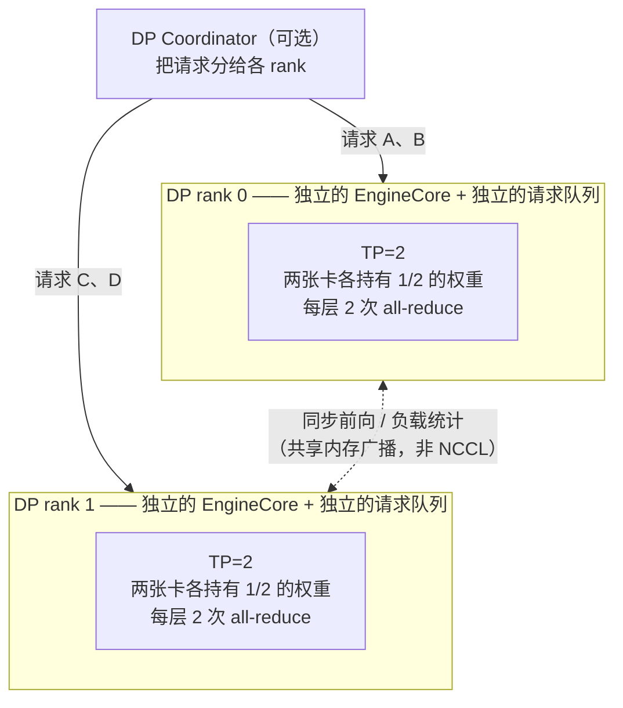

# 第 7 章 并行与分布式：TP / PP / DP / EP 怎么拼

> 目标：分清四种并行的职责与代价，知道每种并行"切"的是什么、"通信"发生在哪里。

## 7.1 四种并行，切的东西不同

| 并行 | 切什么 | 通信模式 | 主要目的 |
| --- | --- | --- | --- |
| **TP**（张量并行） | 每层的权重矩阵 | 每层两次 all-reduce（或 all-gather + reduce-scatter） | 放下大模型 / 降低单卡显存与算力压力 |
| **PP**（流水线并行） | 层（前 N 层在卡 0，后 M 层在卡 1） | 只在 stage 边界传 activation | 跨节点（NVLink 带宽不够时） |
| **DP**（数据并行） | 请求（每个 rank 一套完整权重） | 只在需要时同步（如 MoE 的 DP attention） | 提高吞吐（近似线性） |
| **EP**（专家并行） | MoE 的专家 | all-to-all 分发 token | MoE 模型（专家数量 >> GPU 数） |

这四者可以组合。总 GPU 数 = `TP × PP × DP`，再加额外的 `decode_context_parallel_size`、`prefill_context_parallel_size` 等维度。



**关键区别**：TP 组内的卡"共同服务同一批请求"；DP 组之间"各自服务不同的请求"，只在需要同步时通信。

进程映射关系（`ParallelConfig.data_parallel_rank` 相关逻辑）：每个 Engine Core 拥有一个 **TP×PP 的连续 GPU 切片**。`Worker.init_device` 里 `local_rank += dp_local_rank * tp_pp_world_size` 这一行就是在算这个偏移。

## 7.2 `GroupCoordinator`：通信的统一入口

`vllm/distributed/parallel_state.py:411`。它是所有集合通信的**唯一入口**，把"用哪个通信库"这件事封装起来。

```python
class GroupCoordinator:
    def all_reduce(self, input_): ...
    def all_gather(self, input_, dim=-1): ...
    def reduce_scatter(self, input_, dim=-1): ...
    def broadcast(self, input_, src=0): ...
    def send(self, tensor, dst) / recv(...): ...
    def send_object / recv_object / isend_object: ...        # 传 Python 对象
    def broadcast_tensor_dict / send_tensor_dict / recv_tensor_dict / isend_tensor_dict: ...
    def graph_capture(self, graph_capture_context=None): ...  # ★ CUDA Graph 兼容
```

### 为什么要有 `all_reduce` 的"用户入口"和"_out_place"实现之分

```python
def all_reduce(self, input_):
    """
    User-facing all-reduce function before we actually call the all-reduce.
    We need this because Dynamo does not support passing an arbitrary object
    (`self` in this case) to a custom op. ... In addition, PyTorch custom ops
    do not support mutation or returning a new tensor in the same op. So we
    always make the all-reduce operation out-of-place.
    """
    if self.world_size == 1:
        return input_                                  # ★ 单卡直接短路
    if self.use_custom_op_call:
        return torch.ops.vllm.all_reduce(input_, group_name=self.unique_name)
    else:
        return self._all_reduce_out_place(input_)
```

三个要点：

1. **`world_size == 1` 时直接返回**，不做任何通信。这是最常见的部署形态（单卡），短路掉所有框架开销。
2. **通过字符串 `group_name` 查表**，而不是传 `self`。因为 `torch.compile`（Dynamo）不支持把任意 Python 对象传给自定义算子。
3. **注册成自定义算子 `torch.ops.vllm.all_reduce`**，这样它才能被 inductor 识别为一个"不透明但可融合"的节点 —— 这是 `fuse_allreduce_rms` 这类融合 pass 能工作的前提。

### `graph_capture`：CUDA Graph 里的集合通信

```python
def graph_capture(self, graph_capture_context=None):
    ...
```

CUDA Graph 捕获时，集合通信必须使用**图兼容的通信库**（NCCL 需要在 capture 模式下初始化，custom all-reduce 要预热好缓冲区），并且**不能有动态分配**。
这就是 `AttentionCGSupport` 里 `NEVER` 的后端也常常能进 PIECEWISE 图（因为 attention 被切出去了）的原因，但 TP 的 all-reduce 留在了图里。

## 7.3 通信后端的选择顺序

这是 vLLM 性能调优里最容易被忽略的一块。all-reduce 的实现在 `vllm/distributed/device_communicators/`：

| 实现 | 文件 | 什么时候用 | 特点 |
| --- | --- | --- | --- |
| **Custom AllReduce** | `custom_all_reduce.py` | 单机、TP ≤ 8、张量够大 | 用 NVLink/P2P 自己实现 one-shot / two-shot all-reduce，比 NCCL 快，**但只支持小规模** |
| **Quick AllReduce** | `quick_all_reduce.py` | 特定配置 | 另一种自研实现 |
| **PyNccl** | `pynccl.py` | 通用兜底 | vLLM 自己加载 NCCL，可控性强 |
| **FlashInfer AllReduce** | `flashinfer_all_reduce.py` | TRT-LLM 风格融合 | `VLLM_FLASHINFER_ALLREDUCE_BACKEND` |
| **SymmMem** | `symm_mem.py` | 对称内存（NVLink SHARP 类） | `VLLM_ALLREDUCE_USE_SYMM_MEM`（默认开） |
| **PyTorch distributed** | — | 最后兜底 | 兼容性最好 |

选择逻辑在 `cuda_communicator.py`。可以整体禁用自研实现：`--disable-custom-all-reduce`（`ParallelConfig.disable_custom_all_reduce`）。

> 💡 **性能视角（重点）**：
> 自研 all-reduce 在 TP=2/4/8 单机场景下比 NCCL 快，是因为它知道**张量的确切大小和拓扑**，可以用 one-shot（一次 NVLink 环形交换）或 two-shot 算法，少一次 kernel launch。
> **代价是泛用性**：跨节点、TP 很大、或张量形状怪异时会回退。
> 判断方法：启动日志里会打印实际选中的 all-reduce 实现。**如果看到 fallback 到 NCCL，值得查一下为什么**（常见原因：跨 NVLink 域、`disable_custom_all_reduce=True`、或者启动时握手失败）。

### DP 的同步

`shm_broadcast.py` 提供**共享内存广播**（single-writer multi-reader），用于 DP 之间同步"这一步要不要执行"、以及广播采样结果给所有 rank。
这个设计避免了对 NCCL 的依赖（`ParallelConfig.disable_nccl_for_dp_synchronization`），因为 DP 同步的内容只是几个标量/小张量，用共享内存比 NCCL 便宜得多。

> 💡 **性能视角**：DP 之间的前向必须**步调一致**（否则 MoE 的 all-to-all 会挂），但 vLLM 不想为此付出 NCCL 的启动开销。
> 共享内存广播 + sentinel 机制（`vllm/v1/worker/sentinel/`）就是干这个的。

## 7.4 EP 与 MoE：为什么需要 all-to-all

MoE 层里，每个 token 只激活 top-k 个专家。如果专家分散在不同 GPU 上：

```text
1. 每个 GPU 算出本地 token 要发给哪些专家（gate 的结果）
2. all-to-all：把 token 发给持有对应专家的 GPU
3. 各 GPU 本地做专家计算
4. all-to-all：把结果发回来
```

`vllm/distributed/device_communicators/all2all.py` 提供多种实现，由 `--all2all-backend`（`ParallelConfig.all2all_backend`）选择：朴素 all-to-all、DeepEP 风格、FlashInfer 的 all-to-all 等。

> 💡 **性能视角**：MoE 的 all-to-all 是**延迟敏感**的（每层一次，层数很多）。
> 专家放置策略（`expert_placement_strategy`）直接影响通信量；`enable_eplb`（Expert Parallel Load Balancer）会**在线统计专家负载并重新放置专家**，防止热点专家打满某张卡。
> 相关代码：`GPUModelRunner.eplb_step`（`gpu_model_runner.py:3466`）。

## 7.5 PP 的代价：bubble 与 micro-batch

PP 把模型按层切分。朴素实现下，卡 0 算完才能给卡 1，卡 1 算完给卡 2…… 中间大量空闲，这就是 **pipeline bubble**。

缓解手段是 micro-batch（把 batch 切成若干份流水起来）。vLLM 在 `vllm/v1/worker/` 里有 PP 相关的协调逻辑（如 `_pp_broadcast_prev_sampled_token_ids`），并结合异步调度减少 bubble。

`AsyncIntermediateTensors`（`gpu_worker.py:143`）是个有意思的细节：PP 传 activation 时，如果通信还没完成，就返回一个"惰性张量"，**让后续计算的重叠成为可能** —— `wait_for_comm`（`:157`）在真正访问数据时才等。

> ⚠️ **易错点**：PP 与异步调度、CUDA Graph、投机解码都有复杂的交互（例如调度器里 `current_step < request.next_decode_eligible_step` 的 PP 门控）。
> **初学者不要一上手就配 PP**；先用 TP 把模型放下。

## 7.6 DBO / ubatching：更激进的 CPU-GPU 重叠

`ParallelConfig.enable_dbo` + `ubatch_size`，实现见 `vllm/v1/worker/ubatching.py`、`ubatch_utils.py`、`gpu_ubatch_wrapper.py`。

思路：把一个 batch 切成两个 micro-batch（ubatch），**让一个 ubatch 的 CPU 准备工作与另一个 ubatch 的 GPU 执行重叠**，形成两级流水。

相关阈值：

```python
dbo_decode_token_threshold: int = 32      # decode 超过这么多 token 才启用
dbo_prefill_token_threshold: int = 512    # prefill 超过这么多 token 才启用
```

留意调度器里对 DBO 的配合：
- `cascade_attn_prefix_lens` 在 `use_ubatching` 时被禁用（cascade attention 与 ubatch 的元数据假设冲突）；
- `_get_slot_mappings` 会**按 ubatch 切片**返回列表。

官方文档 `docs/design/dbo.md` 是这块的专门材料。

## 7.7 DP 的负载均衡

`DP > 1` 时，请求要分发到哪个 DP rank？

- **外部 LB**（`data_parallel_external_lb`）：用户自己在外面做负载均衡（例如 k8s service 轮询）。
- **内部 LB**（默认）：`DPCoordinator` 进程（`vllm/v1/engine/coordinator.py:146` `DPCoordinatorProc`）收集各 rank 的 `SchedulerStats`，按"队列长度 + KV 使用率"等指标分发。

各 rank 定期发布自己的负载：

```python
# vllm/v1/engine/core.py:1424  _maybe_publish_request_counts
if counts != self.last_counts:
    self.last_counts = counts
    stats = SchedulerStats(*counts, kv_cache_usage=self.scheduler.get_kv_cache_usage())
    self.output_queue.put_nowait((-1, EngineCoreOutputs(scheduler_stats=stats)))
```

`-1` 是"虚拟请求 id"，表示这是元数据而非真实请求输出。

> 💡 **性能视角**：DP 的负载均衡质量直接决定整体吞吐 —— 木桶效应明显。
> 一个 rank 排长队而另一个空闲，是 DP 部署最常见的性能问题。
> 观测方式：`vllm/v1/metrics/` 里的 per-engine 指标（`PerEngineStatLoggerAdapter`）。

## 7.8 `-tp` 还是 `-dp`？一个实用判断

| 场景 | 建议 |
| --- | --- |
| 模型放得下单卡 | `TP=1`（无通信） |
| 模型放不下单卡，单机内 | `TP=2/4/8`（NVLink 快，自研 all-reduce 生效） |
| 模型放不下单机 | `TP=8` + `PP=跨机`（PP 通信量小，适合走以太网） |
| 模型放得下，要提吞吐 | `DP=N`（每 rank 一套权重，吞吐近线性，无 TP 通信） |
| MoE 大模型 | `TP` + `EP`（`--enable-expert-parallel`） |
| 想同时要吞吐和低延迟 | `DP` + `--api-server-count` 多开 |

> 💡 **性能视角（重要）**：**TP 会引入每层两次 all-reduce，是延迟（而非吞吐）的敌人。**
> 在 decode 阶段（memory-bound，算得很快），all-reduce 的延迟占比很高。
> 所以"**能 DP 就 DP，不能才 TP**"是常见的经验法则 —— 但 DP 要求权重放得下单卡。

## 7.9 本章小结

- 四种并行切的东西不同：TP 切权重、PP 切层、DP 切请求、EP 切专家。总卡数 = TP×PP×DP。
- `GroupCoordinator` 是通信唯一入口；`world_size==1` 短路；通过 `torch.ops.vllm.*` 自定义算子接入 torch.compile。
- all-reduce 有自研实现（custom/quick/symm-mem）、PyNccl、FlashInfer 多条路径，单机小 TP 时自研更快；回退到 NCCL 值得排查。
- DP 同步走共享内存广播而非 NCCL。
- MoE 的 all-to-all 延迟敏感，EPLB 在线再平衡专家。
- PP 有 bubble；DBO/ubatching 用 micro-batch 做 CPU-GPU 两级重叠。
- "能 DP 就 DP，不能才 TP"。

⚠️ **易错点**
- `-tp` 与 `-dp` 的乘积必须等于卡数（`TP × PP × DP = N`），再加其他并行维度时要小心。
- 自研 all-reduce 只在单机内、TP 规模小时更快；跨机时反而可能更慢。

📖 官方文档：`docs/design/dbo.md`、`docs/design/fused_moe_modular_kernel.md`、`docs/design/moe_kernel_features.md`

下一章 → [第 8 章 服务化与可观测性](08-服务化与可观测性.md)
