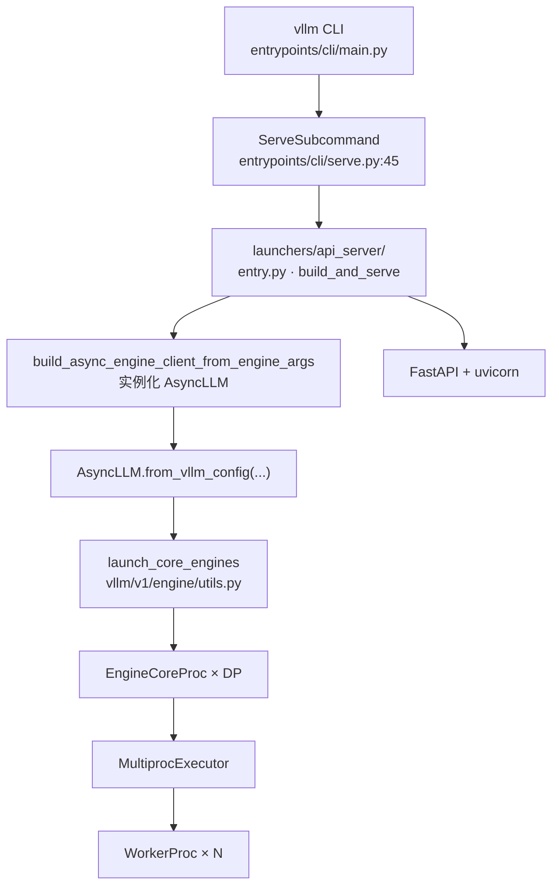
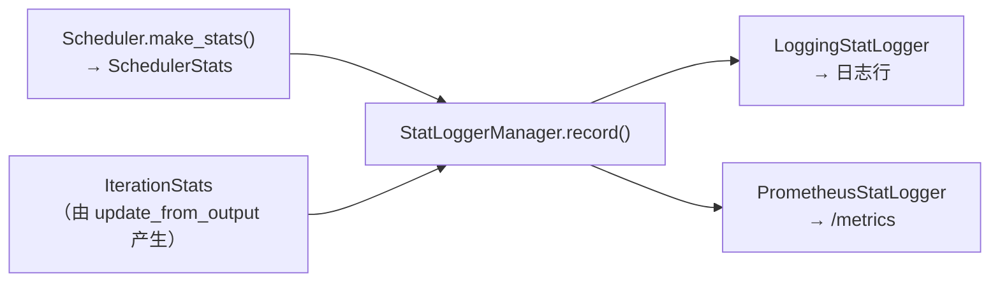

# 第 8 章 服务化与可观测性：从 vllm serve 到指标

> 目标：知道在线服务的进程布局、每个指标怎么来的、以及"怎么测才算数"。

## 8.1 启动链路

```bash
vllm serve Qwen/Qwen3-0.6B --max-model-len 4096
```



> ⚠️ **易错点**：`vllm/entrypoints/openai/api_server.py` 在当前版本只是一个**废弃的 shim**（几十行，带 `DeprecationWarning` 后 re-export）。
> 真正的实现已经拆到 `vllm/entrypoints/launchers/api_server/`（`entry.py` / `app_state.py` / `routers.py`）和 `vllm/entrypoints/openai/{chat_completion,completion,models}/serving.py`。
> 网上大量博客还在引用旧路径，读的时候要留意版本。

## 8.2 请求怎么被接住

OpenAI 兼容层的类是 `OpenAIServingChat`（`vllm/entrypoints/openai/chat_completion/serving.py:116`）等，它们最终都调用同一个引擎客户端 `AsyncLLM`。

`AsyncLLM` 的两个核心：

**① `add_request`**（`vllm/v1/engine/async_llm.py:~281`）：把 prompt 处理成 `EngineCoreRequest` 后，通过 `engine_core.add_request` 投递（`EngineCoreClient`，可能是 `InprocClient` 或 `AsyncMPClient`），并返回一个 `RequestOutputCollector` 供该请求消费输出。

**② `_run_output_handler`**（`async_llm.py:666`）：一个独立的后台 task，循环 `await engine_core.get_output_async()`，把输出分发到各个请求的流。

```python
async def output_handler():
    while True:
        outputs = await engine_core.get_output_async()
        ...
        engine_core_outputs = outputs.outputs
        for start in range(0, num_outputs, chunk_size):        # ★ 分块处理
            end = start + chunk_size
            outputs_slice = engine_core_outputs[start:end]
            processed_outputs = output_processor.process_outputs(
                outputs_slice, outputs.timestamp, iteration_stats)
```

**为什么要按 `chunk_size` 分块？**（`VLLM_V1_OUTPUT_PROC_CHUNK_SIZE`）

因为 `process_outputs` 是纯 Python 同步代码（detokenize、拼 `RequestOutput`），如果一次处理 1000 个请求的输出，会**长时间占住 asyncio 事件循环**，导致所有 HTTP 连接的读写都被卡住。分块让事件循环能在块之间调度其他协程。

> 💡 **性能视角**：这是 asyncio 服务的经典陷阱 —— **同步 CPU 工作是事件循环的天敌**。
> vLLM 的其他缓解手段还有：`--api-server-count` 多开进程、多模态加载用独立线程池（`VLLM_MEDIA_LOADING_THREAD_COUNT`）、`renderer_num_workers` 多进程渲染。
> 如果你观察到"高 QPS 下 TTFT 抖动但 GPU 利用率不高"，先怀疑 API Server 进程的 CPU 饱和。

## 8.3 指标：全链路

指标出现在三个位置：**Engine Core（调度统计）**、**Worker（执行统计）**、**API Server（请求统计）**，最后由 `StatLoggerManager` 汇总输出。



关键类型（`vllm/v1/metrics/stats.py`）：

| 类型 | 字段（性能相关） |
| --- | --- |
| `SchedulerStats` | `num_running_reqs`、`num_waiting_reqs`、`num_skipped_waiting_reqs`、`kv_cache_usage`、`prefix_cache_stats`、`spec_decoding_stats`、`cudagraph_stats` |
| `IterationStats` | `time_to_first_tokens_iter`（TTFT）、`inter_token_latencies_iter`（ITL）、`num_preempted_reqs`、`num_generation_tokens` |
| `FinishedRequestStats` | `queued_time`、`prefill_time`、`inference_time`、`decode_time`、`mean_time_per_output_token`、`num_cached_tokens` |
| `PrefixCacheStats` | `requests` / `queries` / `hits`，以及抢占相关的 `preempted_requests` / `preempted_queries` / `preempted_hits` |
| `SpecDecodingStats` | `num_accepted_tokens`、**`num_accepted_tokens_per_pos`**（第 k 个草稿位置的接受率曲线） |
| `PerfStats` | `num_flops_per_gpu`、`num_read_bytes_per_gpu`、`num_write_bytes_per_gpu`（roofline 分析用） |

### TTFT 与 ITL 到底怎么算的

`IterationStats.update_from_output`（`stats.py:455`）：

```python
# prefill 阶段
first_token_latency = iteration_timestamp - req_stats.arrival_time    # ← 含排队时间！
# decode 阶段
itl = engine_core_timestamp - req_stats.last_token_ts
```

**注意 TTFT 是从 `arrival_time` 起算的**，也就是**包含了排队时间**。这一点非常重要：

- 你看到的 TTFT ↑ 可能是 GPU 慢，也可能是**请求太多在排队**。
- 区分方法：看 `FinishedRequestStats.queued_time`（`update_from_events` 处理 `EngineCoreEventType.QUEUED` / `SCHEDULED` 事件得到）。**`queued_time` 大 = 排队问题；`prefill_time` 大 = 计算问题。**

> 💡 **性能视角**：这是排障时第一个要做的分流。
> `TTFT 高 + queued_time 占比高` → 加实例 / 减 `max_num_seqs` / 看 `Waiting` 队列。
> `TTFT 高 + prefill_time 高` → chunked prefill 切得太碎 / 模型或量化有问题 / 该用投机解码。

### 指标输出在哪里

- **日志**：`LoggingStatLogger`（`loggers.py:99`），间隔由 `VLLM_LOG_STATS_INTERVAL` 控制。
- **Prometheus**：`PrometheusStatLogger`（`loggers.py:443`），默认 `/metrics` 端点。
- **DP 聚合**：`AggregatedLoggingStatLogger`（`loggers.py:332`）把所有 engine 的数字加起来；Prometheus 则是单 logger + N 个 label（`engine_idx`）。
- **多 API Server 时**：`client_count > 1` 会禁用部分 stats 日志，避免数字不完整误导。

> ⚠️ **易错点**：DP > 1 时，单看日志里的 `Running/Waiting` 是**所有 rank 之和**。某个 rank 排队严重而总体看起来正常是常见的坑 —— 用 per-engine 指标（`PerEngineStatLoggerAdapter`）看。

## 8.4 怎么测才算数：benchmark 三件套

`vllm bench` 的子命令（`vllm/entrypoints/cli/benchmark/`）：

| 子命令 | 用途 | 关键输出 |
| --- | --- | --- |
| `vllm bench serve` | 端到端压测（对已启动的服务发请求） | TTFT / TPOT / ITL 分位数、吞吐、goodput |
| `vllm bench latency` | 单 batch 延迟微基准 | 固定 batch 下的延迟 |
| `vllm bench throughput` | 离线最大吞吐 | tokens/s |
| `vllm bench sweep` | 自动扫参数组合 | 对比表 |
| `vllm bench startup` | 冷启动时间分解 | 各阶段耗时 |
| `vllm bench mm-processor` | 多模态预处理性能 | — |

### 压测必守的几条规矩

1. **显式给 `max_tokens`**。否则会被填成 `max_model_len - prompt_len`，输出长度失控，结果无法解释。
2. **控制输入/输出长度分布**。固定 `--random-input-len` / `--random-output-len` 才可比较。真实场景用 `--dataset-name sharegpt` 或 speed-bench。
3. **请求速率要扫**。用 `--request-rate` 从低到高扫，找到"吞吐饱和点"（继续加 QPS，吞吐不涨而 TTFT 暴涨）。
4. **注意 prefix caching 会让结果虚高**。压测如果反复用同一 prompt，命中率接近 100%，测的是缓存不是计算。要 `--enable-prefix-caching` 关掉（或换不同 prompt）。
5. **预热**。首次请求会触发编译/图捕获，必须丢弃前若干次。
6. **`--enforce-eager` 的结果不能代表生产**。

> 💡 **性能视角**：报性能数字时必须写清六个量：**模型、硬件、TP/DP 配置、输入/输出长度分布、并发或请求速率、是否开 prefix caching / 是否 eager**。少任何一个，数字都不可复现。

## 8.5 Profiling：找出时间花在哪

**配置方式在当前版本已经改为 `--profiler-config`（`ProfilerConfig`），不再有 `VLLM_TORCH_PROFILER_DIR` 环境变量。**

```bash
vllm serve Qwen/Qwen3-0.6B \
  --profiler-config '{"profiler": "torch", "torch_profiler_dir": "/tmp/vllm_profile"}'
```

主要字段（`vllm/config/profiler.py`）：

| 字段 | 含义 |
| --- | --- |
| `profiler` | `"torch"` 或 `"proton"` |
| `torch_profiler_dir` | trace 输出目录 |
| `torch_profiler_record_shapes` | 记录张量形状（定位形状特化问题时有用） |
| `detailed_trace_annotation` | **按 roofline 模型给每个请求打 context/generation 标注** |
| `wait_iterations` / `warmup_iterations` / `active_iterations` | 对应 `torch.profiler.schedule(wait, warmup, active, repeat)` |
| `delay_iterations` / `max_iterations` | 起止控制 |

生成的 trace 用 <https://ui.perfetto.dev/> 打开。

### 用 profiler 回答的三个典型问题

1. **GPU 是忙是闲？** 看 timeline 上是否有大片空隙。有空隙 = CPU 没喂饱 GPU（找 `_prepare_inputs`、detokenize、调度）。
2. **attention 占比多少？** 在 decode 阶段，理想情况下 attention + LM head 是主要开销。如果某个融合 pass 没生效，能看到明显多出来的小 kernel。
3. **每层的 CUDA 时间表**：`vllm/profiler/layerwise_profile.py` 的 `LayerwiseProfileResults` 能把 kineto trace 聚合成"每层耗时表"，并可导出 CSV（`export_model_stats_table_csv`）。**看哪一层异常贵，是定位融合失效最快的办法。**

### 另外两条轻量路径

- **`record_function_or_nullcontext("...")`**：vLLM 在热路径上埋了大量带名字的区间。在 trace 里直接按名字搜，就能定位到代码位置。
- **`--compilation-config '{"debug_dump_path": "..."}'`**：dump 编译产物，看融合是否按预期发生。

## 8.6 本章小结

- 启动链路：CLI → `launchers/api_server` → `AsyncLLM` → `launch_core_engines` → EngineCore + Workers。
- 旧路径 `entrypoints/openai/api_server.py` 已是 shim。
- 输出处理在后台 task 里**分块**执行，避免阻塞 asyncio 事件循环。
- 指标三来源（Scheduler / Worker / API Server），TTFT **含排队时间**；排障第一步是分流"排队 vs 计算"。
- `vllm bench` 有 6 个子命令；压测有六条必须交代的配置。
- Profiler 用 `--profiler-config` 配置；`layerwise_profile` 能给每层耗时表。

⚠️ **易错点**
- `RequestOutput` 里的 `metrics` 字段（`FinishedRequestStats`）才是"这个请求经历了什么"的权威数据，比聚合日志更有诊断价值。
- `num_preempted_reqs` 持续 > 0 基本等价于"显存不够，正在重复计算"。这是最贵的一种浪费。

📖 官方文档：`docs/design/metrics.md`（指标定义与实现细节）

下一章 → [第 9 章 性能优化速查表](09-性能优化速查表.md)
