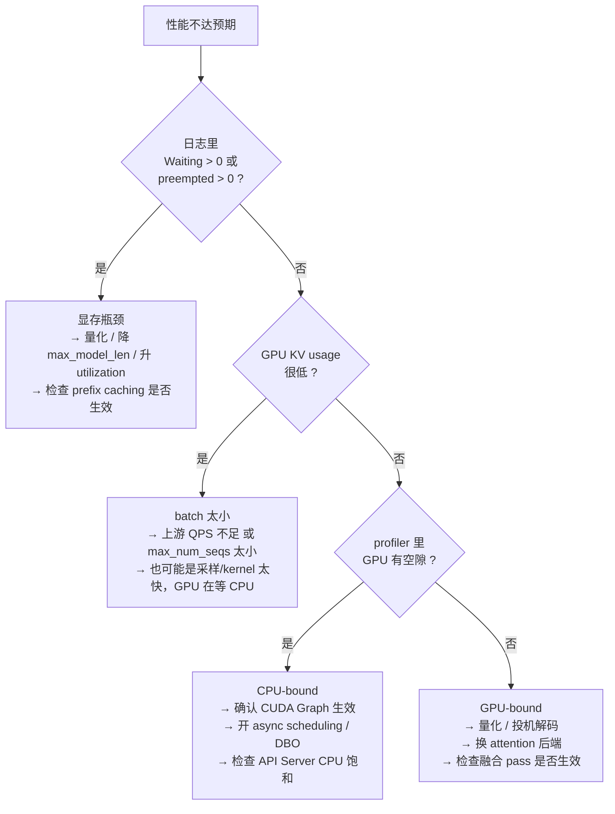

# 第 9 章 性能优化速查表

> 目标：把前八章的知识压缩成"调什么 → 影响什么 → 代价是什么"的对照表，以及一张排障决策树。

## 9.1 先建立"时间都花在哪"的心智模型

一个 decode step 的耗时可以拆成四段：

```text
step 耗时 = max( CPU 准备时间 , GPU 执行时间 ) + 同步开销
           ├─ CPU 准备：调度 + _prepare_inputs + 采样的 CPU 部分 + detokenize + 网络
           └─ GPU 执行：kernel launch + attention + GEMM/MoE + LM head + 采样 kernel
```

**两个 regime：**

| Regime | 特征 | 瓶颈 | 优化方向 |
| --- | --- | --- | --- |
| **GPU-bound** | GPU 利用率高（>80%），batch 大 | 显存带宽（decode）/ 算力（prefill） | 量化、投机解码、更大 batch、MoE kernel |
| **CPU-bound** | GPU 有空隙，launch 之间的 gap 明显 | Python 调度、张量准备、kernel launch | CUDA Graph、torch.compile、异步调度、DBO |

> 💡 **判断方法**：用 profiler 看 timeline 上 GPU 之间有没有空隙。
> **有大量空隙 → 你在优化 CPU 路径**（CUDA Graph、减少同步、ubatching）。
> **GPU 连续满载 → 你在优化 GPU 路径**（量化、更好的 kernel、投机解码）。

## 9.2 优化开关总表

### 显存与并发（决定吞吐上限）

| 开关 | 默认 | 作用 | 代价/风险 |
| --- | --- | --- | --- |
| `--gpu-memory-utilization` | 0.92 | **线性决定 KV block 数 = 并发上限** | >0.95 有 OOM 风险 |
| `--kv-cache-memory-bytes` | 无 | 直接指定 KV 字节数，替代 utilization | 需要自己算准 |
| `--num-gpu-blocks-override` | 无 | 硬覆盖 block 数 | 压测固定条件用 |
| `--max-model-len` | 模型原生 | 决定单请求最大 KV 占用 | 调小 → 同显存能装更多并发 |
| `--max-num-seqs` | 按设备 | batch 里最大请求数 | 调大 → 可能触发抢占（重算） |
| `--enable-prefix-caching` | **已开** | 复用相同前缀的 KV | 哈希开销；压测时结果虚高 |
| `--kv-offloading-size` | 无 | KV 分层到 CPU | 只在前缀命中率高时划算 |
| `--block-size` | 16 | 分页粒度 | **不要随便改**；受后端约束 |

### 调度（决定 prefill/decode 的平衡）

| 开关 | 默认 | 作用 | 代价/风险 |
| --- | --- | --- | --- |
| `--max-num-batched-tokens` | 按模型 | **一步最多算多少 token** | 调大：TTFT↓ 但 ITL↑（抖动） |
| `--long-prefill-token-threshold` | 0（关） | 长 prefill 主动切块 | TTFT↑ 换 decode 稳定 |
| `--enable-chunked-prefill` | **已开** | 长 prompt 分块 | **几乎不要关** |
| `--scheduling-policy` | `fcfs` | `priority` 让重要请求插队 | 优先级队列维护成本略高 |
| `--async-scheduling` | 自动 | 调度不等采样，CPU 超前跑 | 输出延迟↑，`max_model_len` 需预留 |

### 计算图与编译

| 开关 | 默认 | 作用 | 代价/风险 |
| --- | --- | --- | --- |
| `-O0` | | 全关：无编译、无图、无融合 | **启动最快，性能最低** |
| `-O1` | | PIECEWISE 图 + 基础融合 | 启动快，性能中 |
| `-O2` | **默认** | FULL_AND_PIECEWISE + 更多融合 | 启动最慢，性能最好 |
| `-O3` | | 目前等同 O2 | — |
| `--compilation-config.cudagraph_mode` | `FULL_AND_PIECEWISE` | `NONE`/`PIECEWISE`/`FULL`/`FULL_DECODE_ONLY` | 受 attention 后端能力限制（会被降级） |
| `--enforce-eager` | off | 禁编译禁图 | **调试用，测性能别用** |
| `--compilation-config.pass_config.fuse_allreduce_rms` | O2 开 | allreduce 融进 RMSNorm | 需要 TP>1 才有意义 |

### 并行

| 开关 | 作用 | 代价/风险 |
| --- | --- | --- |
| `-tp N` | 切权重，放下大模型 | **每层两次 all-reduce，伤延迟** |
| `-pp N` | 切层，跨机扩展 | pipeline bubble；与异步调度/投机解码交互复杂 |
| `-dp N` | 切请求，吞吐近线性 | 每 rank 一份权重（显存需求 ×N） |
| `--enable-expert-parallel` | MoE 专家切分 | all-to-all 延迟敏感 |
| `--enable-eplb` | 在线再平衡专家 | 统计与迁移开销 |
| `--enable-dbo --ubatch-size 2` | micro-batch 做两级重叠 | 实现复杂，收益依赖负载 |
| `--disable-custom-all-reduce` | 退回 NCCL | **通常更慢**，只在握手失败时用 |

### 算法层面（收益最大）

| 手段 | 典型收益 | 前提 |
| --- | --- | --- |
| **量化**（FP8/AWQ/GPTQ-Marlin） | 显存减半 → 并发翻倍；decode 带宽减半 | 精度可接受；kernel 支持 |
| **投机解码**（EAGLE/MTP/n-gram） | decode 延迟降 1.5~3×（视接受率） | 有草稿模型/支持 MTP；额外显存 |
| **Prefix caching** | 重复前缀场景 prefill 直接归零 | prompt 有共享前缀 |
| **更好的 attention 后端** | 换 FlashInfer/FA3 常有明显差距 | SM 架构支持 |
| **更好的 MoE kernel** | DeepGEMM/CUTLASS/TRT-LLM 差异很大 | 硬件 + 量化格式匹配 |

## 9.3 两种优化目标，两套打法

### 目标 A：最大化吞吐（离线批处理、批量生成）

```text
优先级：
1. 让 batch 尽可能大 → gpu_memory_utilization 拉到 0.95、max_num_seqs 拉高
2. 显存不够就量化（FP8/AWQ），把权重省下来的显存全给 KV
3. 保持 -O2（图 + 融合）
4. 确认没有抢占（num_preempted_reqs == 0）
5. TP 尽量小（DP 优先）—— TP 的 all-reduce 是纯粹的额外开销
6. prefix caching 打开（离线任务常有共享 system prompt）
```

### 目标 B：最小化延迟（在线交互、实时应用）

```text
优先级：
1. 降低单步耗时 → CUDA Graph 必须生效（PIECEWISE 或 FULL）
2. 投机解码（接受率高时收益最直接）
3. 减小 max_num_batched_tokens，避免大 prefill 拖慢 decode
4. long_prefill_token_threshold 设为几百，主动切块
5. 考虑 P/D 分离（prefill 和 decode 用不同实例）
6. TP 要小心：TP=2/4 的 all-reduce 在 decode 上占比可能到 20%+
```

> 💡 **性能视角（核心权衡）**：**吞吐和延迟在这个系统里是直接对立的**。
> batch 越大 → GPU 越满 → 吞吐越高，但每个 token 的到达时间越晚（ITL 越差）。
> `max_num_batched_tokens` 就是这个权衡的主旋钮。**不要问"怎么同时优化两者"，要问"我的 SLA 是什么"**。

## 9.4 排障决策树



### 五个最常见的"其实不是性能问题"

1. **`--enforce-eager` 忘关** → 性能腰斩。
2. **`-O0`/`-O1`** → 图没生效。
3. **压测用了同一 prompt** → prefix caching 让数字虚高，换个 prompt 就崩。
4. **`max_tokens` 没设** → 输出超长，吞吐指标无意义。
5. **没预热** → 前几次请求包含编译/图捕获时间。

## 9.5 优化级别的具体内容

来自 `docs/design/optimization_levels.md`：

| 级别 | cudagraph_mode | mode | 融合 |
| --- | --- | --- | --- |
| `-O0` | `NONE` | `NONE`（`custom_ops=["none"]`） | 全关 |
| `-O1` | `PIECEWISE` | `VLLM_COMPILE` | `fuse_norm_quant`、`fuse_act_quant` |
| `-O2`（默认） | `FULL_AND_PIECEWISE` | `VLLM_COMPILE` | + `fuse_allreduce_rms`、`fuse_rope_kvcache`（ROCm） |
| `-O3` | 同 O2 | 同 O2 | 同 O2（预留） |

**用户显式设置的 flag 优先于级别默认值**（"User-set flags take precedence over optimization level defaults"）。

> 💡 **性能视角**：`-O1` 是**开发期的好选择** —— 启动快（几十秒 vs 几分钟），但 CUDA Graph 和编译都在，不会掩盖"代码破坏了图捕获"这类问题。
> `-O0` 只适合调试逻辑正确性。

## 9.6 融合 pass 在优化什么

`vllm/compilation/passes/fusion/` 下的 pass，按"省了什么"分类：

| Pass | 融合内容 | 省了什么 |
| --- | --- | --- |
| `add_rms_fusion` | residual add + RMSNorm | 一次显存往返 + 一次 kernel launch |
| `allreduce_rms_fusion` | allreduce + RMSNorm | **一次显存往返 + 一次 launch（TP 场景收益大）** |
| `act_quant_fusion` | 激活 + 量化 | 一次 kernel |
| `rms_quant_fusion` | RMSNorm + 量化 | 一次 kernel |
| `rope_kvcache_fusion` | RoPE + KV cache 写入 | 一次 kernel + 一次显存读 |
| `qk_norm_rope_fusion` | QK norm + RoPE | 一次 kernel |
| `collective_fusion` | 多个小 collective 合成一个 | launch 次数（小张量时收益明显） |
| `sequence_parallelism` | allreduce → reduce-scatter + all-gather | 通信量减半（但需要全图，与 piecewise 互斥） |

**为什么"融合"这么值钱？** 因为在 decode 这种 memory-bound 的场景，**每个 elementwise kernel 都是"读一遍、算一下、写一遍"，算力几乎没用上，带宽全被浪费**。把三个 kernel 融成一个，显存读写从 3 读 3 写变成 1 读 1 写。

> ⚠️ **注意**：`sequence_parallelism` 和 `attn_quant_fusion` **需要看到整张图**，所以与 piecewise 编译互斥。启用它们会自动把 `splitting_ops` 设为 `[]`（不切图），代价是失去 piecewise CUDA Graph。这是 `docs/design/cuda_graphs.md` 里明确说的"confusing performance tradeoffs"。

## 9.7 一张"症状 → 检查项"表

| 症状 | 首先检查 |
| --- | --- |
| 吞吐远低于预期 | `--enforce-eager`？`-O` 级别？prefix caching 是否让数字虚高？ |
| TTFT 高、ITL 正常 | 排队（看 `queued_time`）；prompt 太长；chunked prefill 切太碎 |
| ITL 高、TTFT 正常 | `max_num_batched_tokens` 太大；有抢占；GPU-bound |
| 吞吐抖动大 | 抢占（`num_preempted_reqs`）；调度策略；上游请求分布不均 |
| 显存 OOM | `gpu_memory_utilization`；`max_model_len`；KV dtype；CUDA Graph 显存 |
| 启动太慢 | `-O1`/`-O0`；`VLLM_USE_PRECOMPILED`；编译缓存 `VLLM_CACHE_ROOT` |
| GPU 利用率忽高忽低 | CPU-bound：API Server 饱和 / 采样 CPU 开销 / 同步过多 |
| TP 扩展没有收益 | all-reduce 走了 NCCL？batch 太小？通信量 > 计算量？ |
| 投机解码没提速 | 看 `num_accepted_tokens_per_pos` 曲线；接受率 <40% 通常不值 |

## 9.8 本章小结

- 先判断 GPU-bound 还是 CPU-bound，两条路径的优化手段完全不同。
- 显存开关决定并发上限；调度开关决定 prefill/decode 平衡；编译开关决定 CPU 开销；并行开关决定规模。
- 算法级手段（量化、投机解码、prefix caching）的收益通常大于调参。
- 吞吐与延迟直接对立，先明确 SLA。
- `-O1` 是开发期甜点，`-O2` 是生产默认。
- 融合的价值来自 memory-bound 场景下的显存读写削减。

⚠️ **易错点**
- 优化前先**建立基线**并记录下来。没有基线的优化是猜测。
- 一次只改一个变量。

下一章 → [第 10 章 动手实验](10-动手实验.md)
