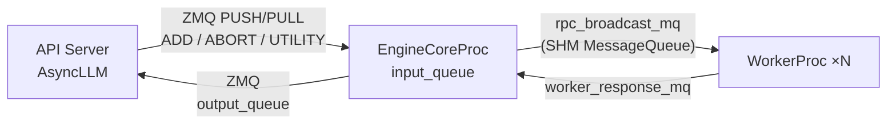

# 第 1 章 进程模型与通信栈

> **本章回答**：请求进入引擎后，跨了哪些进程边界？每次跨边界付多少代价？vLLM 用什么手段把这笔钱省下来？
> 涉及文件：`vllm/v1/engine/{core,core_client,utils,coordinator}.py`、`vllm/v1/executor/`、`vllm/distributed/device_communicators/shm_broadcast.py`

## 1.1 三种客户端形态

`EngineCoreClient.make_client`（`vllm/v1/engine/core_client.py:90`）根据配置决定引擎核心跑在哪里：

| 实现 | 何时使用 | 通信方式 | 每次请求的额外开销 |
| --- | --- | --- | --- |
| `InprocClient`（`:306`） | 离线 `LLM` + `VLLM_ENABLE_V1_MULTIPROCESSING=0` | **直接函数调用** | 0 |
| `MPClient`（`:503`） | 默认（含离线与在线） | ZMQ（输入队列）+ `MessageQueue`（输出队列） | 1 次序列化 + 1 次 IPC |
| `AsyncMPClient` | 在线服务 | 同 MPClient，但封装成 async | 同上 + asyncio 调度 |
| `DPLBAsyncMPClient` | DP > 1 的内部负载均衡 | 通过 DP Coordinator 转发 | 同上 + 一跳 |

`InprocClient` 是最省事也最省的：

```python
class InprocClient(EngineCoreClient):
    def __init__(self, *args, **kwargs):
        self.engine_core = EngineCore(*args, **kwargs)
    def get_output(self) -> EngineCoreOutputs:
        return self.engine_core.step()          # 直接调用，无 IPC
```

> 💡 **性能视角**：`InprocClient` 省掉了每次 step 的 IPC 往返，**单批次离线推理用它更快**。
> 代价是：调度和 GPU 执行在同一个 Python 进程里，**GIL 会让它们互相等待**（除非 execute 是异步 future）。
> 这就是为什么 `VLLM_ENABLE_V1_MULTIPROCESSING` 默认是 1（开启多进程）：吞吐场景下分离更划算。

## 1.2 EngineCore 的 busy loop

`vllm/v1/engine/core.py:1411`：

```python
@fault_tolerant_wrapper
def run_busy_loop(self):
    """Core busy loop of the EngineCore."""
    while self._handle_shutdown():
        # 1) Poll the input queue until there is work to do.
        self._process_input_queue()
        self._maybe_publish_request_counts()
        # 2) Step the engine core and return the outputs.
        self._process_engine_step()
        self._maybe_publish_request_counts()
    raise SystemExit
```

### `_process_input_queue`：把"等"做得很便宜

```python
def _process_input_queue(self):
    waited = False
    while not self.has_work() and self.is_running():
        self._notify_idle_state_callbacks()
        if self.input_queue.empty():
            with self.aborts_queue.mutex:
                self.aborts_queue.queue.clear()      # 顺手清空 abort 队列
        block = self.process_input_queue_block          # ← 关键开关
        try:
            req = self.input_queue.get(block=block)
            self._handle_client_request(*req)
        except queue.Empty:
            break
        if not block:
            break
    # 把剩下的请求全部抽干（不等）
    while not self.input_queue.empty():
        req = self.input_queue.get_nowait()
        self._handle_client_request(*req)
```

三个要点：

1. **`process_input_queue_block`**：如果上一步 GPU 还在忙，这里用非阻塞（`block=False`）挤一点时间做别的事；闲下来时用阻塞等，避免忙轮询烧 CPU。
2. **`_notify_idle_state_callbacks`**：空闲时通知等待者（例如测试代码等待引擎 idle）。
3. **abort 队列被清空**：因为所有 abort 也走 `input_queue`，`aborts_queue` 只是"快速通道"，重复的条目直接丢弃即可。

### `_process_engine_step`

```python
def _process_engine_step(self) -> bool:
    outputs, model_executed = self.step_fn()
    for output in outputs.items() if outputs else ():
        self.output_queue.put_nowait(output)
    self.post_step(model_executed)
    if not model_executed and self.scheduler.has_requests():
        time.sleep(0.001)          # ★ 让出 GIL
    return model_executed
```

`time.sleep(0.001)` 看着随意，其实是必要的：当没有模型执行但有调度工作时（例如等待远端 KV 传输），如果不让出 GIL，后台传输线程就没机会推进。**这是"纯 Python 并发"的典型妥协。**

### `step_fn` 的两种形态

- 普通：`EngineCore.step`（`:597`）
- batch queue：`EngineCore.step_with_batch_queue`（`:638`）

后者在 `vllm_config.scheduler_config.async_scheduling` 或显式开启 batch queue 时使用。它的核心思想（代码注释原文）：

```text
1. Try to schedule a new batch if the batch queue is not full.
   If a new batch is scheduled, directly return an empty engine core output.
   In other words, fulfilling the batch queue has a higher priority than
   getting model outputs.
2. If there is no new scheduled batch, ... block until the first batch in the
   job queue is finished.
3. Update the scheduler from the output.
```

`batch_queue` 是一个 `deque[(future, scheduler_output, exec_future)]`，`batch_queue_size` 控制深度。

> 💡 **性能视角（核心权衡）**：batch queue 让 CPU 可以**连续提交 N 个 step**而不等 GPU，把 GPU 的 idle gap 填满。
> 代价是**输出延迟增加 N 个 step**（结果要排队出）。
> 所以它适合"吞吐优先"的场景；而 `max_num_scheduled_tokens` 这个独立预算存在的意义，就是提前预留 N 步的 token 额度（否则会算到 `max_model_len` 之外）。

## 1.3 通信底座：ZMQ + 共享内存消息队列



两个通道，两种取舍：

| 通道 | 实现 | 为什么这样选 |
| --- | --- | --- |
| API Server ↔ EngineCore | ZMQ（`zmq.asyncio`） | 跨进程/跨机、异步友好、消息边界清晰 |
| EngineCore ↔ Worker | **共享内存 `MessageQueue`** | 每步都要广播 `SchedulerOutput`，序列化/拷贝成本必须压到最低 |

`MessageQueue`（`vllm/distributed/device_communicators/shm_broadcast.py`）：

```python
MessageQueue(writer_count, reader_count, max_chunk_bytes, connect_ip)
# 方法：create_from_handle / export_handle / enqueue / dequeue(indefinite=) / wait_until_ready
```

它是一个**环形缓冲区 + 共享内存**的广播队列：一个 writer 写一次，N 个 reader 各自读。这正是"一次 enqueue 广播到所有 worker"的实现方式 —— **不需要序列化 N 次、也不需要 N 次系统调用**。

`MultiprocExecutor._init_executor`（`multiproc_executor.py:118`）里的关键一段：

```python
# 只有 node_rank_within_dp == 0 的 leader 节点创建 MQ 并 export_handle
rpc_broadcast_mq = MessageQueue(world_size, local_world_size,
                                max_chunk_bytes=VLLM_MQ_MAX_CHUNK_BYTES_MB * 1024 * 1024)
handle = rpc_broadcast_mq.export_handle()
```

跨节点时 handle 通过 torch.distributed 传播，远端节点用 `create_from_handle` 挂到同一块共享内存（这要求节点内共享内存，跨节点靠 `create_mq_broadcaster`/`create_single_reader_mq_broadcasters` 转发）。

> 💡 **性能视角**：`VLLM_MQ_MAX_CHUNK_BYTES_MB` 决定了能一次广播多大的 `SchedulerOutput`。
> 如果 batch 很大导致 `SchedulerOutput` 超过这个值，会走**分片传输**（多次 enqueue），每步的 IPC 次数上升。
> 这也是为什么 `SchedulerOutput` 要尽量小（记得第 3 章的"只传 diff"吗？）。

## 1.4 Executor 与 WorkerProc

### `Executor.get_class`：唯一的执行器选择点

`vllm/v1/executor/abstract.py:49`：

| 配置 | 执行器 | 特点 |
| --- | --- | --- |
| `"mp"`（默认） | `MultiprocExecutor` | 多进程 + SHM MQ，**无 Ray 开销** |
| `"uni"` | `UniProcExecutor` | 单进程直调 worker |
| `"ray"` | `RayExecutorV2`（新）或 `RayDistributedExecutor`（旧） | 跨机调度、弹性 |
| `"external_launcher"` | `ExecutorWithExternalLauncher` | 由外部启动器（如 torchrun/MPI）提供 rank 信息 |

`RayExecutorV2`（`ray_executor_v2.py:237`）值得注意：它**继承 `MultiprocExecutor`**，只把"起进程"换成"起 Ray actor"，**保住了共享内存 MQ 的数据通路**。
旧的 `RayDistributedExecutor` 走 Ray object store / Compiled DAG，数据通路更重。所以新部署应优先 `VLLM_USE_RAY_V2_EXECUTOR_BACKEND`。

### `collective_rpc`：一次广播，N 个并发执行

`MultiprocExecutor.collective_rpc`（`multiproc_executor.py:375`）：

```python
# ① 方法可以是字符串（走 getattr）或可调用对象（cloudpickle 序列化）
send_method = method if isinstance(method, str) else cloudpickle.dumps(method)
# ② 一次 enqueue，所有 worker 都会收到
rpc_broadcast_mq.enqueue((send_method, args, kwargs, output_rank))
# ③ 只有 output_rank 需要回传
response_mqs = self.response_mqs if output_rank is None else [self.response_mqs[output_rank]]
def get_response():
    for mq in response_mqs:
        status, data = mq.dequeue(timeout=timeout)
        ...
    return aggregate(...)
future = FutureWrapper(get_response, aggregate)
return future if non_block else future.result()
```

三个性能设计：

1. **`unique_reply_rank=self.output_rank`**：`execute_model` 只从**一个** worker 收结果（`_get_output_rank`，`:541`）。因为采样结果在 TP 下是所有 rank 一致的（或只在最后一个 PP stage 产生），让 N 个 worker 都回传纯属浪费。
2. **`non_block=True`**：返回 `FutureWrapper` 而不是阻塞。EngineCore 因此可以在 GPU 忙的时候算 grammar bitmask。
3. **`FutureWrapper`**（`:78`）把"取响应"和"聚合"拆成两个闭包。

### `WorkerProc`：worker 进程的样子

`WorkerProc.__init__`（`multiproc_executor.py:640`）的流程：

```python
self.worker = WorkerWrapperBase(rpc_rank=local_rank, global_rank=rank)
all_kwargs = [{}] * local_world_size
all_kwargs[local_rank] = {...}          # ★ 只填自己那一份
worker.init_device()
worker.load_model()
if scheduler_config.async_scheduling:
    start async_output_copy_thread      # ★ 异步拷贝线程
current_platform.update_block_size_for_backend(vllm_config)
_init_message_queues(input_shm_handle, vllm_config)
enable_envs_cache()                      # ★ 之后读 env 走缓存
```

`all_kwargs[local_rank] = {...}` 这个约定很 vLLM：**所有 worker 看到同一份"参数列表"，各自只取自己那一份**。这避免了在主进程里为每个 worker 单独构造一份参数（也算一种省内存/省序列化的手法）。

**`async_output_copy_thread`**（`async_output_busy_loop`，`:1011`）里有一行值得注意的代码：

```python
current_platform.set_device(self.worker.device)     # 注释：线程不继承 CUDA context
```

注释解释了原因：Python 线程不会继承 CUDA context。如果不显式设置 device，在这个后台线程里做任何 CUDA 操作都会**在 device 0 上隐式创建 context，白吃一份显存**。这是个很容易踩的坑。

**`enable_envs_cache()`**：此后 `envs.VLLM_*` 的读取走内存缓存而不是 `os.getenv`。热路径上每步可能读几十次环境变量，系统调用开销不可忽略。

### Worker 侧的主循环

```python
def worker_busy_loop(self):
    while True:
        self._execute_worker_rpc(self.rpc_broadcast_mq.dequeue(indefinite=True))

def _execute_worker_rpc(self, ...):
    method, args, kwargs, output_rank = ...
    if isinstance(method, str):
        func = getattr(self.worker, method)
    else:
        func = partial(cloudpickle.loads(method), self.worker)
    output = func(*args, **kwargs)
    if output_rank is None or self.rank == output_rank:      # 只有 output_rank 回传
        self.enqueue_output(output)
```

**worker 就是个死循环收 RPC 的进程**。它的"智能"全在 `Worker`/`ModelRunner` 里。

## 1.5 TP/PP/DP 的通信分组

`vllm/distributed/parallel_state.py:1888` `initialize_model_parallel` 是整个分布式拓扑的建立点。取组的全局函数：

```python
get_world_group()    # 全局
get_tp_group()       # 张量并行
get_pp_group()       # 流水线并行
get_dp_group()       # 数据并行
get_ep_group()       # 专家并行
get_dcp_group()      # decode context parallel
get_pcp_group()      # prefill context parallel
get_eplb_group()     # 专家负载均衡
```

`GroupCoordinator`（`:411`）为每个组维护两个 process group：

```python
device_group = torch.distributed.new_group(ranks, backend=torch_distributed_backend)
cpu_group    = torch.distributed.new_group(ranks, backend="gloo")     # 用于协调 + NCCL bootstrap
```

**为什么要一个 gloo 组？** 因为 `PyNcclCommunicator` 的初始化需要一个能传小控制消息、且不依赖 CUDA 的通道（NCCL 自己不能 bootstrap 自己）。这是分布式框架的通用套路。

### `graph_capture`：让集合通信能进 CUDA Graph

```python
@contextmanager
def graph_capture(self, graph_capture_context=None):
    # 取 CA comm 的 capture context、ROCm 的 aiter AR context
    ...
    stream.wait_stream(curr_stream)
    with torch.cuda.stream(stream), maybe_ca_context, maybe_aiter_context:
        yield
```

**为什么必须有这个 contextmanager？** CUDA Graph 捕获时：

1. all-reduce 的通信 buffer 必须在**同一个 stream** 上分配和使用，否则 replay 时会读到错误的地址；
2. custom all-reduce 需要预先"录制"自己的 kernel；
3. 一些通信库不允许在 capture 期间做动态分配。

所以 `graph_capture` 做的就是把"进入可捕获状态"这件事显式化。

### `_should_use_all_gather`：换一种通信省一轮

`parallel_state.py:1034`：

```python
def _should_use_all_gather(self, key, numel, all_gather_group, all_gather_tensors) -> bool:
    if all_gather_group is None:
        return False
    use_all_gather = numel % all_gather_group.world_size == 0
    if all_gather_tensors is not None:
        use_all_gather = all_gather_tensors.get(key, use_all_gather)
    return use_all_gather
```

PP 传 activation 时，默认是 `broadcast`（rank 0 发给其他所有人）。但**如果张量能被 world_size 整除**，可以改用 `all_gather` —— 让每个 rank 都算一部分再汇聚，省掉"一个 rank 算、其他人等"的空闲。
这是 `broadcast_tensor_dict`（`:952`）里的一个自动优化。

> 💡 **性能视角**：这类"根据张量形状自动选通信原语"的优化，是分布式框架里性价比最高的一类改动 —— 不需要用户改配置，也不改变语义。

## 1.6 DP Coordinator：负载均衡与同步前向

`vllm/v1/engine/coordinator.py:146` `DPCoordinatorProc`。它做两件事：

1. **负载均衡**：收集所有 DP rank 的 `SchedulerStats`，决定新请求发给谁。
2. **同步前向（synchronized forward）**：MoE 模型在 DP 下，各 rank 必须**同步进入前向**，否则 expert 的 all-to-all 会挂。它通过"wave"机制让所有 rank 对齐（`_send_start_wave`，`:460`）。

各 rank 发布自己的负载：

```python
# EngineCore._maybe_publish_request_counts (:1424)
if counts != self.last_counts:
    self.last_counts = counts
    stats = SchedulerStats(*counts, kv_cache_usage=self.scheduler.get_kv_cache_usage())
    self.output_queue.put_nowait((-1, EngineCoreOutputs(scheduler_stats=stats)))
```

`-1` 是"虚拟请求 id"，表示这是元数据而不是某个请求的输出。

> 💡 **性能视角**：DP 的负载均衡质量是**木桶效应**最明显的环节。
> 一个 rank 排队、另一个空闲时，整体吞吐受损而单看某个 rank 的指标却"正常"。
> 排查时用 `PerEngineStatLoggerAdapter` 看 per-engine 指标，不要只看聚合日志。

### 环境差异：fork 特有的弹性扩展

⚠️ **本仓库特有**：`EngineCore` 里有 `_eep_scale_up_before_kv_init`（`:1012`）、`_eep_send_engine_core_notification`（`:1015`），以及 `vllm/v1/engine/utils.py` 里的 `CoreEngineActorManager.scale_up_elastic_ep` / `scale_down_elastic_ep`。
这是**弹性专家并行（elastic EP）** 的在线扩缩容支持，不是上游 vLLM 的标准特性。读到这些代码时请意识到它属于实验性扩展。

## 1.7 本章小结

| 机制 | 省了什么 | 代价 |
| --- | --- | --- |
| `InprocClient` | 全部 IPC | GIL 竞争 |
| SHM `MessageQueue` | 序列化与拷贝 | 依赖共享内存（节点内） |
| `non_block` + `FutureWrapper` | GPU 等待时间 | 代码复杂度 |
| batch queue | CPU/GPU 重叠 | 输出延迟 N 步 |
| `unique_reply_rank` | N-1 次回传 | 依赖"结果在所有 rank 一致" |
| gloo 组 + `graph_capture` | 让通信进图 | 额外的初始化 |
| `enable_envs_cache` | 系统调用 | 运行时改 env 不生效 |
| DP Coordinator | 负载均衡 + MoE 同步 | 单点，需容错 |

⚠️ **易错点**
- 关闭多进程（`VLLM_ENABLE_V1_MULTIPROCESSING=0`）后，某些在线特性不可用，且 `MPClient` 相关代码路径全部不走。
- worker 侧后台线程必须显式 `set_device`，否则隐式 context 会吃显存 —— 自己写插件时的常见 bug。

下一章 → [第 2 章 输入与输出处理](02-输入与输出处理.md)
