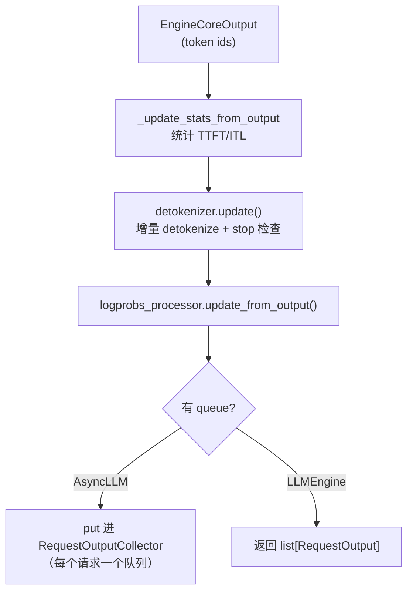

# 第 2 章 输入与输出处理：CPU 侧热路径

> **本章回答**：为什么 vLLM 要在 API Server 和 Engine Core 之间划一条线？输入侧和输出侧各有哪些"看起来不起眼但很贵"的操作，vLLM 怎么处理它们？
> 涉及文件：`vllm/v1/engine/{input_processor,output_processor,detokenizer,logprobs}.py`、`vllm/renderers/`

## 2.1 为什么输入处理必须在另一个进程

回顾第 1 章的进程布局，把它换成"耗时视角"：

| 阶段 | 典型耗时 | 在哪个进程 | 能否与 GPU 重叠 |
| --- | --- | --- | --- |
| HTTP 解析 + JSON | 0.1~1 ms | API Server | ✅ |
| **tokenize** | 0.5~5 ms（长 prompt 更久） | API Server | ✅ |
| 多模态预处理（图像解码/编码） | 10~500 ms | API Server（线程池） | ✅ |
| 校验 + 组装 `EngineCoreRequest` | 0.1 ms | API Server | ✅ |
| 调度 | 0.1~2 ms | Engine Core | ❌（串在 step 前） |
| **detokenize** | 0.05 ms/token | API Server | ✅ |
| 采样 CPU 部分 | 0.1~1 ms | Engine Core/Worker | ❌（串在 step 后） |

**结论**：把 tokenize/detokenize 放在 API Server，它们就能和 GPU 的 forward 并行。这是"分进程"最直接的性能收益。

于是有一个重要的部署推论：**API Server 是 CPU 密集的，高 QPS 场景要给它足够的 CPU 或直接多开进程**（`--api-server-count`，DP 下默认跟随 DP size）。

```bash
# 压测发现 TTFT 抖动但 GPU 利用率不高时，先试这个
vllm serve <model> --api-server-count 4
```

## 2.2 Renderer：tokenize 的现代入口

旧代码里 tokenize 散落在各处（`tokenizer.encode(prompt, add_special_tokens=...)`），现在统一到 `vllm/renderers/` 的 `Renderer`：

```python
# vllm/v1/engine/input_processor.py:332
(engine_input,) = renderer.render_cmpl([parsed_prompt], tok_params)
```

`Renderer` 负责：

- **聊天模板渲染**（Jinja）→ 得到最终 prompt 字符串；
- **多模态占位符插入**（`<P>` 之类）；
- **tokenize**，并把"哪些 token 是 tokenizer 产出的、哪些是图像 placeholder"这个信息带下来（对应 `EngineCoreRequest.prompt_is_token_ids`）。

`Renderer.render_cmpl` 对应 completion 场景，`render_chat` 对应 chat 场景。两者都产出 `EngineInput`（一个 TypedDict），再由 `split_enc_dec_input` 拆成 encoder/decoder 两部分（`input_processor.py:339`）。

相关配置：`ModelConfig.renderer_num_workers`（多进程渲染，提升 tokenize 吞吐）。

## 2.3 `InputProcessor.process_inputs`：逐步拆解

`vllm/v1/engine/input_processor.py:281`。按顺序：

### ① 参数校验

```python
self._validate_params(params, supported_tasks)   # 采样参数合法性
self._validate_lora(lora_request)
```

`_validate_params`（`:84`）检查 `temperature`/`top_p`/`top_k` 范围、`logprobs` 数量是否超过 `max_logprobs` 等。**在 API Server 侧失败 = 不占用引擎资源**，这是把校验前置的好处。

### ② prompt 校验与长度检查

`_validate_prompt_len`（`:436`）、`_validate_model_input`（`:483`）、`_validate_model_inputs`（`:547`）。
超长 prompt 在这里被拒绝（或标记为 `FINISHED_IGNORED`），而不是进引擎后才发现。

### ③ 补齐 `max_tokens`

```python
sampling_params = params.clone()
if sampling_params.max_tokens is None:
    seq_len = length_from_prompt_token_ids_or_embeds(prompt_token_ids, prompt_embeds)
    sampling_params.max_tokens = self.model_config.max_model_len - seq_len
```

`params.clone()` 是必须的 —— 用户在 Python 里可能复用同一个 `SamplingParams` 对象并发调用，不 clone 会互相污染。
注释里还留了一个 TODO：`# TODO: can we avoid cloning here in multiproc case?` —— 多进程下 clone 的收益其实为零（反正要序列化），但代价是真实的。

### ④ 从模型的 generation config 合并默认值

```python
sampling_params.update_from_generation_config(
    self.generation_config_fields, self.renderer.get_eos_token_id())
if self.tokenizer is not None:
    sampling_params.update_from_tokenizer(self.tokenizer)
```

**为什么要在服务端做这件事？** 因为 `generation_config.json` 里可能有 `repetition_penalty`、`eos_token_id`、`stop_strings` 等模型作者设定的默认值。如果交给客户端，用户不可能知道该设什么，结果会与 HF `transformers` 不一致。**这是"正确性优先"的一个例子，代价是每个请求多几次 dict 操作。**

### ⑤ 多模态：内容寻址缓存

```python
def inject_into_mm_cache(self, ...):   # :222
```

多模态的处理哲学是：**大对象不过进程边界，只过 hash**。

```text
API Server 侧：
  收到 image_url → 下载/解码 → 预处理 → 算出 mm_hash
  → 存进 P0 缓存（本进程）
  → 只把 mm_hash + 元信息放进 EngineCoreRequest 过 ZMQ

Engine Core / Worker 侧：
  拿到 mm_hash → 查自己的 P1 缓存 → 命中则复用视觉编码结果
  未命中 → 按需从 P0 取（通过 IPC 通道）
```

对应的代码位置：`OutputProcessor.process_outputs` 里有一段处理 `mm_cache_miss_hashes` 的逻辑（`output_processor.py:~700`），用于 P0/P1 缓存漂移时的自愈：引擎报告"我找不到这些 hash"，前端就把它们从 P0 里剔除，让客户端重传。

> 💡 **性能视角**：
> 1. **同一张图在多轮对话里只编码一次**（内容寻址），这是多模态服务最大的优化。
> 2. ZMQ 只传 hash（几十字节），不传图像张量（几 MB），**省下的序列化时间直接体现为 TTFT**。
> 3. 代价是引入了两级缓存一致性问题（P0/P1 漂移），需要自愈机制。

### ⑥ 组装 `EngineCoreRequest`

```python
class EngineCoreRequest(msgspec.Struct):     # vllm/v1/engine/__init__.py:107
    request_id: str
    prompt_token_ids: list[int] | None
    mm_features: list[MultiModalFeatureSpec] | None
    sampling_params: SamplingParams | None
    arrival_time: float
    lora_request: LoRARequest | None
    cache_salt: str | None
    data_parallel_rank: int | None
    priority: int = 0
    ...
```

**它是 `msgspec.Struct` 而不是 `@dataclass`**，这是刻意的性能选择：

| 序列化方式 | 相对速度 | 备注 |
| --- | --- | --- |
| `pickle` | 1× | Python 专有，慢 |
| `json` | ~1× | 类型易丢失 |
| **msgspec** | **3~10×** | C 扩展 + 结构化 schema |

每个请求都要过 ZMQ 一次，序列化耗时直接影响"请求从 HTTP 到被调度"的延迟。相关代码在 `vllm/v1/engine/serial_utils.py`。

## 2.4 输出侧：`OutputProcessor` 的设计约束

`vllm/v1/engine/output_processor.py:607` `process_outputs` 的 docstring 里有一条给开发者的硬性约定：

```text
NOTE FOR DEVELOPERS

vLLM V1 minimizes the number of python loops over the full
batch to ensure system overheads are minimized. This is the
only function that should loop over EngineCoreOutputs.

If you need to touch every element of the batch, do it from
within the loop below.
```

**为什么禁止额外的全 batch 循环？** 因为在 `chunk_size` 分块（第 8 章入门教程）之下，每个 chunk 都会走一次 `process_outputs`，而它内部是纯 Python 的逐请求循环。多一个这样的循环，就是 O(batch) 的纯开销叠加。

处理流程：



`_finish_request`（`:738`）负责收尾：移除 `RequestState`、通知 `OutputProcessor`、更新 `finished_requests` 统计。

## 2.5 增量 detokenize 的两条路径

`vllm/v1/engine/detokenizer.py`：

| 实现 | 基类 | 何时用 | 做法 |
| --- | --- | --- | --- |
| `FastIncrementalDetokenizer`（`:168`） | `BaseIncrementalDetokenizer` | tokenizer 是 HuggingFace `tokenizers` 后端 | 逐 token 解码 + 用底层 API 处理字节回退 |
| `SlowIncrementalDetokenizer`（`:251`） | 同上 | 其他 tokenizer | 必要时整段重解码 |

`IncrementalDetokenizer.from_new_request`（`:50`）是工厂方法。

### 字节回退（byte-fallback）问题

BPE tokenizer 可能把一个多字节 UTF-8 字符**切成多个 token**。逐个 token 解码时，前面几个会解出替换字符 `U+FFFD`（`�`）。

`BaseIncrementalDetokenizer` 的处理：`_protected_step`（`:224`）—— 如果解出的文本以 `�` 结尾，就**先不发**，等后续 token 补全。

`LogprobsProcessor._correct_decoded_token`（`logprobs.py:249`）里有更完整的处理：它尝试用**最多 4 个前序 token 作为上下文**去解码，找到"干净前缀"和"字节回退前缀"的边界，再把完整解码结果减去干净前缀：

```python
max_ctx = min(len(context_token_ids), 4)
for num_ctx in range(1, max_ctx + 1):
    context = context_token_ids[-num_ctx:]
    full_decoded = self.tokenizer.decode(context + [token_id])
    if full_decoded.endswith("�"):
        continue        # 还没补全，再多带一个 context token 试
    ...
```

**这段代码揭示了一个重要事实：logprobs 的 token→文本映射比 token id 本身复杂得多。** 如果你只想要 token id（`skip_tokenizer_init=True`），这些开销全都可以省掉。

### stop buffer：为什么必须缓冲

```python
# __init__ (:88)
if self.stop:
    self.stop_buffer_length = max(len(s) for s in self.stop) - 1
else:
    self.stop_buffer_length = 0
```

**缓冲长度 = 最长 stop 字符串长度 - 1。**

原因：stop 匹配是**字符级**的，而 token 边界和字符边界不对齐。如果 stop 是 `"\n\n"`，第一个 token 解出 `"\n"` 时你无法确定它是不是 stop 的前缀，**必须等下一个 token**。缓冲住最多 `len(stop)-1` 个字符，就能保证不会误发。

```python
# get_next_output_text (:149)
buffer_length = 0 if finished else self.stop_buffer_length
if not delta:
    return self.output_text[:-buffer_length] if buffer_length else self.output_text
length = len(self.output_text) - buffer_length
last_offset = self._last_output_text_offset
if last_offset < length:
    self._last_output_text_offset = length
    return self.output_text[last_offset:length]
return ""
```

> 💡 **性能视角**：这是一个**"延迟 vs 正确性"的显式权衡**。
> `stop_buffer_length` 越大越安全，但流式输出的观感越差（每次都要等几个字符）。
> **没有 stop 字符串时它就是 0，不花任何代价。** 所以能不用 stop 字符串就尽量不用（用 `stop_token_ids` 更好，token 级匹配不需要缓冲）。

## 2.6 `LogprobsProcessor`：被低估的开销

`vllm/v1/engine/logprobs.py:30`。它处理三种 logprobs：

| 类型 | 含义 | 成本 |
| --- | --- | --- |
| 采样 token 的 logprob | 被选中 token 的对数概率 | 低（只 gather 1 个） |
| top-k logprobs | 每步前 k 个候选及其 logprob | 中（要排序/选择） |
| prompt logprobs | prompt 每个 token 的 logprob | **高（要保留全部 prompt 的 logits → 显存！）** |

`_verify_tokens`（`:312`）做一致性检查：解码出的 token 文本与 tokenizer 的 token 表是否一致（有些 tokenizer 的 `decode` 有特殊行为）。

**关键性能警告**：

```python
# CacheConfig / 相关逻辑
skip_reading_prefix_cache = ...   # prompt_logprobs 请求会跳过读前缀缓存
```

`KVCacheManager.get_computed_blocks` 的注释里说了：

```python
# We skip finding the prefix cache hit when prefix caching is
# disabled or the request is marked as skipping kv cache read
# (which happens when the request requires prompt logprobs
# or calls a pooling model with all pooling).
```

**请求 prompt_logprobs 会让该请求无法使用前缀缓存**，因为每个 prompt token 都需要"当时的 logits"，而缓存命中的 token 没有重新计算，就没有 logits。

> 💡 **性能视角（重要）**：
> 1. `prompt_logprobs` 是**性能杀手**：它既禁用前缀缓存，又要保留 prompt 全长的 logits（`[prompt_len, vocab]` 的浮点张量）。
> 2. `logprobs=k`（top-k）的成本随 k 上升，因为要在 vocab 维度上做选择。
> 3. 如果业务不需要 logprobs，**显式不传**能省掉整条路径（Sampler 里 `raw_logprobs` 只在需要时才计算）。
> 4. 用 token id 而不是文本来消费输出（`skip_tokenizer_init`）能绕开 detokenize。

## 2.7 `AsyncLLM` 输出侧的并发结构

`vllm/v1/engine/async_llm.py`：

- **每个请求一个 `RequestOutputCollector`**（`output_processor.py:48`），内部是一个 `asyncio.Queue`（或单值模式）。
- **一个全局 `output_handler` task** 拉取 `EngineCoreOutputs` 并分发。
- 用户侧的 `generate()` 协程 `await collector.get()` 拿到自己的输出。

```python
class RequestOutputCollector:
    def __init__(self, output_kind: RequestOutputKind, request_id: str): ...
    def put(self, output): ...        # 从 output_handler 调用
    def get_nowait(self): ...
```

**为什么用"每请求一个队列"而不是"一个全局队列 + 分发"？** 因为每个 HTTP 请求对应一个协程，各自 `await` 自己的队列是最自然的背压机制 —— 客户端读得慢，就只堵住自己那一路，不影响其他请求。

`_validate_streaming_input_sampling_params`（`async_llm.py:531`）之类的检查则报错在"流式输入 + 某些采样参数"的不兼容组合上 —— 这类前置校验能避免运行到一半才发现问题。

## 2.8 三个可以自己动手验证的结论

1. **把 `--api-server-count` 从 1 调到 4**，在高 QPS 下观察 TTFT 是否改善。如果改善明显，说明之前是 API Server CPU 饱和。
2. **对同一个请求加 `prompt_logprobs=1`**，观察 TTFT 和 `Prefix cache hit rate` 的变化。你会看到命中率掉到 0。
3. **把 `stop=["\n\n"]` 换成 `stop_token_ids=[...]`**，观察流式输出的 token 到达间隔是否更平滑（少了 stop buffer 的等待）。

## 2.9 本章小结

| 机制 | 性能动机 | 代价 |
| --- | --- | --- |
| API Server / Engine Core 分进程 | tokenize 与 GPU 并行 | IPC 往返 |
| `msgspec.Struct` | 序列化快 3~10× | 需要显式 schema |
| 多模态内容寻址（只传 hash） | 省带宽 + 省重复编码 | P0/P1 缓存一致性 |
| 增量 detokenize | 避免 O(n²) 解码 | 字节回退的边界处理 |
| stop buffer | 避免错误的提前输出 | 最多 `len(stop)-1` 字符的额外延迟 |
| 每请求一个输出队列 | 天然背压，互不阻塞 | 对象数量 = 请求数 |
| prompt_logprobs 禁用前缀缓存 | —（正确性要求） | **显著的性能损失** |

⚠️ **易错点**
- `VLLM_V1_OUTPUT_PROC_CHUNK_SIZE` 调太大会阻塞事件循环，调太小会增加循环开销。默认值通常是合理的。
- `SamplingParams` 在 `process_inputs` 里被 clone，你在客户端改对象不会影响已提交的请求。
- `Renderer` 是近期重构的产物；搜老代码里的 `tokenizer.encode` 会找到大量已废弃路径。

下一章 → [第 3 章 调度器内部](03-调度器内部.md)
