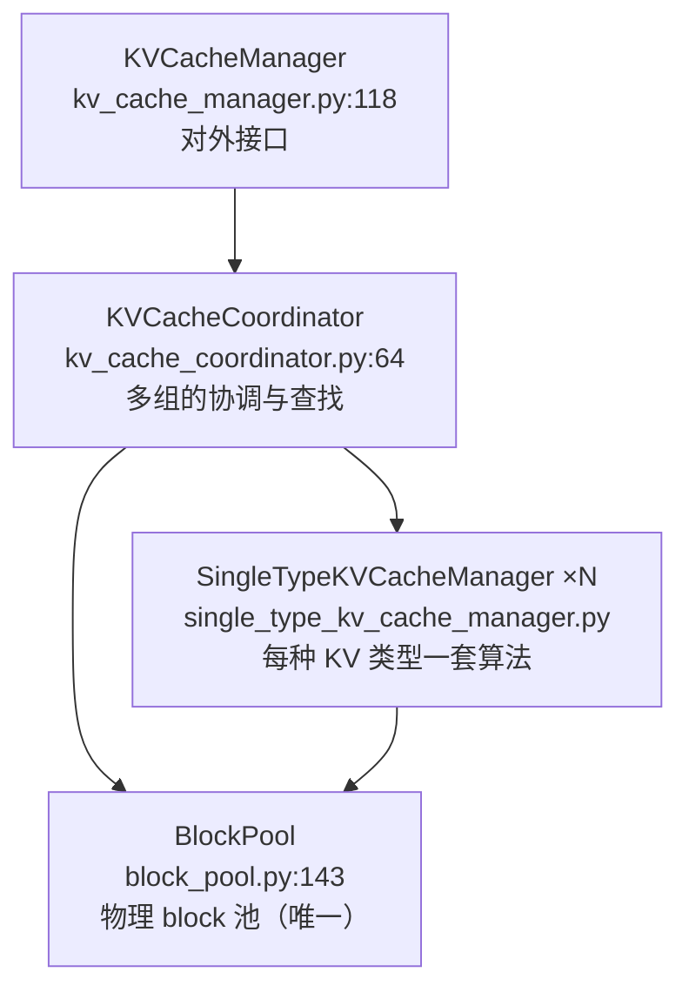

# 第 4 章 KV Cache 管理器内部

> **本章回答**：block 池怎么组织？前缀缓存的查找、命中、驱逐在代码里长什么样？混合模型（MLA/Mamba/sliding window）怎么共用一个池？KV 怎么搬到 CPU 或远端？
> 涉及文件：`vllm/v1/core/{kv_cache_manager,kv_cache_coordinator,block_pool,kv_cache_utils,single_type_kv_cache_manager}.py`、`vllm/v1/kv_cache_interface.py`

## 4.1 四个对象的职责划分



- **`KVCacheManager`**：调度器唯一看到的接口。`get_computed_blocks` / `allocate_slots` / `free`。
- **`KVCacheCoordinator`**：当一个模型有多种 KV 规格时（MLA + sliding window，或 full attention + Mamba），负责协调。三个实现：
  - `KVCacheCoordinatorNoPrefixCache`（`:420`）—— 关前缀缓存时的极简版
  - `UnitaryKVCacheCoordinator`（`:472`）—— 所有层同一规格
  - `HybridKVCacheCoordinator`（`:560`）—— 混合规格
- **`SingleTypeKVCacheManager`**：每种 KV 类型的分配算法。子类：
  - `FullAttentionManager`（`:685`）—— 标准全注意力
  - `SlidingWindowManager`（`:885`）—— 只保留最近 W 个 token，**旧 block 可以循环复用**
  - `RSWAManager`（`:839`）—— 带额外保留 token 的滑动窗口
  - `CircularBufferManager`（`:1115`）—— 环形缓冲（如 Gemma 的局部/全局交替）
  - `ChunkedLocalAttentionManager`（`:1202`）
  - `MambaManager`（`:1360`）—— SSM 状态缓存（**不是 per-token KV**）
  - `CrossAttentionManager`（`:1899`）—— 编码器-解码器的 cross attention
  - `SinkFullAttentionManager`（`:1962`）—— attention sink
- **`BlockPool`**：物理 block 的池子。**整个引擎只有一个**（所有组共享同一块显存池，只是按组切片）。

> 💡 **性能视角**：为什么 `BlockPool` 要全局唯一？
> 因为所有 KV 张量都在同一块预分配显存里，block id 是**全局地址**。如果每个组各有一个池，就需要在每处做地址翻译，且无法灵活地在组之间调配空间。
> 代价是组之间需要"对齐"（见 4.5 的 page size 统一）。

## 4.2 `BlockPool` 的三个数据结构

```python
class BlockPool:
    blocks: list[KVCacheBlock]                    # 全部 block（按 block_id 索引）
    free_block_queue: FreeKVCacheBlockQueue       # 空闲队列（双向链表）
    cached_block_hash_to_block: BlockHashToBlockMap  # 哈希 → block
```

### `BlockHashToBlockMap`：为什么不是普通 dict

`block_pool.py:33`。它做的是 **`BlockHashWithGroupId` → 一组 block**（而不是一个）：

```python
class BlockHashToBlockMap:
    def get_one_block(self, key) -> KVCacheBlock | None: ...
    def contain(self, key, block_id) -> bool: ...
    def insert(self, key, block) -> None: ...
    def pop(self, key, block_id) -> KVCacheBlock | None: ...
```

**为什么可能有多块？** 因为 vLLM v1 的 block table 是 **append-only**（入门教程 4.6 讲过的"重复块"问题）。同一个 hash 可能对应多个物理 block：
- 请求 A 产生了 `[ABCD]` 的 block（id=0），被缓存；
- 请求 B 有同样的前缀，但它的 block id 是 3（因为 append-only，不能复用 0）；
- 于是 hash `ABCD` 同时映射到 block 0 和 block 3。

代码里对"单块"和"多块"做了区分以省内存：只有一个块时直接存 block 对象，多于一个才升级成 dict。

### `FreeKVCacheBlockQueue` 的完整语义

`vllm/v1/core/kv_cache_utils.py:229`。类 docstring 是理解它的最好材料：

```python
"""This class organizes a list of KVCacheBlock objects to a doubly linked
list of free blocks. We implement this class instead of using Python
builtin deque to support removing a block in the middle of the queue
in O(1) time. To close the performance gap to the builtin deque which is
implemented in C++, this class does not allocate any Python objects when
manipulating the linked list. Instead, this class manipulates the
prev_free_block and next_free_block attributes of the given blocks.

The queue is ordered by block ID in the beginning. When a block is allocated
and then freed, it will be appended back with the eviction order:
1. The least recent used block is at the front (LRU).
2. If two blocks have the same last accessed time (allocated by the
   same sequence), the one with more hash tokens (the tail of a block
   chain) is at the front.
Note that we maintain this order by reversing the block order when free
blocks of a request. This operation is outside of this class.
"""
```

翻译成三个设计决策：

| 决策 | 原因 |
| --- | --- |
| 自实现双向链表，不用 `deque` | `deque` 无法 O(1) 删除中间元素（前缀命中时要把 block 从 free 队列"摘出来"） |
| 指针直接存在 `KVCacheBlock` 上 | 避免为每个队列元素分配 wrapper 对象。**每步都要操作这些链表，分配开销会累积** |
| 头尾用哨兵（`fake_free_list_head` / `fake_free_list_tail`） | 减少边界分支判断（注释：`The implementation guaranteed that the fake head and tail are NEVER got popped`） |
| 释放时**逆序**加回队尾 | 一个请求的最后一个 block 哈希覆盖 token 最多、最不可能被复用，应最先被驱逐 |

完整的 API：

```python
popleft()                  # 取 LRU 块
popleft_n(n)               # 批量取（省循环开销）
remove(block)              # O(1) 从中间摘除（touch 用）
append(block)              # 放到尾部
prepend_n(blocks)          # 批量放头部
append_n(blocks)           # 批量放尾部
get_all_free_blocks()
iter_blocks_after(...)
```

**`popleft_n` / `append_n` / `prepend_n` 的批量版本存在是有意义的**：分配 32 个 block 时，如果逐个 `popleft()`，就是 32 次 Python 方法调用 + 32 次链表指针修改；批量版本一次搞定。

### `touch`：命中块必须立刻"保护"

```python
# block_pool.py:702
def touch(self, blocks: Sequence[KVCacheBlock]) -> None:
    for block in blocks:
        if block.ref_cnt == 0 and not block.is_null:
            self.free_block_queue.remove(block)      # ★ O(1) 摘除
        block.ref_cnt += 1
```

**顺序很重要**：先判断 `ref_cnt == 0` 再 `remove`。如果 `ref_cnt > 0`，说明块还在被别的请求用，**它本来就不在 free 队列里**，不能 `remove`（会破坏链表）。

### `_maybe_evict_cached_block`

```python
# block_pool.py:679
```

驱逐 = 三步（**不拷贝数据、不清零显存**）：

1. 从 free 队列头部弹出（这已经是 LRU）；
2. `cached_block_hash_to_block.pop(hash, block_id)` 从哈希表摘除；
3. `block.reset_hash()` 清掉 `_block_hash` / `_block_hash_num_tokens`。

**为什么驱逐这么便宜？** 因为 KV 数据本身不需要动 —— 它会被新请求覆写。哈希表摘除只是让"别人无法通过前缀缓存找到它"。

⚠️ **例外**：新分配的 block 可能要**清零**。`SchedulerOutput.new_block_ids_to_zero` 字段就是干这个的：

```python
# new_block_ids_to_zero: list[int] | None
# The worker zeros the corresponding GPU memory before the blocks are used,
# preventing stale NaN/data from corrupting attention or SSM computation.
```

这是一条重要但容易被忽略的正确性修复：**被复用的显存里可能残留上一次的 NaN，直接读进 attention 会污染结果**（尤其对 Mamba 的 recurrent state）。

## 4.3 链式哈希的完整实现

```python
# kv_cache_utils.py:621
def hash_block_tokens(hash_function, parent_block_hash, curr_block_token_ids,
                      extra_keys=None) -> BlockHash:
    if not parent_block_hash:
        parent_block_hash = NONE_HASH
    curr_block_token_ids_tuple = tuple(curr_block_token_ids)
    return BlockHash(
        hash_function((parent_block_hash, curr_block_token_ids_tuple, extra_keys)))
```

三部分输入：

| 部分 | 作用 | 不加会怎样 |
| --- | --- | --- |
| `parent_block_hash` | 区分"相同内容在不同上下文" | `[the, leaves]` 在开头和在中间会被误命中 |
| `curr_block_token_ids` | 本块的 token 序列 | 降低碰撞概率 |
| `extra_keys` | LoRA / 多模态 / cache_salt | 不同 LoRA、不同图片、不同租户会互相污染 |

`extra_keys` 的产生在 `generate_block_hash_extra_keys`（`kv_cache_utils.py:583`），由三个生成器拼装：

- `_gen_mm_extra_hash_keys`（`:475`）—— 多模态输入的 hash
- `_gen_lora_extra_hash_keys`（`:542`）—— LoRA id
- `_gen_prompt_embeds_extra_hash_keys`（`:557`）—— prompt embeddings（soft prompt）

### 为什么哈希要缓存

`get_request_block_hasher`（`kv_cache_utils.py:770`）返回一个**每请求的哈希器**：

```python
def request_block_hasher(request: Request) -> list[BlockHash]:
    ...
```

**理由**：同一个请求在它被调度的每一步都会做前缀查找，`request.block_hashes` 会被反复访问。如果每步重算所有 block 的哈希，就是 O(prompt_len / block_size) 次哈希运算 × 每步。
哈希器把结果缓存在 `Request` 上，只在 token 增长时增量计算。

`hash_block_tokens` 上还有 `LRU cache`（docstring 提到：`We use LRU cache for this function to avoid recomputing hash values for the same block contents.`）。

### 哈希算法与安全

`CacheConfig.prefix_caching_hash_algo`：

| 算法 | 速度 | 可复现性 | 适用 |
| --- | --- | --- | --- |
| `sha256`（默认） | 慢 | pickle 序列化，跨版本不可复现 | 需要抗碰撞 |
| `sha256_cbor` | 慢 | **CBOR 序列化，跨语言可复现** | 多语言/跨版本一致 |
| `xxhash` | **快** | pickle | 单租户、追求性能 |
| `xxhash_cbor` | 快 | CBOR | 快 + 可复现 |

> 💡 **性能视角**：如果你的场景有很长的共享前缀（例如固定 system prompt），**哈希算法的选择会体现在 CPU 时间上**。
> 但要注意官方文档的警告：非加密哈希理论上增加了碰撞风险，多租户环境下可能泄漏信息（通过缓存命中与否推断别人的 prompt）。
> **`cache_salt`** 是另一层保护：请求带 salt 时，salt 会被注入第一个 block 的哈希，只有相同 salt 的请求能互相复用。

## 4.4 分配路径：`allocate_slots` 的布局

`kv_cache_manager.py:343`。docstring 里的布局图是核心：

```text
| < comp > | < new_comp > | < ext_comp >  | < new >  | < lookahead > |
                                          |   < to be computed >     |
                        |            < to be allocated >             |
```

| 段 | 含义 | 谁提供 |
| --- | --- | --- |
| `comp` | 该请求之前已分配的 block | `req_to_blocks[req_id]` |
| `new_comp` | 本步新命中的前缀缓存块 | `get_computed_blocks` |
| `ext_comp` | 外部（KV connector / P-D 分离）提供的块 | `num_external_computed_tokens` |
| `new` | 本步要算的 token 需要的新块 | 从 free 队列分配 |
| `lookahead` | 投机解码预留 | `num_lookahead_tokens` |

### 几个值得注意的参数

| 参数 | 用途 |
| --- | --- |
| `num_lookahead_tokens` | 投机解码预分配（EAGLE 等需要为草案 token 占位） |
| `delay_cache_blocks` | P/D 分离时，正在传输的块先别缓存 |
| `full_sequence_must_fit` | **准入闸门**：只有整个序列都能放下才分配 |
| `reserved_blocks` | 给在途序列留的余量 |
| `has_scheduled_reqs` | 决定是否应用 `watermark` |

**`full_sequence_must_fit` 是个重要的正确性/性能权衡**（docstring 原文）：

```text
Used as an admission gate to prevent over-admitting requests when chunked
prefill would otherwise only check the first chunk
```

chunked prefill 下，调度器一次只看一个 chunk 的 KV 需求。如果不做整体检查，可能**接受了一个永远无法完成的请求**（它的完整序列放不下），最后只能靠抢占/超时来处理 —— 极差的体验。所以对某些场景要开启整体检查。

`SchedulerConfig.scheduler_reserve_full_isl`（默认 `True`）与这个相关。

### `watermark`

`SchedulerConfig.watermark`（默认 0.0）：在已调度任何请求后，**额外保留一定比例的 block 不分配**。
作用是防止"一步把显存吃干，导致其他在途请求无法推进"。`has_scheduled_reqs` 控制它是否生效。

## 4.5 混合模型：多组的协调

### 规格体系

`vllm/v1/kv_cache_interface.py`：

```text
KVCacheSpec（基类，:145）
├─ AttentionSpec（:379）          num_kv_heads / head_size / dtype / kv_quant_mode / page_size_padded
│   ├─ FullAttentionSpec（:439）      + sliding_window / attention_chunk_size / non_causal
│   │   ├─ MLAAttentionSpec（:546）       + cache_dtype_str / alignment
│   │   │   └─ HiddenStateCacheSpec（:606）
│   │   └─ RSWASpec（:613）               + rswa_window
│   ├─ ChunkedLocalAttentionSpec（:655）
│   └─ SlidingWindowSpec（:695）      + sliding_window / extra_retained_tokens
├─ MambaSpec（SSM 状态，不是 per-token KV）
└─ ...
```

`KVCacheSpecKind`（`:131`）是分类枚举（`FULL_ATTENTION` / `SLIDING_WINDOW` / `MLA_ATTENTION` / `SLIDING_WINDOW_MLA`），**attention 后端就是按这个分类选的**（入门教程 6.3）。

### 为什么需要"页大小统一"

不同的层可能有不同的 `page_size_bytes`：

```text
FullAttention 层：2 × 8 heads × 128 dim × 2B × 16 tokens = 64 KiB / block
MLA 层：        576 dim × 2B × 64 tokens                = 72 KiB / block
Mamba 层：      recurrent state 固定大小
```

如果每一组按自己的页大小独立分配，`num_blocks` 就只能是"各组最小值的妥协"，会浪费显存。

`kv_cache_utils.py` 里有一整套统一逻辑：

| 函数 | 作用 |
| --- | --- |
| `get_uniform_page_size`（`:1070`） | 求一个统一页大小 |
| `unify_kv_cache_spec_page_size`（`:1113`） | 把各组规格的页大小对齐 |
| `unify_hybrid_kv_cache_specs`（`:1587`） | 混合规格的统一 |
| `_approximate_gcd`（`:1611`） | 求近似最大公约数（避免为一个小层把页大小压得太小） |
| `_get_packed_kv_cache_groups`（`:1646`） | 把页大小能整除的组打包在一起 |

**核心思想**：让各组共享同一个 `num_blocks`，靠**页大小对齐**（向上取整到公共倍数，或加 padding）来吸收差异。这样 `KVCacheConfig.num_blocks` 只有一个值，分配和回收逻辑大幅简化。

代价是**部分层会有 padding 浪费**。`CacheConfig.skip_page_size_padded` / `mamba_page_size_padded` 是相关的调优开关。

### 显存布局：两种排布

`get_kv_cache_config_from_groups`（`kv_cache_utils.py:1385`）的注释给出了两种 layout：

```text
block-outer（同一个打包对每个 block 重复）：
group 0: | blk 0 [ A | B  | pad ] | blk 1 [ A | B  | pad ] | ...
group 1: | blk 0 [  C  |    D   ] | blk 1 [  C  |    D   ] |
         |<--- bytes_per_block -->|

layer-outer（只支持统一页大小或单组模型）：
group 0: | A [ blk 0 | blk 1 | ... ] | B [ blk 0 | blk 1 | ... ] |
group 1: | C [ blk 0 | blk 1 | ... ] | D [ blk 0 | blk 1 | ... ] |
```

`CacheConfig.kv_cache_layout`（env `VLLM_KV_CACHE_LAYOUT`）可以选择。**`block-outer` 对 attention kernel 更友好**（同一个 block 的所有数据在连续地址上），这就是它成为默认的原因。

## 4.6 前缀缓存查找：`find_longest_cache_hit`

`KVCacheCoordinator.find_longest_cache_hit`（`kv_cache_coordinator.py:404`，基类），实现分三种：

- `KVCacheCoordinatorNoPrefixCache`（`:461`）：直接返回空。
- `UnitaryKVCacheCoordinator`（`:525`）：单规格，简单的逐块 hash 查表。
- `HybridKVCacheCoordinator`（`:766` 和 `:900` 的 per-group 版本）：**最难的部分**。

### 混合模型的难题

不同组的"缓存能力"不同：

- Full attention 组：每个 block 都能缓存；
- Sliding window 组：**只有最近 W 个 token 的 KV 是有效的**，更早的 block 已经被循环复用了。

如果 full attention 组命中了 10 个 block，而 sliding window 组只能提供 5 个，那**共同**能复用的只有 5 个 block（取 min）。

`HybridKVCacheCoordinator` 的做法：

```python
def _cache_hit_alignment_tokens(self) -> int: ...      # :662
def _align_cacheable(self, num_tokens) -> int: ...      # :724
def find_longest_cache_hit(self, ...): ...              # :766
def find_longest_cache_hit_per_group(self, ...): ...    # :900
```

还有 `shared_prefix_boundary` 的概念（`KVCacheManager.get_computed_blocks` 的第三个返回值）：

```python
# The junction to pin is where the lagging sparse-retention group stops
# (num_new_computed_tokens) plus the uncached shared prefix -- i.e.
# the longest single-group hit. Sub-block gaps are left to the mask,
# which floors to the alignment boundary (a no-op there).
```

**要"钉住"的部分是"落后组的终点 + 未缓存的共享前缀"**，否则这个交界点会被驱逐，跨请求复用的收益就没了。

> 💡 **性能视角**：混合模型的前缀缓存命中率天然低于纯 full-attention 模型。
> 因为**木桶效应**：最不能缓存的那一组决定了整体能复用多少。
> 如果 slidiing window 很小（例如 4096），超长 prompt 的前缀缓存收益会显著低于预期。这是选模型时要考虑的因素。

### `max_cache_hit_length = num_tokens - 1` 的代价

```python
# NOTE: When all tokens hit the cache, we must recompute the last token
# to obtain logits. Thus, set max_cache_hit_length to prompt_length - 1.
# This can trigger recomputation of an entire block, rather than just
# the single last token, because allocate_slots() requires
# num_computed_tokens to be block-size aligned. Removing this limitation
# could slightly improve performance in the future.
```

**问题**：整个 prompt 都命中缓存时，仍然要重算最后一个 token 才能拿到 logits。而 `allocate_slots` 要求 `num_computed_tokens` 是 block 对齐的，所以**可能要多算一整个 block（16 个 token）**。

官方也承认这是可以优化的点。**这是读代码时值得留意的一类"已知的浪费"**。

## 4.7 KV 的搬运：connector 与 offload

### KVConnector：P/D 分离与跨实例复用

`SchedulerOutput` 里有三个相关字段：

```python
kv_connector_metadata: KVConnectorMetadata | None
has_sync_kv_loads: bool
kv_connector_block_state: KVConnectorBlockState | None   # Scheduler 内部用
```

调度器侧对应的方法：

| 方法 | 作用 |
| --- | --- |
| `_build_kv_connector_meta`（`scheduler.py:1386`） | 组装连接器元数据 |
| `_update_waiting_for_remote_kv`（`:2816`） | 外部 KV 到位后提升请求状态 |
| `_connector_finished`（`:2758`） | 连接器完成时的收尾 |
| `_request_remaining_blocks`（`:2795`） | 估算还需要多少 block |
| `_inflight_prefill_reserved_blocks`（`:2809`） | 在途 prefill 预留 |

请求可能进入 `WAITING_FOR_REMOTE_KVS` 状态，此时**不跑前向但已经推进了 `num_computed_tokens`**（因为 KV 在远端已经算好了）：

```python
# Set num_computed_tokens even though KVs are not yet loaded.
# request.num_computed_tokens will not be used anywhere until
# the request finished the KV transfer.
```

### offload：把 KV 放到 CPU

`CacheConfig.kv_offloading_size` / `kv_offloading_backend`，实现目录 `vllm/v1/kv_offload/` 与 `vllm/v1/simple_kv_offload/`。

> 💡 **性能视角**：offload 的经济性分析
> - **收益**：换回来的 KV 如果被反复复用（多轮对话、固定前缀），省下的是**完整的 prefill 计算**；
> - **成本**：H2D 传输一整段 KV ≈ `2 × layers × kv_heads × head_dim × seq_len × dtype_bytes`。8K 上下文的 7B 模型约 448 MiB；PCIe 4.0 x16 约 25 GB/s → ~18 ms。
> - **对比**：重算 8K token 的 prefill 在 H100 上约 30~80 ms。
> - **结论**：勉强划算，而且只在"命中率高"时成立。**随机 prompt 场景下 offload 通常得不偿失。**
>
> 这就是为什么 `kv_offloading_size` 默认是 `None`（关闭）。

## 4.8 `num_gpu_blocks` 的推导与 `CacheConfig` 的字段

启动时（`gpu_worker.py:510` `determine_available_memory`）→ `get_kv_cache_config_from_groups`：

```python
bytes_per_block = _get_kv_cache_bytes_per_block(kv_cache_groups)
num_blocks = available_memory // bytes_per_block
num_blocks = may_override_num_blocks(vllm_config, num_blocks)
size = bytes_per_block * num_blocks
```

相关配置字段（`vllm/config/cache.py`）：

| 字段 | 默认 | 作用 |
| --- | --- | --- |
| `block_size` | 16（后端可覆盖） | 逻辑块 token 数 |
| `gpu_memory_utilization` | 0.92 | 显存比例 → 决定 `num_blocks` |
| `kv_cache_memory_bytes` | None | **直接指定 KV 字节数**（跳过 profiling） |
| `num_gpu_blocks_override` | None | 硬覆盖 block 数 |
| `cache_dtype` | `"auto"` | fp8 / nvfp4 等 KV 量化 |
| `enable_prefix_caching` | **True** | |
| `prefix_caching_hash_algo` | `"sha256"` | |
| `prefix_cache_retention_interval` | None | 缓存保留时长（TTL） |
| `sliding_window` | None | 覆盖模型的滑动窗口 |
| `kv_sharing_fast_prefill` | False | 共享前缀的快速 prefill（**与 prompt_logprobs 冲突**） |
| `kv_offloading_size` / `kv_offloading_backend` | None / `"native"` | KV 分层 |

`kv_cache_memory_bytes` 值得单独说：设置它之后**跳过显存 profiling**（省几秒启动时间），但必须自己算准。官方会建议一个带 150 MiB 冗余的值。

> 💡 **性能视角**：`gpu_memory_utilization` 是**唯一一个"调大就一定提升吞吐"的开关**（在 OOM 之前）。
> 0.92 → 0.95 大约能多 3% 的 KV 空间，在显存紧张的场景意味着少 3% 的抢占。
> 但注意：profiling 测出的峰值显存有波动，加上 CUDA Graph 的私有池，0.96+ 风险明显上升。

## 4.9 本章小结

| 组件 | 关键设计 | 性能动机 |
| --- | --- | --- |
| `BlockPool` | 全局唯一池 + 双向链表 free 队列 | O(1) 中部删除、零对象分配 |
| `BlockHashToBlockMap` | hash → 多块 | 适配 append-only block table |
| `touch` | 先判 `ref_cnt==0` 再摘除 | 避免破坏链表 |
| 驱逐 | 只摘哈希表，不搬数据 | 极便宜 |
| 链式哈希 | `hash(父哈希, token, extra)` | 只有整条前缀相同才命中 |
| 哈希缓存 | 每请求哈希器 + LRU | 避免每步重算 |
| `allocate_slots` | 五段布局 + `full_sequence_must_fit` 准入 | 防止接受无法完成的请求 |
| 页大小统一 | `_approximate_gcd` + padding | 单一 `num_blocks`，简化逻辑 |
| 混合查找 | 取各组最小命中 + pin 交界点 | 木桶效应，但保证可复用 |
| `max_cache_hit_length - 1` | 全命中仍重算一个 block | **已知的浪费，官方承认可优化** |
| offload | 命中率高时才划算 | 传输 vs 重算的账 |

⚠️ **易错点**
- `new_block_ids_to_zero` 的存在说明"复用显存不清零"是危险的；自己实现 KV 相关插件时要记得这个坑。
- `prefix_cache_retention_interval` 是 TTL 语义，不是"LRU 时间窗口"。
- `kv_sharing_fast_prefill` 与 `prompt_logprobs` 不兼容（会产错 logprobs），代码里有显式断言。

📖 官方文档：`docs/design/prefix_caching.md`、`docs/design/hybrid_kv_cache_manager.md`

下一章 → [第 5 章 ModelRunner 内部](05-ModelRunner内部.md)
