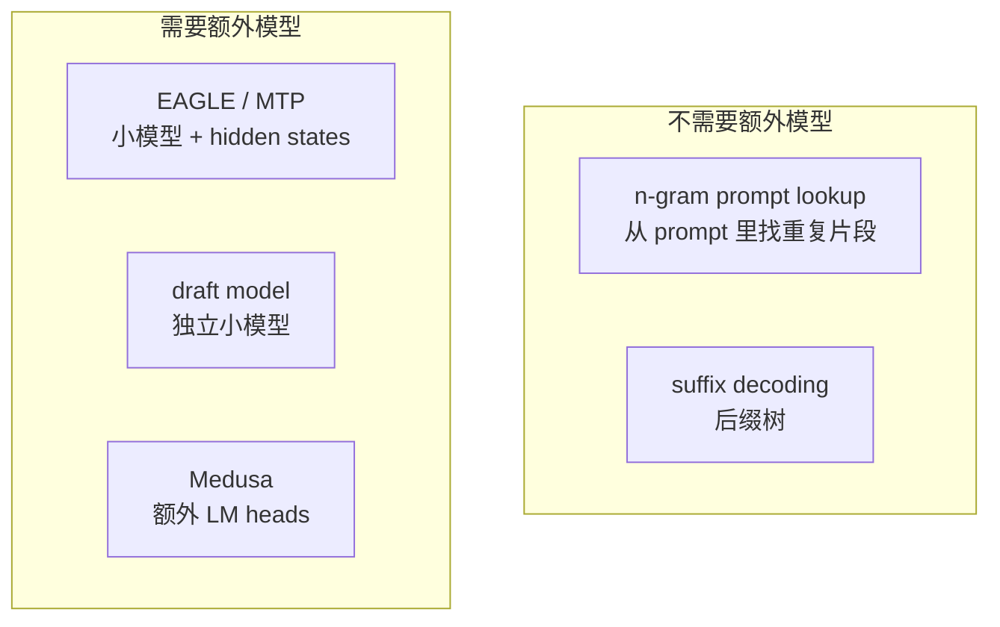
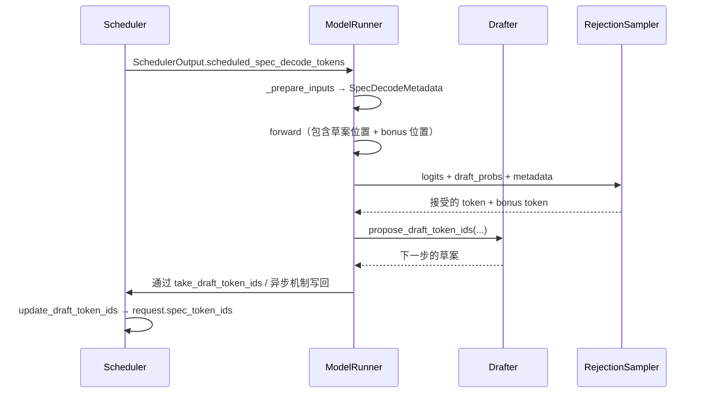

# 第 8 章 采样与投机解码

> **本章回答**：采样流水线的 9 步为什么是这个顺序？哪些 fast path 是设计出来的？投机解码的接受/拒绝在代码里怎么算？EAGLE/draft/ngram/suffix 的区别是什么？
> 涉及文件：`vllm/v1/sample/{sampler,rejection_sampler,metadata,logits_processor/}.py`、`vllm/v1/sample/ops/`、`vllm/v1/spec_decode/`

## 8.1 `Sampler.forward` 的 9 步（原文照抄 + 解读）

`vllm/v1/sample/sampler.py:21` 的类 docstring 是最权威的说明：

```text
1. If logprobs are requested:
    a) If `logprobs_mode` is `raw_logprobs`, compute logprobs as the final logprobs to return.
    b) If `logprobs_mode` is `raw_logits`, clone the logits as the final logprobs to return.
2. Convert logits to float32.
3. Apply allowed token ids whitelist.
4. Apply bad words exclusion.
5. Apply logit processors which are not argmax-invariant, i.e. that can impact
   greedy sampling.
    a) Min tokens processor
    b) Logit bias processor
6. Apply penalties
    a) Repetition penalty  b) Frequency penalty  c) Presence penalty
7. Sample the next tokens. `sample` method performs:
    a) If not `all_random`, perform greedy sampling. If `all_greedy`, return the
       greedily sampled tokens and final logprobs if requested.
    b) Apply temperature.
    c) Apply logit processors which are argmax-invariant, by default the min_p processor.
    d) Apply top_k and/or top_p.
    e) Sample the next tokens with the probability distribution.
    f) If `all_random` or temperature >= epsilon (1e-5), return the randomly sampled
       tokens. Else return the greedily sampled tokens.
8. Gather the logprobs of the top `max_num_logprobs` and sampled token (if requested).
9. Return the final `SamplerOutput`.
```

### 为什么第 5 步必须在第 7 步之前

**`min_tokens` 和 `logit_bias` 会改变 argmax。** 而温度缩放、top-k/top-p **不会**改变 argmax（greedy 的结果与它们无关）。

所以处理器被分成两类：

```python
sampling_metadata.logitsprocs.argmax_invariant       # 可以先做 greedy 决策（min_p 等）
# 非 invariant 的必须在 greedy 之前跑完（min_tokens、logit_bias）
```

这个分类让 `sample()` 能安全地"先算 greedy，再决定要不要算其他的"。

### 一个有意思的细节：logprobs 用的是"原始 logits"

代码注释（`:80` 附近）指出：**top-k logprobs 用的是惩罚/温度之前的原始 logits**。这是与 v0 的有意分歧 —— 因为用户期望的 logprobs 是"模型的原始置信度"，而不是"被惩罚后的值"。

`LogprobsMode` 有几个取值：`raw_logits`、`raw_logprobs`、`processed_logits`、`processed_logprobs`。`Sampler.forward` 的 `logprobs_mode_override` 参数让调用方（例如 `RejectionSampler`）临时切换模式。

## 8.2 `sample()`：三条 fast path

`sampler.py:244`：

```python
def sample(self, logits, sampling_metadata, logprobs_mode_override=None):
    logprobs_mode = logprobs_mode_override or self.logprobs_mode
    assert not (sampling_metadata.all_greedy and sampling_metadata.all_random)

    # ── fast path 1：全随机 ──
    if sampling_metadata.all_random:
        greedy_sampled = None                     # ★ 根本不算 argmax
    else:
        greedy_sampled = self.greedy_sample(logits)   # 一次 argmax
        # ── fast path 2：全 greedy ──
        if sampling_metadata.all_greedy:
            processed_logprobs = None
            if (sampling_metadata.max_num_logprobs is not None
                    or sampling_metadata.logprob_token_ids):
                if logprobs_mode == "processed_logits":
                    processed_logprobs = logits
                elif logprobs_mode == "processed_logprobs":
                    processed_logprobs = self.compute_logprobs(logits)
            return greedy_sampled, processed_logprobs      # ★ 直接返回

    # ── 通用路径 ──
    logits = self.apply_temperature(logits, sampling_metadata.temperature,
                                    sampling_metadata.all_random)
    for processor in sampling_metadata.logitsprocs.argmax_invariant:
        logits = processor.apply(logits)
    random_sampled, processed_logprobs = self.topk_topp_sampler(
        logits, sampling_metadata.generators,
        sampling_metadata.top_k, sampling_metadata.top_p)

    if greedy_sampled is None:
        return random_sampled, processed_logprobs

    sampled = torch.where(
        sampling_metadata.temperature < _SAMPLING_EPS,
        greedy_sampled, random_sampled,
        out=greedy_sampled,       # ★ 复用张量，避免分配
    )
    return sampled, processed_logprobs
```

**可以省掉的工作**：

| 路径 | 省掉的东西 |
| --- | --- |
| `all_greedy` | 温度缩放、top-k/top-p、多项式采样 —— **一次 argmax 就结束** |
| `all_random` | argmax、`torch.where` —— 也不用为 greedy 准备张量 |
| 通用路径 | 只做必要的工作 |

`out=greedy_sampled` 是微优化：`torch.where` 的结果直接写回 `greedy_sampled` 的显存，省一次分配。

### `max_num_logprobs` 的边界情况

docstring 第 8 步里有个容易困惑的说明：

```text
Note that if the sampled token is within the top `max_num_logprobs`, the logprob
will be eventually merged in `LogprobsProcessor` during output processing.
Therefore, the final output may contain either `max_num_logprobs + 1` or
`max_num_logprobs` logprobs.
```

即：你请求 `logprobs=5`，可能拿到 5 个或 6 个。**这是接口的一个"不精确性"，写客户端时要注意。**

## 8.3 `TopKTopPSampler`：在构造时定路径

`vllm/v1/sample/ops/topk_topp_sampler.py:77`。

```python
class TopKTopPSampler(nn.Module):
    def __init__(self, logprobs_mode):
        super().__init__()
        # ★ 在这里就把 self.forward 绑定到具体实现
        if logprobs_mode not in PROCESSED_LOGPROBS_MODES and flashinfer_sampler_supported():
            self.forward = self.forward_cuda
        elif current_platform.is_cpu() and platform.machine() not in ("riscv64", "ppc64le"):
            self.forward = self.forward_cpu
        elif current_platform.is_xpu() and envs.VLLM_XPU_USE_SAMPLER_KERNEL:
            self.forward = self.forward_xpu
        elif current_platform.is_hip() and aiter available:
            self.forward = self.forward_hip
        else:
            self.forward = self.forward_native
```

实现路径：

| 实现 | 做法 |
| --- | --- |
| `forward_cuda`（`:155`） | 用 FlashInfer 的融合采样 kernel；**无 top-k/top-p 或存在 per-request generator 时回退 native** |
| `forward_native`（`:125`） | `apply_top_k_top_p` → `softmax(float32)` → `random_sample` |
| `forward_hip` / `forward_xpu` / `forward_cpu` | 平台特定 |

**为什么在 `__init__` 里绑定而不是每次调用判断？** 采样是每步必走的路径，一次 `if` 判断在每秒几百步下就是实打实的 CPU 时间。**把分支移出热路径。**

`forward_cuda` 的回退条件值得注意：
- `k is None and p is None`：没有任何过滤，没必要用融合 kernel；
- **存在 per-request `generators`**：FlashInfer 0.2.3+ **不支持** per-request generator，必须回退（会 log 一次警告）。

> 💡 **性能视角**：**per-request seed 会让采样变慢** —— 因为它强制回退到 native 路径（多几次 kernel launch）。
> 压测时不要设 `seed`。生产上如果业务需要可复现，要意识到这个代价。

### `random_sample`：Gumbel 技巧

```python
def random_sample(probs, generators, use_fp64_gumbel=False): ...
def sample_with_exponential_noise(probs, q): ...
def empty_exponential_noise_like(...): ...
```

**Gumbel-max 技巧**：从多项分布采样等价于"给每个类别的 logit 加上 Gumbel 噪声后取 argmax"。而 Gumbel 噪声可以由指数分布噪声构造，实现上是"一次指数噪声生成 + 一次加法 + 一次 argmax"，**比累积分布 + 二分查找快得多**。

`use_fp64_gumbel` 用双精度提高数值精度（但更慢）。`apply_top_k_only`（`:411`）是只有 top-k 时的捷径（不需要 softmax）。

## 8.4 惩罚项：`apply_penalties`

`vllm/v1/sample/ops/penalties.py:10`：

```python
def apply_all_penalties(logits, prompt_token_ids, presence_penalties,
                        frequency_penalties, repetition_penalties, output_token_ids):
    return _apply_all_penalties(...)   # 委托给 vllm.model_executor.layers.utils.apply_penalties
```

`_convert_to_tensors`（`:41`）：

```python
make_tensor_with_pad(output_token_ids, vocab_size, ...)
# vocab_size 用作 pad 哨兵值，因为没有真实 token id 等于 vocab_size
```

代码里那句坦白的注释值得引用：

```python
# The penalties implementation is currently quite inefficient and will be
# reworked anyhow.
```

以及异步调度下的一个坑：

```python
# 异步调度的行可能带 -1 占位符，必须替换成合法 id
masked_fill_(== -1, vocab_size)
```

**为什么用 `vocab_size` 而不是 0？** 因为要给 scatter/gather 一个"一定不存在"的索引。用 0 会误伤真实的 token 0。

> 💡 **性能视角**：惩罚项是 `[num_reqs, vocab]` 级别的操作（scatter + gather + 算术）。
> `InputBatch.no_penalties` 为真时整段跳过。**统一采样参数（不带惩罚）能让整批走快路径。**

## 8.5 `RejectionSampler`：投机解码的验证

`vllm/v1/sample/rejection_sampler.py:38`。

### `forward` 的流程

```python
def forward(self, metadata, draft_probs, logits, sampling_metadata):
    # ① bonus token 先算
    bonus_logits = logits[bonus_logits_indices]        # 索引出张量 → 新 storage，可以安全 in-place 改
    bonus_token_ids = self.sampler(bonus_logits, ..., predict_bonus_token=True,
                                   logprobs_mode_override=...)

    # ② target logits（所有草案位置 + bonus 位置）
    raw_target_logits = logits[target_logits_indices].to(torch.float32)
    target_logits = self.apply_logits_processors(target_logits, ...)
    # 注释：target_logits 可能被 in-place 更新以省内存

    # ③ 拒绝采样
    rejection_sample(draft_token_ids, num_draft_tokens, max_spec_len,
                     cu_num_draft_tokens, draft_probs, target_logits,
                     bonus_token_ids, sampling_metadata, ...)
```

### "bonus token" 是什么

投机解码的完整语义：

```text
1. 草稿模型猜出 K 个 token: d₁, d₂, ..., d_K
2. 目标模型对这 K 个位置 + 1 个额外位置算 logits
3. 从前往后逐个验证：
   - dᵢ 被接受 → 继续验证 i+1
   - dᵢ 被拒绝 → 从这里开始重采样，后面的草案全丢
4. 如果 K 个全被接受 → 额外采一个 token（这就是 bonus token）
```

**为什么要有 bonus token？** 因为目标模型已经算了 K+1 个位置的 logits（第 K+1 个位置本来就要算，用于下一个 decode step）。K 个草案全对时，这个位置的 logits 就"顺便"产出了一个额外的 token。**等于白赚一个 token。**

`parse_output`（`:253`）是反向操作：把 `[num_reqs, max_spec_len + 1]` 的采样矩阵拆成每请求的有效 token 列表。`_bookkeeping_sync` 调用它。

### 索引的两个集合

`SpecDecodeMetadata`（`vllm/v1/spec_decode/metadata.py`）：

```python
draft_token_ids: list[int]           # [num_tokens] 所有草案 token 展平
num_draft_tokens: list[int]          # [batch]
cu_num_draft_tokens: list[int]       # 前缀和
cu_num_sampled_tokens: list[int]
target_logits_indices: list[int]     # 需要验证的位置
bonus_logits_indices: list[int]      # 每个请求的 bonus 位置
logits_indices: list[int]            # 上面两者拼起来，就是 compute_logits 的输入行
max_spec_len: int                    # __post_init__ 计算
```

**注意 `logits_indices` 包含草案位置 + bonus 位置** —— 所以 `compute_logits` 实际算的行数比"每请求 1 行"多。**这解释了为什么投机解码不是免费的**：它把 LM head 的开销乘以 `1 + K`（但换来 K+1 个 token 的产出）。

`make_dummy` 用于 CUDA Graph 捕获时构造一个假的 metadata。

## 8.6 六种投机解码方法

`vllm/v1/spec_decode/` 的文件清单：

| 文件 | 类 | 机制 | 需要额外模型？ |
| --- | --- | --- | --- |
| `llm_base_proposer.py` | `SpecDecodeBaseProposer` | **所有模型型 drafter 的共享基类** | — |
| `eagle.py` | `EagleProposer` | EAGLE / EAGLE3 / MTP 家族（传 hidden states） | ✅ |
| `draft_model.py` | `DraftModelProposer` | 独立的（通常更小的）草稿模型 | ✅ |
| `medusa.py` | `MedusaProposer` | 在目标的 hidden states 上挂多个额外 LM head | ✅（多头） |
| `ngram_proposer.py` | `NgramProposer` | **prompt lookup**（numba，CPU） | ❌ |
| `ngram_proposer_gpu.py` | `NgramProposerGPU` | GPU 版 n-gram 匹配 | ❌ |
| `suffix_decoding.py` | `SuffixDecodingProposer` | 后缀树 | ❌ |
| `custom_class_proposer.py` | — | 用户自定义（`method="custom_class"`） | — |
| `extract_hidden_states.py` | — | 只提取 hidden states 的变体 | — |
| `metadata.py` | `SpecDecodeMetadata` | — | — |
| `utils.py` | — | `next_power_of_2`、EAGLE step 的融合 kernel | — |
| `vocab_mapping.py` | — | 草稿/目标词表不同时的映射 | — |
| `metrics.py` | `SpecDecodingStats` | — | — |
| `dynamic/` | — | 动态投机长度调优 | — |

⚠️ **本仓库特有**：`dflash.py`、`gemma4.py`、`step3p5.py` 是 fork 携带的模型族专用 proposer（以及 `dspark_draft_topk` 之类的配置），不属于上游标准特性。

### 三类方法的本质区别



| 维度 | n-gram / suffix | EAGLE / MTP | draft model |
| --- | --- | --- | --- |
| 额外显存 | **0** | 较小 | 较大 |
| 接受率 | 依赖文本重复性（代码/摘要高，闲聊低） | 高（同源） | 中 |
| drafter 开销 | 很低（CPU/GPU 查表） | 一次小模型 forward | 一次小模型 forward |
| 适用场景 | 代码补全、RAG、有大量复制的场景 | 通用（尤其是 MTP 原生支持的模型） | 通用 |

`suffix_decoding_max_tree_depth`（默认 24）、`suffix_decoding_max_cached_requests`（默认 10000）、`suffix_decoding_min_token_prob`（默认 0.1）是 suffix 方法的调参。

`NgramProposer` 里有个细节：`num_tokens_threshold = 8192` 决定何时启用多线程 —— **长 prompt 的 n-gram 匹配单线程太慢**。

### `utils.py` 里的融合 kernel

```python
def eagle_step_slot_mapping_metadata_kernel(...):
    # 注释：把 positions、slot mapping、seq_lens 的更新融合进一个 launch，
    # 以减少 launch 开销
```

**EAGLE 的每一步都要更新这三个元数据**。分成三个 kernel 就是三次 launch；融合成一个就是一次。这是"投机解码额外开销"的重要削减点。

## 8.7 与 `GPUModelRunner` 的接口



### 关键接口点

| 位置 | 作用 |
| --- | --- |
| `scheduler_output.scheduled_spec_decode_tokens` | 调度器告诉 worker 每请求要验证哪些草案 |
| `_prepare_inputs` 里的 `num_decode_draft_tokens` | **chunked-prefill 行用 `-1`**（因为 guided decoding 可能回滚草案） |
| `_get_draft_token_ids_cpu` | 只在需要（惩罚/bad words）时才取 CPU 版草案 |
| `sample_tokens` 的 drafter 分派 | 三种 regime（见第 5 章 5.8） |
| `request.spec_token_ids` | 调度器侧的草案存储，每步清空并重填 |
| `update_draft_token_ids`（`scheduler.py:2322`） | 非异步调度路径下的草案回写 |

### 调度器侧的两个数字

```python
# scheduler.py
num_spec_tokens = ...                # 每个位置最多几个草案
max_num_new_slots_for_drafting       # 预算预留
num_sampled_tokens_per_step          # 每步采样几个 token
```

以及第 3 章讲过的 `pad_spec_decode` —— **为了保住 uniform 形状，宁可不调度**。

### 动态投机长度

`dynamic_sd_lookup`（`scheduler.py:1142` 附近）：

```python
# Dynamic speculative decoding: compute optimal K
if self.dynamic_sd_lookup is not None and len(num_scheduled_tokens) > 0:
    ...
```

配置侧对应 `num_speculative_tokens_per_batch_size`（`vllm/config/speculative.py:473`）。思想是：**batch 越大，验证 K 个 token 的相对成本越高**，所以大 batch 时用更小的 K。

## 8.8 怎么判断投机解码值不值

`SpecDecodingStats`（`vllm/v1/spec_decode/metrics.py:18`）：

```python
class SpecDecodingStats:
    num_spec_tokens: int
    num_drafts: int
    num_draft_tokens: int
    num_accepted_tokens: int
    num_accepted_tokens_per_pos: list[int]      # ★ 关键
    num_draft_tokens_per_pos: list[int]
    def observe_draft(self, num_draft_tokens, num_accepted_tokens): ...
```

**`num_accepted_tokens_per_pos` 是第 k 个草稿位置的累计接受数。** 用它算每个位置的接受率：

```text
接受率_k = accepted_per_pos[k] / drafts
```

典型曲线（第一位置最高，往后递减）：

```text
pos 0: 85%
pos 1: 70%
pos 2: 52%
pos 3: 35%    ← 从这里开始收益递减
pos 4: 20%
```

**判据**：某位置的**边际收益** = `接受率_k × 1 个 token` 的收益 − `1 个额外 logits 行 + KV 的计算成本`。
当接受率降到 30% 以下时，继续加大 K 通常不划算。

> 💡 **性能视角（量化分析）**：
> 设接受率为 p（每位置近似独立），K 个草案的期望产出 ≈ `(1 - p^(K+1)) / (1 - p)` 个 token。
> - p = 0.8，K = 4 → 期望 3.36 个 token（3.36× 加速潜力）
> - p = 0.5，K = 4 → 期望 1.94 个 token（不到 2×，还要扣掉验证成本）
> **p < 0.4 时投机解码常常得不偿失。**
> 测量方式：`/metrics` 或日志里的 spec decode 相关指标。

## 8.9 本章小结

| 机制 | 设计 | 收益 |
| --- | --- | --- |
| 处理器按 argmax-invariant 分类 | 让 greedy 决策能提前 | 保住 greedy fast path |
| `all_greedy` 早退 | 一次 argmax 就结束 | 最省的采样路径 |
| 实现路径在 `__init__` 绑定 | 移出热路径的判断 | 每步的 CPU 时间 |
| Gumbel-max 采样 | 指数噪声 + argmax | 免去累积分布查找 |
| `no_penalties` 等集合判断 | 整段跳过 `[batch, vocab]` 操作 | 大 batch 时显著 |
| Bonus token | 白赚一个 token | 投机解码的"红利" |
| `accepted_tokens_per_pos` | 逐位置接受率 | 调 K 的唯一依据 |
| EAGLE step 融合 kernel | 三次 launch → 一次 | 降低 drafter 开销 |
| 动态投机长度 | 大 batch 用小 K | 自适应 |

⚠️ **易错点**
- per-request `seed` 会禁用 FlashInfer 采样路径。
- `logprobs=k` 可能返回 k 或 k+1 个值。
- chunked-prefill 行的草案数记为 `-1`（表示"不可用"），不是 0。
- 投机解码会增加 LM head 的开销（`1+K` 行 logits），不是免费的。

📖 官方文档：`docs/design/logits_processors.md`

下一章 → [第 9 章 分布式执行的性能工程](09-分布式执行的性能工程.md)
