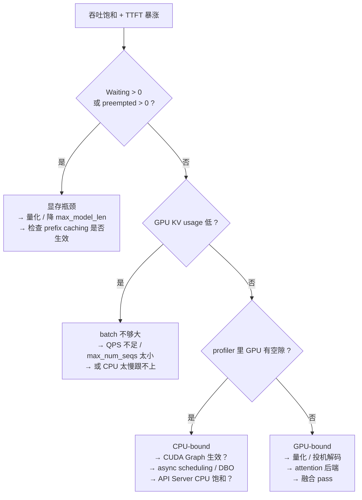

# 第 12 章 性能剖析与调优实战

> **本章回答**：怎么用 profiler 找到瓶颈？roofline 指标怎么读？一套可复现的压测与调优流程长什么样？
> 涉及文件：`vllm/profiler/`、`vllm/v1/metrics/{perf,loggers,stats}.py`、`vllm/entrypoints/cli/benchmark/`

## 12.1 剖析工具的三层

| 层级 | 工具 | 回答的问题 | 开销 |
| --- | --- | --- | --- |
| **指标** | `/metrics`、日志、`RequestOutput.metrics` | "哪个数字异常？" | 极低，可长开 |
| **区间打点** | `record_function_or_nullcontext` + torch profiler | "时间花在哪个阶段？" | 中 |
| **kernel 级** | layerwise profile、kernel 微基准 | "哪个 kernel 异常？" | 高，短时 |

**正确顺序是从上到下**：先用指标定位方向，再用 trace 看阶段，最后才下到 kernel。

## 12.2 指标层：先看什么

### 六个必看数字

| 指标 | 来源 | 健康范围 | 异常说明 |
| --- | --- | --- | --- |
| `Avg generation throughput` | 日志 | 越高越好 | 主要吞吐指标 |
| `Running` | 日志 | 接近 `max_num_seqs` | 太低 → QPS 不足或显存不够 |
| `Waiting` | 日志 | 0 | **> 0 → 排队，显存/并发受限** |
| `GPU KV cache usage` | 日志 | 高（>70%） | 长期很低 → batch 太小 |
| `Prefix cache hit rate` | 日志 | 取决于 workload | 突然掉到 0 → 检查是不是有 prompt_logprobs |
| `num_preempted_reqs` | `/metrics` | **0** | **> 0 → 重复计算，最贵的浪费** |

### 排障第一步：分流"排队 vs 计算"

回顾第 8 章的距离 TTFT 的构成：

```python
# stats.py:455 附近
first_token_latency = iteration_timestamp - req_stats.arrival_time   # 含排队！
```

所以 TTFT 高时，先查 `FinishedRequestStats`：

| `queued_time` 占比 | `prefill_time` | 结论 |
| --- | --- | --- |
| 高 | 低 | **排队问题** → 加实例、调小 `max_num_seqs`、看 `Waiting` |
| 低 | 高 | **计算问题** → 看 prefill 的 kernel、chunked prefill 参数、量化 |
| 都高 | 都高 | 过载，先扩容量 |

`update_from_events`（`stats.py:494`）通过 `EngineCoreEventType.QUEUED` / `SCHEDULED` 事件把这两个时间分开。

> 💡 **性能视角**：这个分流能省掉 80% 的无效排查。
> 很多人看到 TTFT 高就去调 kernel，其实只是实例不够。

### roofline：`PerfStats` 与 `ModelMetrics`

`vllm/v1/metrics/perf.py`：

```python
class ModelMetrics:                     # :1265
    """Parse vllm_config to instantiate metrics for each component.
    is_enabled() will return False if no component metrics could be instantiated."""
    def is_enabled(self) -> bool: ...   # :1291  → len(self.metrics) > 0
    def get_num_flops(self, ctx, per_gpu=True) -> int: ...
    def get_read_bytes(...) / get_write_bytes(...): ...

class PerfStats:                        # :93
    num_flops_per_gpu: int
    num_read_bytes_per_gpu: int
    num_write_bytes_per_gpu: int
    debug_stats: ...
```

`ExecutionContext` 把 batch 内请求按 prefill/decode 分开聚合（docstring 里给了"一个 2048 token 的 prefill + 一个 8192 上下文的 decode"的例子）。

**启用方式**：`ObservabilityConfig.enable_mfu_metrics`（`LoggingStatLogger._enable_perf_stats`，`loggers.py:141` 就是直接返回它）。
**注意 `ModelMetrics.is_enabled()` 还要求至少有一个 `ComponentMetrics` 能从配置里实例化成功** —— 否则即使开了开关也没有数据。启动日志里会打印 `Instantiated ComponentMetrics [...]`，可以用来确认。

**怎么用**：

```text
decode 的算术强度 = num_flops / num_read_bytes
```

对标准 Transformer，decode 的算术强度约 **1~2 FLOP/Byte**，而 H100 的机器平衡点约 **300 FLOP/Byte**（bf16）。
**差距 100 倍以上 → 严格的 memory-bound。**

| 观察结果 | 结论 | 行动 |
| --- | --- | --- |
| 算术强度远低于硬件平衡点 | memory-bound（decode 的正常状态） | 量化、MLA、更好的 attention kernel |
| 算术强度接近平衡点 | compute-bound（prefill 的正常状态） | 更好的 GEMM kernel、并行度、Moe 优化 |
| 实测 FLOPS 远低于硬件峰值 | **kernel 效率有问题** | profile 具体 kernel |

配置：`--enable-mfu-metrics`（即 `ObservabilityConfig.enable_mfu_metrics`）。

## 12.3 Torch profiler：配置与读法

### 配置

**当前版本用 `--profiler-config`（`ProfilerConfig`），不再有 `VLLM_TORCH_PROFILER_DIR` 环境变量。**

```bash
vllm serve <model> --profiler-config '{
  "profiler": "torch",
  "torch_profiler_dir": "/tmp/vllm_profile",
  "torch_profiler_record_shapes": true,
  "detailed_trace_annotation": true,
  "warmup_iterations": 2,
  "active_iterations": 5
}'
```

`ProfilerConfig` 字段（`vllm/config/profiler.py`）：

| 字段 | 含义 |
| --- | --- |
| `profiler` | `"torch"` 或 `"proton"`（Triton Proton） |
| `torch_profiler_dir` | 输出目录（`profiler == "torch"` 时必填） |
| `torch_profiler_record_shapes` | 记录张量形状 |
| `torch_profiler_with_stack` | 记录 Python 栈（默认 True，信息更全但更慢） |
| `torch_profiler_with_memory` | 记录显存分配 |
| `torch_profiler_with_flops` | 记录 FLOPs |
| `torch_profiler_dump_cuda_time_total` | dump 累计 CUDA 时间表（默认 True） |
| `detailed_trace_annotation` | **按 roofline 给每个请求打 context/generation 标注** |
| `wait_iterations` / `warmup_iterations` / `active_iterations` | 对应 `torch.profiler.schedule(wait, warmup, active, repeat)` |
| `delay_iterations` / `max_iterations` | 起止控制 |
| `ignore_frontend` | 不 profile 前端 |

`vllm bench serve --profile` 可以自动开启（省得手动配）。

`Worker.profile(is_start, profile_prefix)`（`gpu_worker.py:1197`）是 worker 侧的入口，`WorkerProfiler.step()`（`profiler/wrapper.py:97`）由 worker 每步调用，内部 `_profiler_step()` 判断是否在 active window。

### 生成 trace 后的三个问题

用 <https://ui.perfetto.dev/> 打开：

**① GPU 有空隙吗？**

```text
[注意力][MLP][注意力][MLP]  ← 连续，GPU-bound
   ↓
[  空隙  ][注意力][ 空隙 ][MLP]  ← 有空隙，CPU-bound
```

有空隙 → 优化 CPU 路径（CUDA Graph、减少同步、异步调度、DBO）。
无空隙 → 优化 GPU 路径（量化、kernel、投机解码）。

**② 有没有"意外的" kernel？**

- **`aten::copy_` / `cudaMemcpyAsync`**：多的 D2H 拷贝 = 同步点；
- **`aten::empty` / `cudaMalloc`**：热路径上的分配（应该用预分配 buffer）；
- **`aten::item` / `aten::_local_scalar_dense`**：**这是 `.item()` 的符号，每个都是一次同步**；
- **`void at::native::elementwise_kernel`**：可能是没被融合的 elementwise 操作。

**③ 名字里带 vLLM 区间的块有多长？**

按 `record_function` 的名字搜：

```text
gpu_model_runner: preprocess
schedule: allocate_slots
...
```

**这是从 trace 反查代码位置最快的办法。**

### `layerwise_profile`：每层耗时表

`vllm/profiler/layerwise_profile.py`：

```python
class LayerwiseProfileResults:          # :83
    def print_model_table(self): ...                     # :99
    def print_summary_table(self): ...                   # :117
    def export_model_stats_table_csv(self): ...          # :135
    def export_summary_stats_table_csv(self): ...        # :141
    def convert_stats_to_dict(self): ...                 # :150
    # 内部：
    def _build_correlation_map(self): ...                 # :171
    def _build_module_tree(self): ...                     # :176
    def _get_kineto_gpu_event(self): ...                  # :213
    def _cumulative_cuda_time(self): ...                  # :226
```

**它把 kineto trace 聚合成"每个 module 的 CUDA 时间"**，并导出 CSV。

> 💡 **性能视角**：**"看哪一层异常贵"是定位融合失效最快的办法。**
> 例如某个 `RMSNorm` 层的耗时异常高 → 说明 `add_rms_fusion` 没生效；
> 某个 `Linear` 层特别慢 → 检查量化 kernel 是否回退到了通用实现。

## 12.4 微基准：把 kernel 单独拿出来测

`benchmarks/` 目录：

| 脚本 | 用途 |
| --- | --- |
| `benchmarks/kernels/` | kernel 微基准（**AGENTS.md 明确要求 kernel 性能测试放这里，不要放 `tests/`**） |
| `benchmarks/attention_benchmarks/` | attention 后端对比 |
| `benchmarks/fused_kernels/` | 融合 kernel |
| `benchmarks/benchmark_topk_topp.py` | 采样 kernel |
| `benchmarks/benchmark_prefix_block_hash.py` | 哈希开销 |
| `benchmarks/benchmark_block_pool.py` | block 池操作 |
| `benchmarks/benchmark_pin_memory.py` | pinned memory 行为 |
| `benchmarks/benchmark_batch_invariance.py` | batch 不变性验证 |
| `benchmarks/overheads/` | 框架开销（CPU 侧） |
| `benchmarks/auto_tune/` | 自动调参 |
| `benchmarks/multi_turn/` | 多轮对话场景 |

`vllm bench latency` / `throughput` 是端到端微基准。

**写微基准的三条规矩**：

1. **先 warmup**（跳过 JIT/first-call 开销）；
2. **用 CUDA Event 计时**（不要用 `time.time()` 包 kernel launch —— 那测的是 launch 时间）；
3. **对齐 SOL（speed of light）**：算出理论带宽/算力上限，看实际达到百分之多少。

仓库里还有 `kernel-microbenchmark` 相关的 skill（`/kernel-microbenchmark`），如果做 kernel 调优可以用。

## 12.5 一套可复现的压测流程

### Step 1：定义基线

写清楚六个量：

```text
模型:            meta-llama/Llama-3.1-8B-Instruct
硬件:            1× H100 80GB
并行:            TP=1
输入/输出长度:   random 1024 / 256
请求速率:        20 req/s（以及 5/10/40 的扫描）
其他:            -O2，prefix caching 开，无投机解码，无量化
```

**缺任何一个，数字都不可复现。**

### Step 2：扫描请求速率找饱和点

```bash
for rate in 2 5 10 20 40 80; do
  vllm bench serve --model <model> \
    --dataset-name random --random-input-len 1024 --random-output-len 256 \
    --num-prompts 500 --request-rate $rate \
    --save-result --result-dir results/
done
```

画一张图，横轴 request rate，纵轴：

- **吞吐**（tokens/s）：会先线性上升，然后饱和；
- **TTFT P99**：在饱和点之后**急剧上升**（排队）。

**饱和点就是系统的合理容量上限。** 继续加压只会增加延迟不加吞吐。

### Step 3：定位瓶颈



### Step 4：单变量改动 + 复测

一次只改一个东西，记录：

| 实验 | 配置 | 吞吐 | TTFT P99 | TPOT P99 |
| --- | --- | --- | --- | --- |
| 基线 | | | | |
| + fp8 量化 | | | | |
| + 投机解码 K=3 | | | | |
| `max_num_batched_tokens` 8192→16384 | | | | |

### Step 5：注意四种"假收益"

| 假象 | 真相 |
| --- | --- |
| prefix caching 命中率 100% | 测的是缓存不是计算 |
| 用固定 prompt 压测 | 同上 |
| `--enforce-eager` / `-O0` 下的对比 | 不代表生产 |
| 没预热就测 | 包含编译时间 |

## 12.6 五个真实场景的调优路径

### 场景 A：在线客服，要求 TTFT < 500ms，长 system prompt

```text
1. prefix caching 必须开（system prompt 共享）→ 检查命中率
2. max_num_batched_tokens 适中（不要太大，避免 decode 陪跑）
3. long_prefill_token_threshold 设 512~1024，主动切块
4. 考虑 P/D 分离（prefill 实例 + decode 实例）
5. 不要 TP（all-reduce 伤延迟）
```

### 场景 B：离线批量生成，追求最大吞吐

```text
1. gpu_memory_utilization 拉满（0.95）
2. 量化（fp8）把权重省下来的显存全给 KV
3. 确认 num_preempted_reqs == 0
4. DP 优先于 TP
5. max_num_seqs 拉高直到出现抢占
6. 启用 batch queue / async scheduling
```

### 场景 C：代码补全，前缀重复度极高

```text
1. prefix caching 是核心（命中率可能 >80%）
2. n-gram 或无模型投机解码的收益极高（代码重复性强）
3. 考虑 KV offload（前缀复用率高时划算）
4. 小 block_size（16 甚至更小）提升命中粒度
```

### 场景 D：长上下文（128K）问答

```text
1. KV 显存是首要约束 → 量化 KV（fp8）+ MLA 模型
2. chunked prefill 必须开，chunk 要够大（减少 chunk 数）
3. 考虑稀疏 attention（MLA sparse）
4. 几乎是 memory-bound 的极端情况 → 一切围绕省带宽
```

### 场景 E：MoE 大模型（DeepSeek 类）

```text
1. 确认专家 kernel 选择（启动日志）—— 差异可达 2~3×
2. EP + EPLB 消除专家热点
3. all2all backend 选择（DeepEP HT/LL 取决于 batch 大小）
4. enable_ep_weight_filter 加速启动
5. MLA decode 后端（FlashMLA / FlashInferMLA）
```

## 12.7 常见"我以为"与"实际"

| 我以为 | 实际 |
| --- | --- |
| 加 GPU 就能提升吞吐 | 先看是 GPU-bound 还是 CPU-bound；CPU-bound 时加卡没用 |
| TP 越大越快 | TP 引入每层 all-reduce，伤延迟；能 DP 就 DP |
| 量化一定加速 | prefill 是 compute-bound，量化主要加速 decode |
| 投机解码总是有用 | 接受率 < 40% 时得不偿失 |
| 显存利用率 100% 是坏事 | **KV usage 高是健康的**；Waiting 高才是坏事 |
| CUDA Graph 只是"锦上添花" | 小 batch 下它决定生死（launch 开销占 30~50%） |
| 编译只是启动慢一点 | 它能消除 30~50% 的 CPU 开销，是吞吐的关键 |

## 12.8 一份排障检查清单

按顺序过一遍，90% 的问题能定位：

```text
□ 1. 是否 --enforce-eager？             → 去掉
□ 2. -O 级别是什么？                     → 生产用 -O2
□ 3. 启动日志里 CUDA Graph 捕获了吗？     → 看 "Capturing CUDA graphs"
□ 4. 启动日志里 attention 后端是哪个？    → 是否符合预期
□ 5. 压测是否预热、max_tokens 是否显式？  → 修正
□ 6. prefix caching 命中率是多少？        → 排除"假收益"
□ 7. Waiting / preempted 是多少？         → >0 就是显存问题
□ 8. GPU KV cache usage 是多少？          → 低就是 batch 小
□ 9. TTFT 里 queued_time 占比多少？       → 区分排队 vs 计算
□ 10. GPU 利用率（nvidia-smi / dcgm）？   → 低就是 CPU-bound
□ 11. profiler 里 GPU 有空隙吗？          → 有空隙查同步点
□ 12. 有没有 --disable-custom-all-reduce？ → 通常应该去掉
```

## 12.9 本章小结

- 三层工具：指标 → 区间打点 → kernel。**从上往下用**。
- 六个必看指标；`preempted > 0` 是最贵的浪费。
- TTFT 含排队时间 —— **先分流"排队 vs 计算"**。
- `PerfStats` 的 roofline 判断 memory-bound 还是 compute-bound。
- Profiler 用 `--profiler-config`（不再是环境变量）；`layerwise_profile` 给出每层耗时表。
- 压测必须交代六个量；先扫请求速率找饱和点，再单变量改动。
- 五种场景有各自的调优路径，但都从"是在排队还是在算"这个问题开始。

⚠️ **最后一条提醒**：**永远先建立基线**。没有基线的优化是猜测，而没有基线的"优化成功"更危险 —— 因为你不知道它到底有没有用。

📖 官方文档：`docs/design/metrics.md`、`docs/contributing/profiling.md`

---

回到 [进阶教程目录](README.md) 或 [入门教程](../01-入门教程/README.md)
